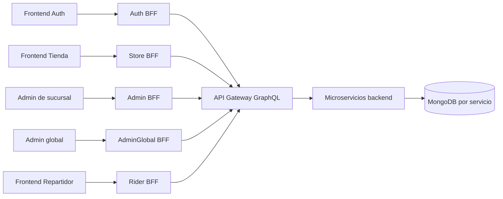
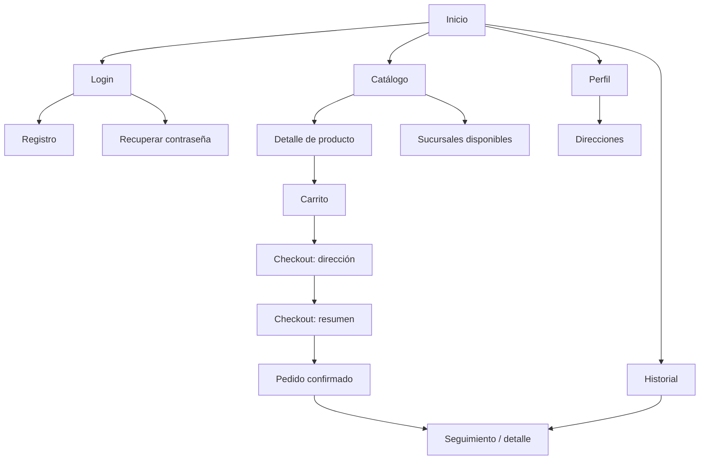
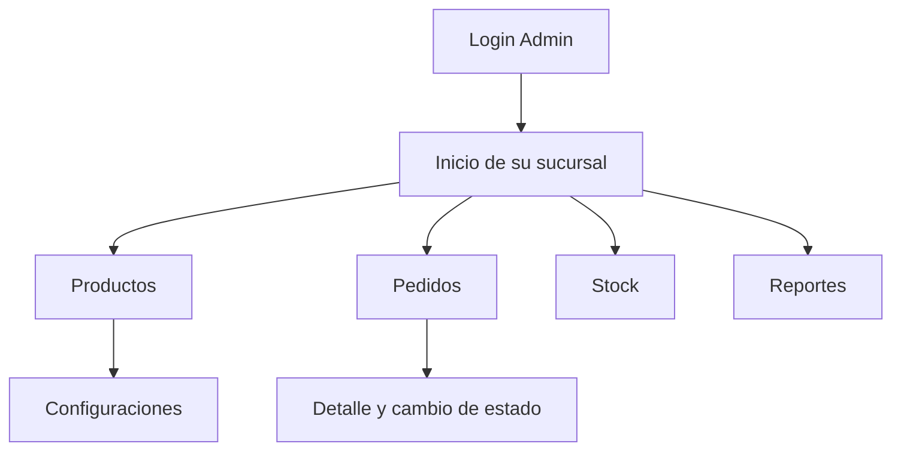
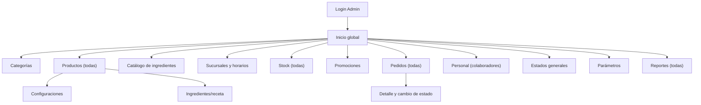
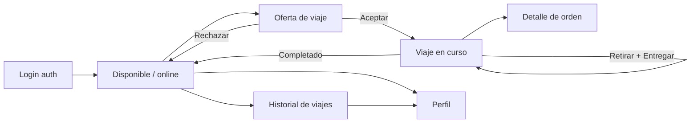

# Especificación Funcional — Auth, Tienda, Admin sucursal, Admin global y Repartidor

**Proyecto:** Plataforma de pedidos para una cadena de comidas rápidas  
**Materia:** Desarrollo de Aplicaciones — UNaHur  
**Equipo:** Thomas (SSR), Mateo (Trainee), Bosco (Trainee)  
**Documento:** requerimientos funcionales de los frontends  
**Alcance:** funcionalidades base de la consigna  
**Versión:** 1.3

> Este documento define el **alcance funcional** de los cinco frontends: **Auth** (login/registro/recuperación), **Tienda** (clientes), **Admin de sucursal** (`apps/admin`), **Admin global** (`apps/admin-global`) y **Repartidor** (`apps/rider`). Incluye **stock de ingredientes por sucursal** (Extensión 1) y la **app del Repartidor** con viajes y ofertas (Extensión 2).

> **Fuentes de verdad:** este documento es la fuente de verdad **funcional**. La fuente de verdad **visual y de sistema** (dirección "Calor", paleta, tokens, layouts) es `client/docs/ui-manifesto.md`; ante cualquier conflicto visual gana el manifesto. La arquitectura implementada (monorepo, apps, paquetes) está en §16 y en `client/CLAUDE.md`.

> **Nota de implementación:** la autenticación vive en su propia app (`apps/auth`), que tras el login redirige a Tienda, Admin de sucursal, Admin global o Repartidor según el `role` que devuelve el auth API. Las pantallas T-01 a T-04 corresponden a esa app.

---

## Índice

1. [Objetivo y alcance](#1-objetivo-y-alcance)
2. [Arquitectura general de los frontends](#2-arquitectura-general-de-los-frontends)
3. [Roles y permisos de interfaz](#3-roles-y-permisos-de-interfaz)
4. [Sistema de diseño compartido](#4-sistema-de-diseño-compartido)
5. [Navegación de la Tienda](#5-navegación-de-la-tienda)
6. [Detalle página por página — Tienda](#6-detalle-página-por-página--tienda)
7. [Navegación del Admin de sucursal](#7-navegación-del-admin-de-sucursal)
8. [Detalle página por página — Admin de sucursal](#8-detalle-página-por-página--admin-de-sucursal)
9. [Navegación del Admin global](#9-navegación-del-admin-global)
10. [Detalle página por página — Admin global](#10-detalle-página-por-página--admin-global)
11. [Navegación del Repartidor](#11-navegación-del-repartidor)
12. [Detalle página por página — Repartidor](#12-detalle-página-por-página--repartidor)
13. [Estados transversales de la interfaz](#13-estados-transversales-de-la-interfaz)
14. [Diseño responsive](#14-diseño-responsive)
15. [Integración frontend–backend](#15-integración-frontendbackend)
16. [Organización del código](#16-organización-del-código)
17. [Distribución del trabajo](#17-distribución-del-trabajo)
18. [Checklist de diseño y entrega](#18-checklist-de-diseño-y-entrega)
19. [Fuera del alcance](#19-fuera-del-alcance)

---

# 1. Objetivo y alcance

La solución tendrá cinco aplicaciones web:

1. **Frontend Auth**, compartido: login, registro y recuperación de contraseña.
2. **Frontend Tienda**, utilizado por clientes.
3. **Frontend Admin de sucursal** (`apps/admin`), utilizado por los administradores de cada sucursal.
4. **Frontend Admin global** (`apps/admin-global`), utilizado por la administración central.
5. **Frontend Repartidor** (`apps/rider`), utilizado por repartidores.

Todas las aplicaciones consumen su **BFF** (Backend for Frontend), que a su vez habla con un **API Gateway** (GraphQL) que enruta hacia los microservicios del backend. La lógica de negocio permanece en el servidor; los frontends se ocupan de presentar información, capturar datos, ejecutar acciones y mostrar los resultados devueltos por la API.



## 1.1 Alcance funcional de la Tienda

- Registro de clientes.
- Inicio de sesión.
- Recuperación y restablecimiento de contraseña.
- Consulta y modificación del perfil.
- Administración de direcciones.
- Consulta de sucursales disponibles para una ubicación.
- Consulta de categorías y productos disponibles.
- Consulta y selección de configuraciones especiales de productos.
- Administración del carrito.
- Confirmación del pedido.
- Seguimiento del estado del pedido.
- Consulta del historial.
- Consulta del detalle de pedidos anteriores.
- Repetición de pedidos.

## 1.2 Alcance funcional de Administración

La administración son **dos apps separadas (dos frontends)**:

**Admin global — `apps/admin-global` (`super_admin`)** — define lo global:

- Definir **productos** (nombre, precio, imagen, categoría) y los **ingredientes/receta** de cada producto.
- Definir el **catálogo de ingredientes** (materias primas y sus unidades).
- Categorías, sucursales y horarios.
- Promociones, estados generales y parámetros del sistema.
- Administrar **personal**: crear usuarios colaboradores de sucursal y **vincularlos a una sucursal ya creada**, además de crear otros admins globales.
- Vista global: pedidos, stock y reportes de **todas** las sucursales.

**Admin de sucursal — `apps/admin` (`branch_admin`)** — opera su propia sucursal:

- Inicio de sesión administrativo.
- **Pausar/reactivar productos** en su sucursal (decide qué vende, **sin editar** la definición del producto).
- **Stock de su almacén** (inventario de ingredientes de su sucursal).
- Consulta de pedidos de **su sucursal** y cambio controlado de estado.
- Reportes base de **su sucursal**.

Reportes base de productos:

- más vendidos;
- menos vendidos;
- sin stock;
- con mayor facturación.

## 1.3 Alcance funcional del Repartidor

- Inicio de sesión como repartidor (rol `rider`, vía la app de auth).
- Activar/desactivar **disponibilidad** (online/offline) y compartir ubicación.
- Recibir **ofertas de viaje** según su ubicación (como Uber Eats) y **aceptar o rechazar**.
- Un **viaje** agrupa una o más **órdenes** (de distintos clientes y/o sucursales).
- Ver el **detalle** de cada orden (retiro, entrega, ítems, mapa de ruta).
- Marcar el **retiro** y la **entrega** de cada orden del viaje.
- Ver el **historial de viajes** realizados.
- Gestionar su **perfil** (nombre, vehículo, teléfono).

## 1.4 Decisiones funcionales que condicionan la UI

- La sucursal se asigna automáticamente al confirmar el pedido.
- La selección se realiza entre sucursales activas, abiertas y dentro de la distancia permitida.
- **Productos e ingredientes globales:** el `super_admin` define los productos (nombre, precio, imagen, categoría), los **ingredientes/receta** de cada producto y el catálogo de ingredientes. El `branch_admin` **no edita** productos: solo puede **pausar/reactivar** un producto en su sucursal.
- **Stock por sucursal, de ingredientes:** cada sucursal controla el stock de **ingredientes** de su almacén. Un producto "se puede preparar" si hay stock suficiente de todos los ingredientes de su receta (ej. con 5 panes no se pueden hacer 7 hamburguesas). **Sin stock no hay compra:** al confirmar, el backend valida el stock de la sucursal asignada y no confirma productos que no puedan prepararse.
- **Descuento de stock en "realización":** el stock se descuenta cuando el pedido **entra en realización** (preparación). Si el pedido no entra en realización (se cancela antes), **no** se descuenta nada. No se reserva stock al confirmar.
- Las promociones se administran como información general (solo `super_admin`); no existe un motor automático de descuentos.
- El carrito muestra el importe total calculado a partir de productos, cantidades y adicionales de configuraciones.
- No se incluye pago en línea.
- No se incluye mapa ni navegación real en la Tienda; la app del Repartidor sí muestra la ruta retiro → entrega.
- **Oferta por ubicación (como Uber Eats):** al repartidor se le **ofrecen viajes** según su ubicación actual (proximidad a retiro/entrega); no ve una lista global de pedidos. Un **viaje** es la unidad de trabajo y puede agrupar varias **órdenes** de distintos clientes. El repartidor acepta o rechaza el viaje completo; el armado/ofrecimiento lo decide el backend.

---

# 2. Arquitectura general de los frontends

## 2.1 Separación de aplicaciones

Cinco aplicaciones independientes (monorepo Turborepo) con paquetes compartidos:

```text
client/
├── apps/
│   ├── auth/         # login, registro, recuperación; redirige por rol
│   ├── store/        # catálogo, carrito, checkout, pedidos, perfil
│   ├── admin/        # admin de sucursal (branch_admin)
│   ├── admin-global/ # admin global central (super_admin)
│   └── rider/        # app del repartidor (entregas)
└── packages/
    ├── components/  # UI genérica + tokens (@repo/components)
    ├── domain/      # tipos, constantes y schemas de validación (@repo/domain)
    ├── api/         # hooks de datos + mocks + sesión (@repo/api)
    └── theme/       # tokens de Chakra (@repo/theme)
```

## 2.2 Responsabilidades del frontend

El frontend debe:

- mostrar los datos entregados por la API;
- capturar y validar la forma básica de los datos;
- impedir envíos evidentemente incompletos;
- mostrar loading, error, éxito y estados vacíos;
- conservar la sesión del usuario;
- proteger rutas según autenticación y rol;
- enviar identificadores y datos, nunca resultados de reglas de negocio calculados como verdad final;
- actualizar la UI con la respuesta real del servidor.

El frontend no debe:

- decidir qué sucursal queda asignada definitivamente;
- decidir si una transición de pedido es válida;
- recalcular como verdad final el importe del pedido;
- confiar en precios almacenados localmente;
- acceder directamente a la base de datos ni a un microservicio (siempre vía el API Gateway);
- duplicar reglas de negocio del backend (validación de stock, asignación de sucursal, transiciones de estado).

## 2.3 Estado de la aplicación

Conviene separar tres clases de estado:

| Tipo | Ejemplos | Tratamiento |
|---|---|---|
| Sesión | usuario autenticado, rol, expiración | Contexto o store global |
| Datos de servidor | productos, pedidos, direcciones, sucursales | Caché de consultas y revalidación |
| Estado de interfaz | modal abierto, tab activa, filtro, paso del checkout | Estado local de cada pantalla |

El carrito debe considerarse un dato del servidor. La interfaz puede mantener una copia temporal para mejorar la experiencia, pero la respuesta de la API es la fuente de verdad.

---

# 3. Roles y permisos de interfaz

| Acción | Visitante | Cliente | Admin de sucursal | Admin general | Repartidor |
|---|:---:|:---:|:---:|:---:|:---:|
| Ver login y registro de clientes | Sí | No necesario | No | No | No |
| Consultar catálogo | Sí | Sí | Desde su módulo (su sucursal) | Desde su módulo | No |
| Ver detalle de producto | Sí | Sí | Sí, en edición (su sucursal) | Sí, en edición | No |
| Administrar carrito | No | Sí | No | No | No |
| Confirmar pedido | No | Sí | No | No | No |
| Administrar perfil y direcciones | No | Sí | No | No | No |
| Consultar pedidos propios | No | Sí | No | No | No |
| Recibir ofertas de viaje (por ubicación) | No | No | No | No | Sí |
| Aceptar viaje, marcar retiros y entregas | No | No | No | No | Sí |
| Consultar su historial de viajes | No | No | No | No | Sí |
| Definir productos, ingredientes y recetas | No | No | No | Sí | No |
| Pausar/reactivar productos de su sucursal | No | No | Sí | Sí (todas) | No |
| Administrar stock de ingredientes | No | No | De su sucursal | Todas | No |
| Administrar categorías | No | No | No | Sí | No |
| Administrar sucursales y horarios | No | No | No | Sí | No |
| Administrar promociones | No | No | No | Sí | No |
| Administrar estados y parámetros | No | No | No | Sí | No |
| Administrar personal (crear colaboradores y vincularlos a sucursal) | No | No | No | Sí | No |
| Consultar y operar pedidos | No | Solo propios | De su sucursal | Todas | Solo los asignados |
| Consultar reportes de productos | No | No | De su sucursal | Todas | No |

## 3.1 Guards de rutas

- **Auth app:** rutas públicas (login, registro, recuperación). Tras loguear, redirige a Tienda, Administración o Repartidor según el `role` del auth API.
- **CustomerRoute (`RequireAuth`):** protege carrito, checkout, pedidos, perfil y direcciones de la Tienda; redirige al login de la app de auth (`VITE_AUTH_URL`).
- **AdminRoute (`RequireAuth roles=["branch_admin"]`):** app `apps/admin` (admin de sucursal); solo ve/opera su propia sucursal.
- **AdminGlobalRoute (`RequireAuth roles=["super_admin"]`):** app `apps/admin-global` (admin global); gestiona lo global (sucursales, categorías, promociones, estados, parámetros, personal) y ve todos los pedidos/reportes.
- **RiderRoute (`RequireAuth roles=["rider"]`):** toda la app del repartidor; solo usuarios con rol `rider`.
- Un cliente no debe poder entrar a rutas administrativas ni de repartidor.
- Un admin de sucursal no accede a sucursales, categorías, promociones, estados, parámetros ni personal (eso es del `super_admin`).
- Un repartidor solo opera su app; no accede a catálogo ni administración.

---

# 4. Sistema de diseño compartido

> **Visual ya definido:** la dirección "Calor", paleta, tipografía, geometría, patrones y tokens viven en `client/docs/ui-manifesto.md`; la implementación está en `@repo/theme` + `@repo/components`. Esta sección queda como propuesta histórica.

## 4.1 Dirección visual

### Tienda

- Apariencia cálida y comercial.
- Imágenes de producto protagonistas.
- Botones de acción grandes.
- Tarjetas de producto simples.
- Diseño mobile-first.
- Jerarquía centrada en “ver producto”, “agregar” y “confirmar pedido”.

### Administración

- Apariencia sobria y operativa.
- Sidebar permanente en escritorio.
- Tablas, filtros y formularios claros.
- Menor uso de imágenes.
- Densidad de información media.
- Jerarquía centrada en “crear”, “editar”, “consultar” y “cambiar estado”.

## 4.2 Paleta propuesta

La identidad puede reemplazarse más adelante, pero se recomienda definir tokens desde el inicio.

| Token | Valor sugerido | Uso |
|---|---:|---|
| `brand-700` | `#9A3412` | Hover y estados fuertes |
| `brand-600` | `#C2410C` | Botón primario |
| `brand-500` | `#EA580C` | Elementos destacados |
| `accent-500` | `#F59E0B` | Indicadores secundarios |
| `neutral-950` | `#111827` | Texto principal |
| `neutral-700` | `#374151` | Texto secundario |
| `neutral-500` | `#6B7280` | Ayuda y placeholders |
| `neutral-200` | `#E5E7EB` | Bordes |
| `neutral-100` | `#F3F4F6` | Fondos secundarios |
| `surface` | `#FFFFFF` | Tarjetas y formularios |
| `success` | `#15803D` | Confirmaciones y entregados |
| `warning` | `#B45309` | Alertas y estados intermedios |
| `danger` | `#B91C1C` | Errores y acciones destructivas |
| `info` | `#1D4ED8` | Mensajes informativos |

Reglas:

- No utilizar únicamente color para comunicar un estado.
- Combinar color, texto e ícono.
- Mantener contraste mínimo legible.
- Los botones deshabilitados deben seguir siendo visibles, pero claramente inactivos.

## 4.3 Tipografía

Fuente sugerida: **Inter**, **Roboto** o equivalente sans-serif.

| Estilo | Tamaño | Peso | Uso |
|---|---:|---:|---|
| Display | 40 px | 700 | Hero de tienda en escritorio |
| H1 | 32 px | 700 | Título principal de página |
| H2 | 24 px | 700 | Secciones |
| H3 | 20 px | 600 | Tarjetas y paneles |
| Body | 16 px | 400 | Texto general |
| Small | 14 px | 400 | Ayudas, metadata y tablas |
| Caption | 12 px | 500 | Etiquetas compactas |

En mobile, el H1 puede reducirse a 26–28 px y el display a 32 px.

## 4.4 Espaciado, bordes y elevación

- Escala de espaciado: `4, 8, 12, 16, 24, 32, 48, 64` px.
- Radio de inputs y botones: 8 px.
- Radio de cards: 12 px.
- Borde estándar: 1 px `neutral-200`.
- Sombra de card: leve; evitar sombras fuertes en tablas.
- Altura mínima de control táctil: 44 px.
- Ancho máximo de contenido de tienda: 1200 px.
- Ancho máximo de formularios: 640–760 px.

## 4.5 Componentes base

### Compartidos

- `Button` — primary, secondary, ghost, danger, loading, disabled.
- `IconButton`.
- `Input`.
- `PasswordInput`.
- `NumberInput`.
- `Select`.
- `Textarea`.
- `Checkbox`.
- `RadioGroup`.
- `DateInput`.
- `TimeInput`.
- `Switch`.
- `Badge`.
- `Tabs`.
- `Modal`.
- `ConfirmationDialog`.
- `Toast`.
- `Alert`.
- `Skeleton`.
- `EmptyState`.
- `ErrorState`.
- `Pagination`.
- `Breadcrumb`.

### Tienda

- `StoreHeader`.
- `MobileStoreNavigation`.
- `CategoryChip`.
- `ProductCard`.
- `ProductOptionGroup`.
- `QuantityStepper`.
- `CartItemCard`.
- `CartSummary`.
- `AddressCard`.
- `BranchCard`.
- `OrderCard`.
- `OrderStatusTimeline`.

### Administración

- `AdminSidebar`.
- `AdminTopbar`.
- `PageHeader`.
- `DataTable`.
- `FilterBar`.
- `RowActionsMenu`.
- `EntityStatusBadge`.
- `FormSection`.
- `FormActions`.
- `OrderStatusSelector`.
- `ReportTable`.

## 4.6 Estados visuales de pedidos

| Estado | Etiqueta visible | Tratamiento sugerido |
|---|---|---|
| `PENDING` | Pendiente | Badge gris/amarillo |
| `CONFIRMED` | Confirmado | Badge azul |
| `PREPARING` | En preparación | Badge naranja |
| `READY_FOR_DELIVERY` | Listo para entregar | Badge violeta o azul fuerte |
| `ON_THE_WAY` | En camino | Badge azul |
| `DELIVERED` | Entregado | Badge verde |
| `CANCELLED` | Cancelado | Badge rojo |

La misma traducción y apariencia deben usarse en Tienda y Administración.

---

# 5. Navegación de la Tienda

## 5.1 Mapa de navegación



## 5.2 Navegación principal

### Escritorio

```text
LOGO | Inicio | Catálogo | Sucursales | Mis pedidos               Carrito | Perfil
```

### Mobile

```text
Inicio | Catálogo | Carrito | Pedidos | Perfil
```

- El acceso a “Sucursales” puede estar dentro del menú o de la pantalla de direcciones.
- El ícono del carrito debe mostrar la cantidad total de ítems.
- “Mis pedidos” y “Perfil” requieren autenticación.

---

# 6. Detalle página por página — Tienda

## T-01 — Iniciar sesión

**Ruta sugerida:** `/login`  
**Acceso:** visitante  
**Objetivo:** autenticar al cliente y devolverlo al flujo que intentaba realizar.

### Estructura visual

```text
┌──────────────────────────────────────┐
│                 LOGO                 │
│                                      │
│          Iniciar sesión              │
│                                      │
│ Correo electrónico                   │
│ [________________________________]   │
│                                      │
│ Contraseña                           │
│ [______________________________] 👁  │
│                                      │
│ [         INGRESAR              ]    │
│                                      │
│ ¿Olvidaste tu contraseña?            │
│ ¿No tenés cuenta? Crear cuenta       │
└──────────────────────────────────────┘
```

### Componentes

- Logo.
- Título y breve texto de ayuda.
- Input de correo.
- Input de contraseña con mostrar/ocultar.
- Botón primario “Ingresar”.
- Enlace a recuperación.
- Enlace a registro.
- Alerta de error general.

### Acciones

- Enviar credenciales.
- Ir a registro.
- Ir a recuperación.
- Volver a la Tienda.

### Validaciones

- Correo obligatorio y con formato válido.
- Contraseña obligatoria.
- No indicar si falló específicamente el correo o la contraseña; mostrar “Credenciales inválidas”.

### Estados

- Loading: botón con spinner y formulario bloqueado.
- Error de credenciales.
- Usuario inactivo.
- Error general de conexión.

### Responsive

- Card centrada de 400–440 px en escritorio.
- Pantalla completa con padding de 20 px en mobile.

### Operaciones backend

- Iniciar sesión.
- Obtener el perfil autenticado.

---

## T-02 — Registro de cliente

**Ruta sugerida:** `/register`  
**Acceso:** visitante  
**Objetivo:** crear una cuenta de tipo cliente.

### Estructura visual

```text
Crear cuenta

Nombre                    Apellido
[____________________]    [____________________]

Correo electrónico
[______________________________________________]

Teléfono
[______________________________________________]

Contraseña
[__________________________________________] 👁

Confirmar contraseña
[__________________________________________] 👁

[                 CREAR CUENTA                  ]

Ya tengo una cuenta
```

### Componentes y campos

| Campo | Tipo | Obligatorio |
|---|---|:---:|
| Nombre | Texto | Sí |
| Apellido | Texto | Sí |
| Correo | Email | Sí |
| Teléfono | Texto/teléfono | Sí |
| Contraseña | Password | Sí |
| Confirmación | Password | Sí |

### Validaciones

- Todos los campos requeridos.
- Correo válido.
- Correo no utilizado.
- Contraseña y confirmación coincidentes.
- Mensajes debajo de cada campo.

### Resultado exitoso

Mostrar una pantalla o estado de éxito con acceso a iniciar sesión. No iniciar automáticamente salvo que el equipo lo defina como comportamiento de la API.

### Responsive

- Dos columnas para nombre/apellido en escritorio.
- Una columna en mobile.

### Operaciones backend

- Registrar cliente.

---

## T-03 — Solicitar recuperación de contraseña

**Ruta sugerida:** `/forgot-password`  
**Acceso:** visitante  
**Objetivo:** iniciar el proceso de recuperación.

### Estructura visual

```text
Recuperar contraseña

Ingresá el correo asociado a tu cuenta.

Correo electrónico
[________________________________]

[              ENVIAR              ]

Volver al inicio de sesión
```

### Reglas de UI

- Tras el envío, mostrar un mensaje neutral:
  - “Si el correo está registrado, vas a recibir las instrucciones correspondientes”.
- No revelar si el correo existe.
- Permitir volver al login.

### Operaciones backend

- Solicitar recuperación de contraseña.

---

## T-04 — Restablecer contraseña

**Ruta sugerida:** `/reset-password?token=...`  
**Acceso:** visitante con token válido  
**Objetivo:** guardar una nueva contraseña.

### Estructura visual

```text
Crear nueva contraseña

Nueva contraseña
[________________________________] 👁

Confirmar contraseña
[________________________________] 👁

[          GUARDAR CONTRASEÑA        ]
```

### Estados

- Token válido.
- Token vencido o inválido.
- Cambio exitoso, con botón para ir al login.
- Error de servidor.

### Operaciones backend

- Validar y utilizar el token.
- Restablecer contraseña.

---

## T-05 — Inicio de la Tienda

**Ruta sugerida:** `/`  
**Acceso:** público  
**Objetivo:** presentar la propuesta principal y dirigir al catálogo.

### Estructura visual

```text
┌─────────────────────────────────────────────────────────────┐
│ LOGO  Inicio  Catálogo  Sucursales  Pedidos     🛒  Perfil │
├─────────────────────────────────────────────────────────────┤
│                                                             │
│      Pedí tu comida favorita                                │
│      Explorá el catálogo y armá tu pedido.                  │
│      [ VER CATÁLOGO ]                                       │
│                                                             │
├─────────────────────────────────────────────────────────────┤
│ Categorías                                                  │
│ [Hamburguesas] [Papas] [Bebidas] [Postres] ...              │
├─────────────────────────────────────────────────────────────┤
│ Productos disponibles                                       │
│ [Producto] [Producto] [Producto] [Producto]                 │
└─────────────────────────────────────────────────────────────┘
```

### Secciones

1. Header.
2. Hero con CTA al catálogo.
3. Categorías activas.
4. Selección de productos disponibles.
5. Footer básico.

### Reglas

- No mostrar métricas administrativas.
- No mostrar descuentos automáticos.
- Solo mostrar productos disponibles.
- Cada card dirige al detalle.

### Estados

- Skeleton de categorías y productos.
- Catálogo vacío.
- Error al cargar catálogo.

### Responsive

- Hero en una columna en mobile.
- Carrusel horizontal o chips desplazables para categorías.
- Grilla de 1 columna en mobile, 2 en tablet y 3–4 en escritorio.

### Operaciones backend

- Listar categorías disponibles.
- Listar productos disponibles.

---

## T-06 — Catálogo

**Ruta sugerida:** `/catalog`  
**Acceso:** público  
**Objetivo:** explorar productos por categoría.

### Estructura visual

```text
Catálogo

[ Buscar por nombre...                                  ]

[Todos] [Hamburguesas] [Combos] [Papas] [Bebidas] ...

┌────────────────┐ ┌────────────────┐ ┌────────────────┐
│     Imagen     │ │     Imagen     │ │     Imagen     │
│ Nombre         │ │ Nombre         │ │ Nombre         │
│ Descripción    │ │ Descripción    │ │ Descripción    │
│ $ Precio       │ │ $ Precio       │ │ $ Precio       │
│ [VER PRODUCTO] │ │ [VER PRODUCTO] │ │ [VER PRODUCTO] │
└────────────────┘ └────────────────┘ └────────────────┘
```

### Componentes

- Título.
- Buscador local o respaldado por la API.
- Filtro por categoría.
- Grilla de `ProductCard`.
- Paginación si el catálogo lo necesita.

### ProductCard

Debe mostrar:

- imagen o placeholder;
- nombre;
- descripción breve;
- categoría opcional como etiqueta;
- precio base;
- botón “Ver producto”.

### Estados

- Sin productos para la categoría.
- Sin coincidencias de búsqueda.
- Error de carga.
- Imagen faltante.

### Responsive

- Mobile: una card por fila o cards compactas en dos columnas si el contenido entra con claridad.
- Desktop: tres o cuatro cards por fila.

### Operaciones backend

- Listar categorías.
- Listar productos disponibles con filtro por categoría.
- Buscar por nombre, si la API lo soporta.

---

## T-07 — Detalle de producto

**Ruta sugerida:** `/products/:productId`  
**Acceso:** público para consultar; autenticación requerida al agregar  
**Objetivo:** mostrar información completa y permitir configurar el producto.

### Estructura visual

```text
┌──────────────────────────┬───────────────────────────────────┐
│                          │ Nombre del producto               │
│          IMAGEN          │ Categoría                         │
│                          │ Descripción completa              │
│                          │ $ Precio base                     │
│                          │                                   │
│                          │ Tamaño *                          │
│                          │ ○ Simple                          │
│                          │ ○ Doble             + $...        │
│                          │                                   │
│                          │ Extras                            │
│                          │ □ Queso             + $...        │
│                          │ □ Bacon             + $...        │
│                          │                                   │
│                          │ Observaciones                     │
│                          │ [______________________________]  │
│                          │                                   │
│                          │ Cantidad      [-] 1 [+]           │
│                          │ Total del ítem: $...              │
│                          │ [ AGREGAR AL CARRITO ]            │
└──────────────────────────┴───────────────────────────────────┘
```

### Componentes

- Imagen grande.
- Nombre, descripción, categoría y precio.
- Un `ProductOptionGroup` por configuración.
- Radio buttons para selección única.
- Checkboxes para selección múltiple.
- Ayuda visual para opciones obligatorias.
- Precio adicional junto a cada opción.
- Textarea de observaciones.
- Selector de cantidad.
- Total estimado del ítem.
- Botón fijo o visible “Agregar al carrito”.

### Validaciones

- Respetar opciones obligatorias.
- Respetar cantidad de opciones permitida por grupo.
- Cantidad mínima: 1.
- No agregar un producto que pasó a no disponible.

### Comportamiento

- El total mostrado en esta pantalla es informativo.
- Al agregar, el backend valida producto, configuraciones y precio actual.
- Si el visitante no está autenticado, enviarlo a login y luego devolverlo al producto.

### Estados

- Producto no encontrado.
- Producto no disponible.
- Configuraciones vacías.
- Error al agregar.
- Agregado exitoso con toast y acceso al carrito.

### Responsive

- Escritorio: imagen y configuración en dos columnas.
- Mobile: imagen arriba, contenido debajo y CTA sticky al pie.

### Operaciones backend

- Obtener producto y configuraciones.
- Agregar ítem al carrito.

---

## T-08 — Sucursales disponibles

**Ruta sugerida:** `/branches`  
**Acceso:** público para consulta; puede utilizar una dirección guardada si el cliente está autenticado  
**Objetivo:** mostrar las sucursales que pueden atender una ubicación.

### Estructura visual

```text
Sucursales disponibles

Ubicación
Dirección: [________________________________________]
Latitud:   [________________]  Longitud: [________________]

[ BUSCAR SUCURSALES ]

┌──────────────────────────────────────────────┐
│ Sucursal Centro                              │
│ Av. Ejemplo 123                              │
│ Teléfono: ...                                │
│ Horario de hoy: 09:00 a 23:00                │
│ Distancia aproximada: 2,3 km                 │
└──────────────────────────────────────────────┘
```

### Reglas

- Solo listar sucursales activas, abiertas y dentro de la distancia configurada.
- No mostrar mapa.
- Si el usuario está autenticado, permitir elegir una dirección propia como origen.
- Esta consulta no confirma ni reserva una sucursal para un pedido.

### Estados

- Ubicación incompleta.
- Sin sucursales disponibles.
- Error al consultar.

### Operaciones backend

- Consultar sucursales disponibles para latitud y longitud.
- Listar direcciones propias, cuando corresponda.

---

## T-09 — Carrito

**Ruta sugerida:** `/cart`  
**Acceso:** cliente autenticado  
**Objetivo:** revisar y modificar el pedido antes de confirmar.

### Estructura visual

```text
Mi carrito

┌────────────────────────────────────────────────────────┐
│ [Img] Producto                                         │
│       Configuración seleccionada                       │
│       Observación: ...                                 │
│       [-] 2 [+]                         $ Subtotal     │
│       [Editar] [Eliminar]                              │
└────────────────────────────────────────────────────────┘

┌────────────────────────────────────────────────────────┐
│ Resumen                                                │
│ Total                                  $ ...            │
│                                                        │
│ [ CONTINUAR CON EL PEDIDO ]                            │
└────────────────────────────────────────────────────────┘
```

### Componentes

- Lista de `CartItemCard`.
- Imagen, nombre, opciones, observación y cantidad.
- Editar configuraciones.
- Editar observaciones.
- Modificar cantidad.
- Eliminar ítem con confirmación.
- Total del carrito.
- CTA para continuar.

### Reglas

- No mostrar descuentos ni promociones automáticas.
- No mostrar reserva de stock.
- El total proviene de la API.
- Si cambia un producto o configuración, actualizar toda la respuesta del carrito.

### Estados

- Carrito vacío con CTA al catálogo.
- Producto que dejó de estar disponible.
- Precio actualizado.
- Error al modificar o eliminar.
- Loading individual por ítem para evitar bloquear toda la pantalla.

### Responsive

- Mobile: resumen sticky en la parte inferior.
- Escritorio: lista a la izquierda y resumen fijo a la derecha.

### Operaciones backend

- Obtener carrito activo.
- Modificar cantidad.
- Modificar observaciones/configurations.
- Eliminar ítem.

---

## T-10 — Checkout: selección de dirección

**Ruta sugerida:** `/checkout/address`  
**Acceso:** cliente autenticado con carrito no vacío  
**Objetivo:** elegir una dirección propia para la entrega.

### Estructura visual

```text
Confirmar pedido

Paso 1 de 2 — Dirección de entrega

○ Casa
  Av. Ejemplo 123, Ciudad
  Lat: ... / Long: ...

○ Trabajo
  Calle Ejemplo 456, Ciudad
  Lat: ... / Long: ...

[ + AGREGAR DIRECCIÓN ]

[ VOLVER AL CARRITO ]            [ CONTINUAR ]
```

### Componentes

- Indicador de pasos.
- Lista de `AddressCard` seleccionables.
- Botón para crear una dirección.
- Botones volver/continuar.

### Validaciones

- Debe seleccionarse una dirección perteneciente al cliente.
- La dirección debe tener texto, latitud y longitud.
- Antes de continuar puede consultarse si existen sucursales disponibles.

### Estados

- Sin direcciones: mostrar formulario o CTA obligatorio para crear una.
- No existen sucursales para la ubicación.
- Error de validación.

### Operaciones backend

- Listar direcciones propias.
- Consultar sucursales disponibles para la dirección.

---

## T-11 — Checkout: resumen y confirmación

**Ruta sugerida:** `/checkout/summary`  
**Acceso:** cliente autenticado con carrito y dirección seleccionada  
**Objetivo:** realizar la última revisión y confirmar el pedido.

### Estructura visual

```text
Confirmar pedido

Paso 2 de 2 — Resumen

DIRECCIÓN DE ENTREGA
Av. Ejemplo 123, Ciudad                   [Cambiar]

PRODUCTOS
2 × Producto A
1 × Producto B

TOTAL
$ ...

La sucursal se asignará automáticamente al confirmar.

[ VOLVER ]                    [ CONFIRMAR PEDIDO ]
```

### Reglas

- No permitir modificar productos directamente; ofrecer volver al carrito.
- No mostrar una sucursal como definitiva antes de que el backend confirme el pedido.
- El backend valida el stock de la sucursal asignada: sin stock suficiente de ingredientes, el pedido no se confirma.
- No solicitar datos de pago.
- No mostrar cupones, descuentos ni método de envío.
- El botón debe bloquearse mientras se procesa la confirmación.

### Errores posibles

- Carrito vacío.
- Producto no disponible.
- Configuración no disponible.
- Sin stock suficiente de ingredientes en la sucursal asignada.
- Dirección inválida.
- No existe sucursal disponible.
- Cambio de precio o total.

Ante un cambio de datos, mostrar el mensaje y la información actualizada para que el cliente vuelva a confirmar.

### Operaciones backend

- Obtener resumen actual del carrito.
- Confirmar carrito como pedido.

---

## T-12 — Pedido confirmado

**Ruta sugerida:** `/orders/:orderId/confirmed`  
**Acceso:** dueño del pedido  
**Objetivo:** confirmar visualmente que el pedido fue creado.

### Estructura visual

```text
✓ Pedido realizado correctamente

Pedido #000123
Sucursal asignada: Sucursal Centro
Estado inicial: Pendiente
Tiempo estimado: 35 minutos

[ VER SEGUIMIENTO ]
[ VOLVER AL INICIO ]
```

### Reglas

- Mostrar únicamente datos devueltos por el backend.
- La sucursal ya debe aparecer como asignada.
- Mostrar el tiempo estimado cuando esté disponible.

### Estados

- Si se recarga la página, recuperar el pedido por su ID.
- Si el pedido no pertenece al usuario, mostrar acceso denegado o no encontrado.

### Operaciones backend

- Obtener pedido propio por ID.

---

## T-13 — Seguimiento y detalle del pedido

**Ruta sugerida:** `/orders/:orderId`  
**Acceso:** dueño del pedido  
**Objetivo:** mostrar el estado actual, la evolución y el detalle completo.

### Estructura visual

```text
Pedido #000123                    [EN PREPARACIÓN]

Sucursal Centro
Tiempo estimado: 35 minutos

✓ Pendiente               14:02
✓ Confirmado              14:05
● En preparación          14:15
○ Listo para entregar
○ En camino
○ Entregado

Detalle del pedido
2 × Producto A
  - Configuración...
  - Observación...
1 × Producto B

Dirección de entrega
...

Total
$ ...
```

### Componentes

- Encabezado del pedido.
- Badge de estado.
- Sucursal asignada.
- ETA.
- `OrderStatusTimeline`.
- Detalle de ítems y configuraciones.
- Dirección.
- Fecha/hora del pedido.
- Importe total.

### Reglas

- Mostrar fecha y hora de cada cambio registrado.
- No inventar pasos ni horarios todavía no ocurridos.
- Si el estado es cancelado, mostrar el estado terminal claramente.
- El cliente no cambia estados desde esta pantalla.

### Actualización

- Botón “Actualizar estado” o refresco periódico moderado.
- No se requiere WebSocket ni notificación en tiempo real.

### Operaciones backend

- Obtener detalle e historial de estados de un pedido propio.

---

## T-14 — Historial de pedidos

**Ruta sugerida:** `/orders`  
**Acceso:** cliente autenticado  
**Objetivo:** consultar pedidos realizados anteriormente.

### Estructura visual

```text
Mis pedidos

┌────────────────────────────────────────────┐
│ Pedido #000123             EN PREPARACIÓN │
│ 14/08/2026 14:02                          │
│ Sucursal Centro                           │
│ Total: $ ...                              │
│ [ VER DETALLE ]                           │
└────────────────────────────────────────────┘

┌────────────────────────────────────────────┐
│ Pedido #000098                  ENTREGADO  │
│ 10/08/2026 20:15                          │
│ Total: $ ...                              │
│ [ VER DETALLE ] [ REPETIR ]               │
└────────────────────────────────────────────┘
```

### Componentes

- Lista paginada o con “cargar más”.
- `OrderCard`.
- Fecha, importe, estado final/actual y sucursal.
- Botón “Ver detalle”.
- Botón “Repetir” para pedidos anteriores.

### Estados

- Sin pedidos, con CTA al catálogo.
- Error de carga.
- Repetición parcialmente posible porque algunos productos ya no están disponibles.

### Operaciones backend

- Listar pedidos propios.
- Repetir pedido.

---

## T-15 — Repetición de pedido

La repetición se inicia desde el historial o el detalle. No necesita una ruta independiente si se resuelve mediante un modal y redirección.

### Flujo visual

```text
¿Querés repetir este pedido?

Se creará un carrito nuevo con los productos que continúen disponibles.

[ CANCELAR ]              [ REPETIR PEDIDO ]
```

### Resultado

- Si todos los productos siguen disponibles: redirigir al carrito nuevo.
- Si algunos no están disponibles: mostrar cuáles no se agregaron y redirigir al carrito con los restantes.
- Si ninguno está disponible: informar que no se pudo generar el carrito.

### Operaciones backend

- Crear un carrito nuevo desde un pedido anterior.

---

## T-16 — Perfil del cliente

**Ruta sugerida:** `/profile`  
**Acceso:** cliente autenticado  
**Objetivo:** consultar y modificar datos personales.

### Estructura visual

```text
Mi perfil

Nombre
[________________________________]

Apellido
[________________________________]

Correo electrónico
[________________________________]

Teléfono
[________________________________]

[ GUARDAR CAMBIOS ]

Direcciones
[ ADMINISTRAR DIRECCIONES ]
```

### Reglas

- Mostrar datos actuales.
- El correo debe seguir siendo único.
- Mostrar confirmación luego de guardar.
- Evitar formularios con estado de edición ambiguo: botones claros “Guardar” y “Cancelar cambios”.

### Operaciones backend

- Obtener perfil propio.
- Actualizar perfil propio.

---

## T-17 — Lista de direcciones

**Ruta sugerida:** `/profile/addresses`  
**Acceso:** cliente autenticado  
**Objetivo:** administrar las direcciones de entrega.

### Estructura visual

```text
Mis direcciones                         [ + NUEVA DIRECCIÓN ]

┌─────────────────────────────────────────────┐
│ Casa                                        │
│ Av. Ejemplo 123, Ciudad                     │
│ Latitud: ... / Longitud: ...                │
│ [ EDITAR ] [ ELIMINAR ]                     │
└─────────────────────────────────────────────┘
```

### Acciones

- Crear.
- Editar.
- Eliminar o desactivar.
- Volver al perfil.

### Estados

- Sin direcciones.
- Error al eliminar una dirección.
- Confirmación antes de eliminar.

### Operaciones backend

- Listar direcciones propias.
- Eliminar/desactivar dirección propia.

---

## T-18 — Crear o editar dirección

**Rutas sugeridas:**  
`/profile/addresses/new`  
`/profile/addresses/:addressId/edit`

**Acceso:** cliente autenticado  
**Objetivo:** capturar el texto y las coordenadas de la dirección.

### Estructura visual

```text
Nueva dirección

Etiqueta
[ Casa ______________________________________ ]

Calle / dirección
[____________________________________________]

Localidad / ciudad
[____________________________________________]

Código postal
[____________________________________________]

Latitud
[____________________________________________]

Longitud
[____________________________________________]

[ CANCELAR ]                     [ GUARDAR ]
```

### Validaciones

- Dirección textual obligatoria.
- Latitud obligatoria y dentro de rango válido.
- Longitud obligatoria y dentro de rango válido.
- Etiqueta opcional o requerida según el modelo acordado.

### Reglas

- No incluir mapa.
- Al editar, cargar los valores existentes.
- Tras guardar desde checkout, volver al paso de selección de dirección.

### Operaciones backend

- Crear dirección propia.
- Obtener dirección propia.
- Modificar dirección propia.

---

# 7. Navegación del Admin de sucursal (`apps/admin`)

El admin de sucursal administra **solo lo relativo a su propia sucursal**. Navegación móvil-first igual que la Tienda, con dock y/o menú lateral.

## 7.1 Mapa de navegación



## 7.2 Menú lateral

```text
INICIO

CATÁLOGO
  Productos (pausar/reactivar)

OPERACIÓN
  Pedidos (de su sucursal)
  Stock de ingredientes

REPORTES
  Productos (de su sucursal)
```

El admin de sucursal **no** crea ni edita productos ni ingredientes (eso es del admin global): solo pausa/reactiva productos y controla el stock de su almacén. No accede a Categorías, Sucursales, Promociones, Personal, Estados ni Parámetros.

---

# 8. Detalle página por página — Admin de sucursal (`apps/admin`)

> Todas las pantallas del admin de sucursal están **acotadas a su propia sucursal**: pausar productos (sin editarlos), stock de ingredientes de su almacén, pedidos y reportes de SU sucursal.

## S-01 — Login administrativo

**Ruta sugerida:** `/admin/login`  
**Acceso:** visitante  
**Objetivo:** autenticar administradores.

### Estructura visual

```text
Administración

Correo electrónico
[________________________________]

Contraseña
[____________________________] 👁

[              INGRESAR              ]
```

### Reglas

- No mostrar registro público.
- La creación de administradores ocurre dentro del sistema.
- Mostrar error genérico para credenciales inválidas.
- Redirigir a `/admin` después del login.

### Operaciones backend

- Iniciar sesión.
- Obtener perfil y rol.

---

## S-02 — Inicio administrativo

**Ruta sugerida:** `/admin`  
**Acceso:** administrador  
**Objetivo:** ofrecer accesos rápidos y visibilidad operativa sin crear reportes adicionales.

### Estructura visual

```text
Inicio

Accesos rápidos
[ NUEVO PRODUCTO ] [ NUEVA CATEGORÍA ] [ NUEVA SUCURSAL ]

Pedidos que requieren atención
#000123  Pendiente       Sucursal Centro      [VER]
#000122  Confirmado      Sucursal Norte       [VER]
#000121  En preparación  Sucursal Centro      [VER]

Administración
[Catálogo] [Sucursales] [Stock] [Parámetros] [Reportes]
```

### Reglas

- No mostrar ventas del día ni estadísticas no solicitadas.
- La lista de pedidos es un acceso operativo a información ya incluida en la gestión de pedidos.
- Si no hay pedidos activos, mostrar estado vacío.

### Operaciones backend

- Consultar pedidos activos o recientes.

---

## S-03 — Productos de mi sucursal (pausar/reactivar)

**Ruta sugerida:** `/products`
**Acceso:** admin de sucursal (`branch_admin`)
**Objetivo:** ver el menú global y decidir qué productos se venden en SU sucursal.

### Estructura visual

```text
Productos de mi sucursal                    [ Buscar... ]

Hamburguesa Clásica         $6.500    [ Activo ● ]
  Categoría: Hamburguesas

Pizza Mozzarella            $7.800    [ Pausado ○ ]
  Categoría: Pizzas
```

### Reglas

- La lista viene del catálogo **global** (no se edita acá).
- Solo se puede **pausar/reactivar** (disponibilidad en esta sucursal).
- No se pueden crear, editar ni eliminar productos o sus ingredientes.
- Un producto pausado no aparece en la Tienda de esta sucursal.

### Operaciones backend

- Listar productos con disponibilidad de la sucursal.
- Cambiar disponibilidad de un producto en la sucursal.
## S-04 — Stock de ingredientes del almacén

**Ruta sugerida:** `/stock`
**Acceso:** admin de sucursal (`branch_admin`)
**Objetivo:** controlar el inventario de ingredientes de SU almacén.

### Estructura visual

```text
Stock de mi almacén                      [ Buscar... ]

Pan de hamburguesa           5 un        [ Ajustar ]
Medallón de carne           12 un        [ Ajustar ]
Feta de queso               8 un         [ Ajustar ]
```

### Reglas

- El stock es de **ingredientes** (materias primas), no de productos.
- Se ajusta manualmente (conteo físico, reposición).
- La disponibilidad de un producto para prepararse depende de este stock (backend).
- El stock se descuenta cuando un pedido **entra en realización** (ver §1.4).

### Operaciones backend

- Listar stock de ingredientes de la sucursal.
- Ajustar cantidad de un ingrediente.
## S-05 — Lista de pedidos

**Ruta sugerida:** `/admin/orders`  
**Acceso:** administrador  
**Objetivo:** localizar y consultar pedidos para operar sus estados.

### Estructura visual

```text
Pedidos

[ Número/cliente... ] [ Estado ▼ ] [ Sucursal ▼ ] [ Fecha ]

Número    Fecha/hora      Cliente       Sucursal       Estado          Total
000123    14/08 14:02     Juan Pérez    Centro         Preparando      $ ...
000122    14/08 13:45     Ana Gómez     Norte          Confirmado      $ ...
```

### Columnas

- Número/ID visible.
- Fecha y hora.
- Cliente.
- Sucursal.
- Estado.
- Importe.
- Acción “Ver”.

### Filtros

Los filtros no crean reportes; solamente facilitan la consulta operativa.

- Número o cliente.
- Estado.
- Sucursal.
- Fecha, si el backend lo permite.

### Estados

- Sin pedidos.
- Sin resultados de filtro.
- Error.

### Operaciones backend

- Listar pedidos administrativos.
- Consultar sucursales y estados para filtros.

---

## S-06 — Detalle y cambio de estado del pedido

**Ruta sugerida:** `/admin/orders/:orderId`  
**Acceso:** administrador  
**Objetivo:** consultar el pedido completo y ejecutar una transición válida.

### Estructura visual

```text
Pedido #000123                         [EN PREPARACIÓN]

Cliente
Juan Pérez — teléfono — correo

Dirección de entrega
...

Sucursal asignada
Sucursal Centro

Detalle
2 × Producto A
  - Configuración...
  - Observación...
1 × Producto B

Total: $ ...

Historial de estados
Pendiente          14:02
Confirmado         14:05
En preparación     14:15

Cambiar estado
Siguiente estado: [ Listo para entregar ▼ ]
[ CONFIRMAR CAMBIO ]
```

### Reglas

- El selector solo debe mostrar estados siguientes permitidos por el backend.
- El backend valida nuevamente la transición.
- Mostrar confirmación antes de guardar.
- Después del cambio, actualizar estado actual e historial.
- Los estados Entregado y Cancelado no muestran siguientes estados.

### Estados

- Pedido no encontrado.
- Transición rechazada por concurrencia o estado actualizado.
- Cambio exitoso.

### Operaciones backend

- Obtener detalle administrativo del pedido.
- Obtener transiciones disponibles o derivarlas de la respuesta.
- Cambiar estado.

---

## S-07 — Reportes base de productos

**Ruta sugerida:** `/admin/reports/products`  
**Acceso:** administrador  
**Objetivo:** mostrar exclusivamente los cuatro reportes exigidos.

### Estructura visual

```text
Reportes de productos

[ Más vendidos ] [ Menos vendidos ] [ Sin stock ] [ Mayor facturación ]

Más vendidos

Posición     Producto                  Cantidad vendida
1            Hamburguesa clásica       250
2            Papas grandes             180
3            Bebida cola               160
```

### Tab 1 — Más vendidos

Columnas:

- posición;
- producto;
- categoría;
- cantidad vendida.

### Tab 2 — Menos vendidos

Columnas:

- posición;
- producto;
- categoría;
- cantidad vendida.

Debe poder mostrar productos con cero ventas.

### Tab 3 — Sin stock

Columnas:

- producto;
- categoría;
- cantidad general.

Solo muestra productos con cantidad general igual a cero.

### Tab 4 — Mayor facturación

Columnas:

- posición;
- producto;
- categoría;
- facturación total.

### Reglas

- No incluir reportes de pedidos.
- No incluir reportes de clientes.
- No incluir reportes de sucursales.
- No incluir reportes de promociones.
- No incluir exportación si no fue solicitada.

### Estados

- Reporte sin datos.
- Error de consulta.
- Loading mediante skeleton de tabla.

### Operaciones backend

- Obtener productos más vendidos.
- Obtener productos menos vendidos.
- Obtener productos sin stock.
- Obtener productos con mayor facturación.

---


# 9. Navegación del Admin global (`apps/admin-global`)

El admin global gestiona **lo global**: sucursales, categorías, promociones, estados, parámetros y administradores, con vista de **todas** las sucursales.

## 9.1 Mapa de navegación



## 9.2 Menú lateral

```text
INICIO

CATÁLOGO
  Categorías
  Productos (todas)
  Ingredientes
  Recetas de producto

OPERACIÓN
  Pedidos (todas)
  Sucursales
  Stock (todas)
  Promociones

SISTEMA
  Personal
  Estados generales
  Parámetros

REPORTES
  Productos (todas)
```

El admin global define el menú completo: **productos, ingredientes y sus recetas**, categorías, sucursales, promociones, estados, parámetros y administradores. También ve pedidos, stock y reportes de todas las sucursales (con **alcance global**).

---

# 10. Detalle página por página — Admin global (`apps/admin-global`)

> El admin global define **productos, ingredientes/receta y el catálogo de ingredientes**, además de categorías, sucursales, promociones, estados, parámetros y administradores. Las pantallas de Productos/Configuraciones/Stock/Pedidos/Reportes son **globales** (todas las sucursales).

## G-01 — Lista de categorías

**Ruta sugerida:** `/admin/categories`  
**Acceso:** administrador  
**Objetivo:** consultar y administrar categorías.

### Estructura visual

```text
Categorías                                  [ + NUEVA CATEGORÍA ]

[ Buscar por nombre... ]   [ Estado: Todos ▼ ]

Nombre               Estado              Acciones
Hamburguesas         Activa              Editar | Desactivar
Bebidas              Activa              Editar | Desactivar
Postres              Inactiva            Editar | Activar
```

### Columnas

- Nombre.
- Estado.
- Acciones.

### Acciones

- Crear.
- Editar.
- Activar/desactivar o eliminar según contrato.
- Consultar.

### Estados

- Sin categorías.
- Sin resultados de filtro.
- Error de carga.
- Confirmación antes de desactivar/eliminar.

### Operaciones backend

- Listar categorías.
- Crear categoría.
- Modificar categoría.
- Activar/desactivar/eliminar categoría.

---

## G-02 — Formulario de categoría

**Rutas sugeridas:**  
`/admin/categories/new`  
`/admin/categories/:categoryId/edit`

### Estructura visual

```text
Nueva categoría

Nombre
[________________________________]

Estado
[ Activa  ON ]

[ CANCELAR ]                  [ GUARDAR ]
```

### Validaciones

- Nombre obligatorio.
- No enviar espacios vacíos.
- Informar conflictos definidos por la API.

### UX

- Formulario corto en modal, drawer o página.
- Si se usa modal, mantener URL o estado navegable cuando sea posible.

---

## G-03 — Lista de productos

**Ruta sugerida:** `/admin/products`  
**Acceso:** administrador  
**Objetivo:** consultar y administrar el catálogo.

### Estructura visual

```text
Productos                                      [ + NUEVO PRODUCTO ]

[ Buscar... ] [ Categoría ▼ ] [ Disponibilidad ▼ ]

Imagen | Nombre | Categoría | Precio | Disponible | Acciones
```

### Columnas

- Miniatura.
- Nombre.
- Categoría.
- Precio.
- Disponible/no disponible.
- Acciones.

### Acciones

- Crear.
- Editar.
- Ver configuraciones.
- Cambiar disponibilidad.
- Eliminar o desactivar según contrato.

### Estados

- Sin productos.
- Sin coincidencias.
- Imagen faltante.
- Error.

### Operaciones backend

- Listar productos con categoría.
- Cambiar disponibilidad.

---

## G-04 — Crear o editar producto

**Rutas sugeridas:**  
`/admin/products/new`  
`/admin/products/:productId/edit`

**Objetivo:** mantener los datos generales del producto.

### Estructura visual

```text
Editar producto

[ Datos generales ] [ Configuraciones ]

Nombre
[____________________________________________]

Descripción
[____________________________________________]
[____________________________________________]

Categoría
[ Seleccionar categoría ▼ ]

Precio
[ $ ________________________ ]

Imagen
[ URL o selector de imagen ]   [ Vista previa ]

Disponible
[ ON ]

[ CANCELAR ]                         [ GUARDAR ]
```

### Validaciones

- Nombre obligatorio.
- Descripción obligatoria.
- Categoría obligatoria.
- Precio obligatorio y no negativo.
- Estado de disponibilidad obligatorio.
- Imagen opcional según la consigna.

### Reglas

- El precio se captura como valor monetario.
- No permitir editar configuraciones sin guardar primero un producto nuevo, salvo que la API soporte una creación conjunta.

### Operaciones backend

- Crear producto.
- Obtener producto.
- Modificar producto.
- Listar categorías para el selector.

---

## G-05 — Configuraciones de producto

**Ruta sugerida:** `/admin/products/:productId/configurations` o tab dentro de edición  
**Acceso:** administrador  
**Objetivo:** definir tamaños, sabores, adicionales o eliminaciones.

### Estructura visual

```text
Producto: Hamburguesa clásica

Configuraciones                              [ + NUEVO GRUPO ]

┌─────────────────────────────────────────────────────────┐
│ Tamaño                                                  │
│ Tipo: selección única | Obligatorio                     │
│                                                         │
│ Simple                         + $0          Disponible  │
│ Doble                         + $1.500       Disponible  │
│                                                         │
│ [ EDITAR GRUPO ] [ + AGREGAR OPCIÓN ]                   │
└─────────────────────────────────────────────────────────┘
```

### Datos de grupo

- Nombre.
- Tipo de selección, según el modelo acordado.
- Obligatorio o no.
- Cantidad mínima/máxima si existe en el modelo.
- Disponible/activo.

### Datos de opción

- Nombre.
- Variación de precio.
- Disponible/no disponible.

### Reglas de UX

- Mostrar las opciones anidadas debajo del grupo.
- No usar una tabla plana que mezcle grupos y opciones.
- Confirmar antes de eliminar un grupo con opciones.

### Operaciones backend

- Listar grupos y opciones de un producto.
- Crear/modificar/eliminar grupo.
- Crear/modificar/eliminar opción.

---

## G-06 — Ingredientes/receta del producto

**Ruta sugerida:** `/products/:productId/ingredients` o tab dentro de edición
**Acceso:** admin global (`super_admin`)
**Objetivo:** definir qué ingredientes (y cuánto) usa un producto.

### Estructura visual

```text
Producto: Hamburguesa Clásica

Ingredientes                              [ + AGREGAR INGREDIENTE ]

Pan de hamburguesa    1 unidad
Medallón de carne    1 unidad
Feta de queso        1 unidad
```

### Reglas

- Cada línea es un ingrediente + cantidad.
- La cantidad puede variar con las opciones (ej. "Doble" = 2 medallones).
- Es la base para descontar stock al entrar en realización.

### Operaciones backend

- Listar ingredientes del producto.
- Agregar/quitar/editar ingrediente y cantidad.
## G-07 — Catálogo de ingredientes

**Ruta sugerida:** `/ingredients`
**Acceso:** admin global (`super_admin`)
**Objetivo:** mantener las materias primas usadas en las recetas.

- Nombre y unidad (unidad, kg, litros).
- ABM: crear, editar, desactivar.
- No se elimina un ingrediente usado en recetas activas (se desactiva).

### Operaciones backend

- Listar ingredientes.
- Crear/modificar/desactivar ingrediente.
## G-08 — Lista de sucursales

**Ruta sugerida:** `/admin/branches`  
**Acceso:** administrador  
**Objetivo:** consultar y administrar locales físicos.

### Estructura visual

```text
Sucursales                                  [ + NUEVA SUCURSAL ]

[ Buscar... ] [ Estado ▼ ]

Nombre          Dirección          Teléfono        Estado      Acciones
Centro          Av. ...            11-...          Activa      Editar
Norte           Calle ...          11-...          Inactiva    Editar
```

### Columnas

- Nombre.
- Dirección.
- Teléfono.
- Estado.
- Acciones.

### Acciones

- Crear.
- Editar.
- Activar/desactivar.
- Consultar horarios.

### Operaciones backend

- Listar sucursales.
- Cambiar estado.

---

## G-09 — Crear o editar sucursal y horarios

**Rutas sugeridas:**  
`/admin/branches/new`  
`/admin/branches/:branchId/edit`

### Estructura visual

```text
Editar sucursal

[ Información ] [ Horarios ]

Nombre
[____________________________________________]

Dirección
[____________________________________________]

Latitud                         Longitud
[____________________]          [____________________]

Teléfono
[____________________________________________]

Estado
[ Activa ON ]

[ CANCELAR ]                         [ GUARDAR ]
```

### Tab Horarios

```text
Día          Abre       Cierra       Cerrado
Lunes        [09:00]    [23:00]      [ ]
Martes       [09:00]    [23:00]      [ ]
Miércoles    [09:00]    [23:00]      [ ]
...

[ GUARDAR HORARIOS ]
```

### Validaciones

- Nombre, dirección, coordenadas, teléfono y estado.
- Latitud y longitud válidas.
- Hora de apertura anterior a la de cierre, según la regla adoptada.
- No exigir horario en un día marcado como cerrado.

### Reglas

- No incluir mapa.
- No incluir stock por sucursal.
- No incluir métricas de pedidos en esta pantalla.

### Operaciones backend

- Crear/modificar sucursal.
- Obtener y actualizar horarios.

---

## G-10 — Lista de promociones

**Ruta sugerida:** `/admin/promotions`  
**Acceso:** administrador  
**Objetivo:** administrar promociones como información general.

### Estructura visual

```text
Promociones                                  [ + NUEVA PROMOCIÓN ]

[ Buscar... ] [ Estado ▼ ]

Nombre             Desde       Hasta       Estado       Acciones
Promo invierno     01/07       31/08       Activa       Editar
Promo especial     10/09       20/09       Inactiva     Editar
```

### Reglas fundamentales

- No incluir tipo de descuento.
- No incluir porcentaje ni importe.
- No incluir 2x1, cupón, combo o envío gratuito.
- No incluir productos, categorías o sucursales objetivo.
- No aplicar promociones automáticamente al carrito.

### Operaciones backend

- Listar promociones.
- Activar/desactivar.

---

## G-11 — Crear o editar promoción

**Rutas sugeridas:**  
`/admin/promotions/new`  
`/admin/promotions/:promotionId/edit`

### Estructura visual

```text
Nueva promoción

Nombre
[____________________________________________]

Descripción
[____________________________________________]
[____________________________________________]

Fecha de inicio                 Fecha de fin
[____/____/________]            [____/____/________]

Estado
[ Activa ON ]

[ CANCELAR ]                         [ GUARDAR ]
```

### Validaciones

- Nombre obligatorio.
- Descripción según el modelo.
- Fecha inicial y final válidas.
- Fecha final no anterior a la inicial.

### Operaciones backend

- Crear promoción.
- Obtener promoción.
- Modificar promoción.
- Activar/desactivar.

---

## G-12 — Lista de personal

**Ruta sugerida:** `/admin/staff`  
**Acceso:** admin global (`super_admin`)  
**Objetivo:** consultar, crear y mantener el personal (colaboradores de sucursal y admins globales).

### Estructura visual

```text
Personal                                   [ + NUEVO COLABORADOR ]

Nombre             Rol              Sucursal        Estado
Thomas ...         Admin global     —               Activo
Mateo ...          Colaborador      Centro          Activo
Bosco ...          Colaborador      Norte           Activo
```

### Acciones

- Crear colaborador (vinculado a una sucursal existente).
- Editar datos permitidos.
- Cambiar sucursal asignada.
- Activar/desactivar.
- No permitir registro público desde el login admin.

### Operaciones backend

- Listar personal.
- Activar/desactivar.

---

## G-13 — Crear o editar colaborador

**Rutas sugeridas:**  
`/admin/staff/new`  
`/admin/staff/:userId/edit`

### Estructura visual

```text
Nuevo colaborador

Nombre                         Apellido
[____________________]         [____________________]

Correo electrónico
[____________________________________________]

Teléfono
[____________________________________________]

Rol
[ Colaborador de sucursal ▼ ]   (o Admin global)

Sucursal                        (solo si es colaborador)
[ Seleccionar sucursal ▼ ]      ← vincula a una sucursal YA creada

Contraseña inicial
[________________________________________] 👁

Estado
[ Activo ON ]

[ CANCELAR ]                      [ CREAR COLABORADOR ]
```

### Validaciones

- Correo único.
- Campos obligatorios.
- Si el rol es "colaborador de sucursal", la **sucursal es obligatoria** (debe existir).
- Contraseña inicial requerida al crear.
- Al editar, no mostrar el hash ni una contraseña existente.

### Operaciones backend

- Crear colaborador.
- Obtener colaborador.
- Modificar datos permitidos (incluida la sucursal asignada).
- Activar/desactivar.

---

## G-14 — Estados generales

**Ruta sugerida:** `/admin/states`  
**Acceso:** administrador  
**Objetivo:** administrar los estados generales solicitados por la consigna.

### Estructura visual

```text
Estados generales                              [ + NUEVO ESTADO ]

Código                 Nombre visible             Orden       Activo
PENDING                Pendiente                  1           Sí
CONFIRMED              Confirmado                 2           Sí
PREPARING              En preparación             3           Sí
...
```

### Campos sugeridos

- Código.
- Nombre visible.
- Orden.
- Estado activo/inactivo.

### Reglas de UI

- Advertir que cambiar estados puede afectar el flujo de pedidos.
- Las transiciones válidas siguen siendo controladas por el backend.
- No permitir desde la UI una transición directa entre estados; esta pantalla administra el catálogo de estados, no pedidos concretos.

### Operaciones backend

- Listar estados.
- Crear/modificar/activar/desactivar estados según el contrato final.

---

## G-15 — Parámetros del sistema

**Ruta sugerida:** `/admin/parameters`  
**Acceso:** administrador  
**Objetivo:** modificar los valores utilizados por las decisiones definidas en el proyecto.

### Estructura visual

```text
Parámetros del sistema

Parámetro                          Valor            Acción
Distancia máxima                   10 km            Editar
Tiempo base de preparación         20 min           Editar
Velocidad promedio de traslado     25 km/h          Editar
```

### Parámetros mínimos relacionados con el alcance

- Distancia máxima para una sucursal disponible.
- Tiempo base de preparación.
- Velocidad promedio de traslado para estimar entrega.

### Edición

- Usar modal o drawer con nombre de solo lectura, valor editable y unidad visible.
- Validar números positivos.
- Mostrar confirmación después de guardar.

### Operaciones backend

- Listar parámetros.
- Modificar parámetro.

---


---


# 11. Navegación del Repartidor

> **Regla absoluta — mismo sistema de diseño que la Tienda:** la app del Repartidor sigue **el sistema de diseño de la app Tienda**, que es la referencia visual absoluta del proyecto. Misma dirección "Calor" (`client/docs/ui-manifesto.md`), misma paleta, tipografía Outfit, tokens semánticos, geometría y los **mismos componentes y layouts** de `@repo/components`. No se inventan estilos ni variantes: si algo falta, se reusa el patrón de la Tienda o se agrega como token compartido. Es **mobile-first** (los repartidores operan desde el celular). El auth es compartido: `RequireAuth roles=["rider"]`.

## 11.1 Sistema de diseño (reuso de la Tienda)

| Capa | Reuso (de la Tienda) |
|---|---|
| Tema | `@repo/theme` (tokens "Calor"); dark = negro + grises, nunca marrón |
| Tipografía | `PageTitle`, `SectionTitle`, `Strong`, `Muted`, `Subtle`, `Price`, `Eyebrow` |
| Botones | `PrimaryButton` (aceptar viaje, retirar, entregar), `GhostButton`/`OutlineButton` (rechazar, secundarias) |
| Layout | `PageContainer` / `WidePageContainer`; `ResponsiveModal`/`SidePanel` para detalle |
| Feedback | `EmptyState` ("Buscando viajes cerca tuyo…"), `OrderStatusBadge`, `OrderTimeline` |
| Navegación | `MobileNav` (dock flotante), `ChipCarousel` (si hay filtros) |
| Formularios | RHF + Zod (schemas en `@repo/domain`); `TextField`/`PasswordField` |
| Datos | `@repo/api` (hooks + mocks) y `@repo/domain` (`Order`, `OrderStatus`, `OrderRider`) |

## 11.2 Mapa de navegación



## 11.3 Dock de navegación (mobile)

| Ítem | Ruta | Visible |
|---|---|---|
| Inicio (ofertas) | `/` | siempre |
| Viaje | `/trip` | solo si hay viaje en curso |
| Historial | `/history` | siempre |
| Perfil | `/profile` | siempre |

---

# 12. Detalle página por página — Repartidor

> **Modelo de entrega (como Uber Eats):** al repartidor no se le muestra una lista global de pedidos, sino **ofertas de viaje** según su ubicación actual. Un **viaje** es la unidad de trabajo y agrupa una o más **órdenes** (de distintos clientes y/o sucursales). El armado y ofrecimiento del viaje lo decide el backend; el frontend muestra la oferta y gestiona aceptación, retiro y entrega.

## R-01 — Inicio / Oferta de viaje

**Ruta sugerida:** `/`  
**Acceso:** repartidor (`roles=["rider"]`)  
**Objetivo:** gestionar la disponibilidad y responder a la oferta de viaje actual.

### Estructura visual

```text
[ Disponible ● ]               (toggle online/offline)

Buscando viajes cerca tuyo…

┌─────────────────────────────────┐
│  Nueva oferta de viaje          │
│  2 órdenes · 3,5 km · ~25 min    │
│  [ mapa: retiros + entregas ]   │
│                                 │
│  $2.400 (ganancia estimada)      │
│                                 │
│    [ Aceptar ]    [ Rechazar ]   │
│  ⏱ 0:28                         │
└─────────────────────────────────┘
```

### Componentes

- Toggle de disponibilidad (online/offline) + estado de ubicación.
- Card de oferta: nº de órdenes, distancia/tiempo, mapa, ganancia estimada.
- `PrimaryButton` (Aceptar) y `GhostButton`/`OutlineButton` (Rechazar).
- Countdown de la oferta (vence sola).

### Reglas

- Sin disponibilidad (offline) → no se reciben ofertas.
- La oferta se acepta o rechaza; al aceptar, el viaje pasa a "en curso".
- Al rechazar o vencer, se sigue online esperando la próxima.

### Estados

- Empty (online, sin oferta): "Buscando viajes cerca tuyo…".
- Loading / error estándar.

### Operaciones backend

- Compartir ubicación del repartidor.
- Recibir oferta de viaje; aceptar o rechazar.

## R-02 — Viaje en curso

**Ruta sugerida:** `/trip`  
**Acceso:** repartidor con viaje activo  
**Objetivo:** ejecutar el viaje: retirar y entregar cada orden.

### Estructura visual

```text
Viaje en curso                    1 de 2 entregados

[ mapa de ruta multi-parada ]

1. Retiro: Sucursal Centro          [ Retirado ✓ ]
   Entrega: Av. Vergara 1234        [ Entregar ]

2. Retiro: Sucursal Centro          [ Retirar ]
   Entrega: Dr. Vergara 2200        [ — ]
```

### Reglas

- El viaje agrupa N órdenes; cada una tiene un retiro y una entrega.
- "Retirar" confirma el pickup; "Entregar" confirma la entrega (`DELIVERED`).
- Al entregar la última orden, el viaje queda completado.
- El repartidor no modifica ítems ni cancela órdenes.

### Operaciones backend

- Marcar retiro y entrega de cada orden.

## R-03 — Detalle de orden

**Ruta sugerida:** `/trip/:orderId`  
**Acceso:** repartidor del viaje  
**Objetivo:** ver el detalle de una orden del viaje (retiro, entrega, ítems, contacto).

- Retiro (sucursal) y entrega (cliente) con direcciones y mapa.
- Ítems + total.
- Acción contextual: "Retirar" / "Entregar".

## R-04 — Historial de viajes

**Ruta sugerida:** `/history`  
**Objetivo:** ver los viajes completados.

- Lista con fecha, nº de órdenes, distancia y ganancia.
- Reutiliza el patrón de historial de la Tienda (T-14).

## R-05 — Perfil

**Ruta sugerida:** `/profile`  
**Objetivo:** datos del repartidor, disponibilidad y salida de la app.

- Nombre, vehículo y teléfono.
- Toggle online/offline.
- Cerrar sesión (vuelve al login de auth).

---

# 13. Estados transversales de la interfaz

Toda página que consume datos debe diseñarse con, al menos, estos estados.

## 11.1 Loading

- Usar skeleton para listas y tarjetas.
- Usar spinner dentro de botones al enviar formularios.
- Evitar bloquear toda la pantalla por una actualización pequeña.
- Deshabilitar acciones duplicadas mientras una solicitud está en curso.

## 11.2 Estado vacío

El estado vacío debe explicar qué falta y ofrecer una acción coherente.

Ejemplos:

- “Todavía no tenés pedidos” → “Ver catálogo”.
- “Tu carrito está vacío” → “Explorar productos”.
- “No hay categorías creadas” → “Nueva categoría”.
- “No hay sucursales disponibles para esta ubicación” → “Cambiar dirección”.

## 11.3 Error

- Mensaje breve y comprensible.
- Acción “Reintentar” cuando corresponda.
- No mostrar trazas técnicas.
- En formularios, ubicar errores de campo debajo del control.
- En errores globales, usar `Alert` o `ErrorState`.

## 11.4 Éxito

- Toast para cambios simples.
- Pantalla completa de éxito solo en acciones importantes, como pedido creado.
- Evitar mostrar un toast y navegar inmediatamente de manera que el mensaje no pueda leerse.

## 11.5 Confirmaciones destructivas

Usar confirmación para:

- eliminar ítem del carrito;
- eliminar/desactivar dirección;
- desactivar categorías, productos, sucursales, promociones o administradores;
- cambiar el estado de un pedido;
- descartar cambios de un formulario con datos modificados.

## 11.6 Acceso denegado y sesión vencida

- Sesión vencida: limpiar sesión y redirigir al login.
- Acceso denegado: mostrar una página 403 o redirigir a un inicio válido.
- Recurso inexistente o ajeno: mostrar 404 seguro, según el contrato del backend.

---

# 14. Diseño responsive

## 12.1 Breakpoints sugeridos

| Nombre | Ancho |
|---|---:|
| Mobile | 360–767 px |
| Tablet | 768–1023 px |
| Desktop | 1024–1439 px |
| Wide | 1440 px o más |

## 12.2 Tienda

- Diseñar primero a 390 px.
- Header compacto y navegación inferior en mobile.
- CTA de producto y carrito sticky cuando mejore el flujo.
- Cards de producto con imagen legible y precio visible.
- Formularios en una columna.
- Checkout sin paneles laterales en mobile.

## 12.3 Administración

- Diseñar primero para 1280 px.
- Sidebar fijo en desktop.
- Sidebar tipo drawer en tablet/mobile.
- Tablas con scroll horizontal en pantallas pequeñas.
- En mobile, transformar acciones de fila en menú de tres puntos.
- Formularios de dos columnas en escritorio y una en mobile.
- No ocultar campos esenciales para “hacer entrar” una tabla; permitir desplazamiento.

---

# 15. Integración frontend–backend

## 13.1 Principio general

Cada pantalla ejecuta una query o mutation GraphQL contra el **BFF** de su aplicación y presenta la respuesta. La UI no debe conocer los microservicios internos ni su base de datos; solo conoce el endpoint de su BFF y su esquema.

```text
Página / componente
        ↓
Cliente GraphQL (Apollo Client / fetch al BFF)
        ↓
BFF (orquesta los casos de uso cross)
        ↓
API Gateway (valida JWT y compone el supergraph)
        ↓
Microservicio / subgraph correspondiente
        ↓
Respuesta GraphQL
```

## 13.2 Organización del cliente GraphQL

```text
shared/api/
├── client.ts        # Apollo Client apuntando al BFF de la app (token en headers)
└── graphql/
    ├── auth/        # queries/mutations de sesión, perfil y recuperación
    ├── catalog/     # categorías, productos, configuraciones, ingredientes
    ├── branch/      # sucursales y horarios
    ├── cart/        # carrito
    ├── order/       # pedidos
    ├── stock/       # stock de ingredientes
    ├── delivery/    # viajes y ofertas del repartidor
    └── reports/     # reportes de productos
```

`apps/auth` apunta al Auth BFF, `apps/store` al Store BFF, `apps/admin` al Admin BFF, `apps/admin-global` al AdminGlobal BFF y `apps/rider` al Rider BFF.

## 13.3 Contratos de UI

Cada operación debe definir:

- request esperado;
- response exitoso;
- errores de validación;
- errores de autorización;
- error de recurso inexistente;
- comportamiento ante sesión vencida;
- nombres exactos de estados;
- formato de fechas y montos.

## 13.4 Fechas y montos

- La API puede devolver fechas en formato estándar; la UI las presenta en formato local.
- Mantener fecha y hora visibles en seguimiento e historial.
- Formatear importes con separadores y moneda definida por el proyecto.
- No realizar operaciones monetarias con strings formateados.

## 13.5 Caché y actualización

- Catálogo: puede reutilizarse durante la navegación, con revalidación.
- Carrito: actualizar después de cada operación.
- Pedido: refrescar al abrir o al presionar “Actualizar”.
- Listados administrativos: invalidar y volver a consultar después de un alta, edición o cambio de estado.

---

# 16. Organización del código (implementada)

> Monorepo Turborepo en `client/`. Estructura **real**, no sugerida. Convención por app: `src/{components,pages,layouts,stores,hooks,plugins,utils}` + `routes.ts`, `config.ts`, `theme.ts`, `main.tsx`, `App.tsx`. Componentes: un `index.tsx` (named export) + `types.ts` + `hooks/` opcional (ver skill `frontend-components`).

## 14.1 Monorepo

```text
client/
├── apps/
│   ├── auth/         # login/registro/recuperación; redirige por rol
│   ├── store/        # Tienda (clientes) — implementada
│   ├── admin/        # Admin de sucursal (branch_admin) — shell + RequireAuth roles=["branch_admin"]
│   ├── admin-global/ # Admin global (super_admin) — RequireAuth roles=["super_admin"]
│   └── rider/        # Repartidor — planificada (§11–§12)
└── packages/
    ├── components/  # @repo/components — UI genérica + tokens
    ├── domain/      # @repo/domain — tipos, constantes, schemas Zod
    ├── api/         # @repo/api — hooks (SWR), mocks, sesión (useAuthStore)
    ├── theme/       # @repo/theme — tokens Chakra ("Calor")
    ├── eslint-config/
    └── typescript-config/
```

## 14.2 Tienda (`apps/store`) — estructura real

```text
apps/store/
├── index.html
├── capacitor.config.ts     # app Android (Capacitor 8)
├── android/                # proyecto nativo
├── android.sh              # build + emulador + instalar
├── scripts/generate-icons.sh
├── assets/icon.png         # logo
├── .env.native             # VITE_MOCK_AUTH=true
└── src/
    ├── main.tsx            # ColorModeProvider + ChakraProvider + BrowserRouter
    ├── App.tsx             # Router + RequireAuth
    ├── theme.ts            # createSystem(defaultConfig, config)
    ├── routes.ts           # rutas en inglés
    ├── config.ts           # AUTH_URL, MOCK_AUTH
    ├── components/
    │   ├── AddressPickerModal/     # + AddressForm
    │   ├── CartButton/
    │   ├── CartDrawer/             # usa SidePanel
    │   ├── CartLineCard/
    │   ├── LocationButton/
    │   ├── Logo/                   # assets/logo-{light,dark}.svg
    │   ├── MobileStoreNavigation/  # wrapper de MobileNav
    │   ├── ProductCard/
    │   └── StoreHeader/
    ├── pages/
    │   ├── HomePage/
    │   ├── CatalogPage/
    │   ├── ProductDetailPage/
    │   ├── CartPage/
    │   ├── CheckoutPage/
    │   ├── SucursalesPage/
    │   ├── OrdersPage/
    │   ├── OrderDetailPage/
    │   ├── ProfilePage/
    │   ├── EditProfilePage/
    │   └── AddressesPage/
    ├── layouts/
    │   └── StoreLayout/
    ├── stores/
    │   ├── cartStore.ts
    │   └── addressStore.ts
    ├── hooks/
    │   └── useNativeSystemBars.ts
    ├── plugins/
    │   └── nativeBars.ts          # plugin nativo de barras (Capacitor)
    └── utils/
        ├── geoapify.ts            # mapa estático (buildStaticMapUrl)
        ├── sucursales.ts          # MOCK_BRANCHES
        └── addresses.ts           # MOCK_ADDRESSES
```

## 14.3 Administración y Repartidor (planificadas)

- `apps/admin` (admin de sucursal): shell `RequireAuth roles=["branch_admin"]` + páginas de su sucursal (§8). Misma estructura que Tienda (`src/pages`, `src/components`, `src/layouts`).
- `apps/admin-global` (admin global): `RequireAuth roles=["super_admin"]` + páginas globales (§10). Misma estructura.
- `apps/rider`: mobile-first, `RequireAuth roles=["rider"]` + páginas R-01..R-05 (§12). Reusa los tokens/layouts de la Tienda.

## 14.4 Paquetes compartidos frente a componentes específicos

- Lo **compartido** vive en `@repo/components` (UI), `@repo/domain` (tipos/schemas), `@repo/api` (hooks/mocks/sesión), `@repo/theme` (tokens). Un componente se mueve a `@repo/components` cuando lo necesita **más de una app**.
- Ya compartidos: `PrimaryButton`, `SecondaryButton`, `GhostButton`, `OutlineButton`, `TextField`, `PasswordField`, `FormField`, `FormPasswordField`, `SearchInput`, `PageContainer`, `WidePageContainer`, `PageTitle`, `SectionTitle`, `Eyebrow`, `Lead`, `Strong`, `Muted`, `Subtle`, `Price`, `TextLink`, `OrderStatusBadge`, `OrderTimeline`, `EmptyState`, `MobileNav`, `ChipCarousel`, `ResponsiveModal`, `SidePanel`, `Footer`, `RequireAuth`, `Logo`, `BackButton`, `SectionHeader`, `QuantityStepper`, `ColorModeProvider`, `useAuthStore`.
- Específicos de la app de auth (`apps/auth`): `AuthLayout`, `AuthSuccess`, `PageHeader`.
- Específicos de Tienda: `ProductCard`, `CartDrawer`, `CartLineCard`, `StoreHeader`, `LocationButton`, `AddressPickerModal`, `MobileStoreNavigation`.
- Específicos de Admin (a crear): `DataTable`, `AdminSidebar`, `FilterBar`.
- Específicos de Repartidor (a crear): cards de pedido asignado, selector de viaje.
- Reglas de componentes: ver `client/.claude/skills/frontend-components/SKILL.md`.

---

# 17. Distribución del trabajo

> **Modalidad actual:** todo se construye con **IA de corrido** (el equipo define el requisito, la IA lo implementa de punta a punta, el equipo revisa). Sin división manual por integrante. El detalle del plan por sprint está en `plan/division-de-tareas.md`.

Estado:

- **Hecho (backend):** arquitectura multicapa + orchestrators, modelos, DTOs, repos en memoria y endpoints.
- **Hecho (frontend):** Tienda (rediseño "Calor" + tokens + validación RHF/Zod), app de auth (redirección por rol), paquetes compartidos (`@repo/*`), app Android (Capacitor).
- **Pendiente:** lógica de negocio + ORM + auth real + tests (backend); **apps de Administración** (§8 y §10) y **app Repartidor** (§11–§12).

---

# 18. Checklist de diseño y entrega

## 16.1 Por cada página en Figma

- [ ] Frame desktop o mobile según prioridad de la aplicación.
- [ ] Estado normal.
- [ ] Estado loading.
- [ ] Estado vacío cuando corresponda.
- [ ] Estado de error.
- [ ] Validaciones visibles.
- [ ] Acciones primarias y secundarias diferenciadas.
- [ ] Responsive documentado.
- [ ] Componentes reutilizables, no dibujados desde cero en cada pantalla.
- [ ] Nombres de estados y campos consistentes con el backend.

## 16.2 Antes de desarrollar

- [ ] Ruta definida.
- [ ] Rol autorizado definido.
- [ ] Operación de API identificada.
- [ ] Request y response acordados.
- [ ] Errores esperados acordados.
- [ ] Componente de loading elegido.
- [ ] Estado vacío definido.
- [ ] Criterio de navegación después del éxito definido.

## 16.3 Antes de cerrar una pantalla

- [ ] Navegación por teclado funcional.
- [ ] Labels asociados a inputs.
- [ ] Foco visible.
- [ ] Contraste suficiente.
- [ ] Botones bloqueados durante el envío.
- [ ] No se puede duplicar una acción por doble clic.
- [ ] Mensajes de error comprensibles.
- [ ] Pantalla probada en mobile y desktop.
- [ ] No contiene funcionalidades fuera del alcance.

---

# 19. Fuera del alcance

Este diseño no incluye:

- reserva de stock al confirmar el pedido (el descuento ocurre al entrar en realización);
- liberación automática de stock;
- alertas o movimientos de stock;
- motor automático de promociones;
- porcentajes de descuento;
- descuentos fijos;
- 2x1;
- cupones;
- combos promocionales;
- envío gratuito;
- reportes de pedidos;
- reportes de clientes;
- reportes de sucursales;
- reportes de promociones;
- calificaciones;
- notificaciones (push o en tiempo real);
- mapa o navegación GPS real en la Tienda (la app del Repartidor sí muestra la ruta retiro → entrega);
- pagos en línea;
- auditoría;
- exportaciones;
- paneles analíticos adicionales;
- micro-frontends (los frontends son un monorepo Turborepo).

---

# Resultado esperado

Al finalizar el diseño, el equipo deberá contar con:

- un flujo completo de Tienda desde el registro hasta el seguimiento del pedido;
- un flujo administrativo completo para mantener la información base;
- una navegación clara para ambos roles;
- un sistema de diseño reutilizable;
- todas las pantallas con estados normales, vacíos, loading y error;
- una definición clara de qué dato solicita cada página y qué operación ejecuta;
- una interfaz estrictamente limitada a las funcionalidades base de la consigna.
