# Plan de desarrollo — Plataforma de pedidos para una cadena de comidas rápidas

**Materia:** Desarrollo de Aplicaciones — UNaHur  
**Equipo:** Thomas (SSR), Mateo (Trainee), Bosco (Trainee)  
**Alcance:** únicamente las funcionalidades base de la consigna  
**Arquitectura:** monolito modular multicapa con patrón Orchestrator  

> Este documento no incluye ninguna funcionalidad de las extensiones 1 o 2 ni agregados técnicos ajenos a la consigna.

---

## 1. Alcance del sistema

La solución estará formada por dos aplicaciones independientes:

1. **Aplicación Cliente**
   - Registro e inicio de sesión.
   - Recuperación de contraseña.
   - Administración del perfil y las direcciones.
   - Consulta del catálogo.
   - Administración del carrito.
   - Confirmación de pedidos.
   - Seguimiento de pedidos.
   - Consulta y repetición de pedidos anteriores.

2. **Aplicación Administrativa**
   - Administración de productos y categorías.
   - Administración de promociones como datos generales.
   - Administración de sucursales y horarios.
   - Administración de stock como dato general por producto.
   - Administración de usuarios administradores.
   - Administración de estados generales y parámetros del sistema.
   - Operación de los estados de los pedidos.
   - Consulta de los reportes de productos solicitados por la consigna.

Las dos aplicaciones consumirán una única API backend y compartirán una misma base de datos.

No se desarrollará una aplicación de repartidores.

---

## 2. Decisión de arquitectura

Se utilizará un **monolito modular**, no microservicios.

```text
Aplicación Cliente ───────┐
                          ├──> API Backend Modular ───> Base de datos compartida
Aplicación Administrativa ┘
```

El backend se dividirá por módulos funcionales, por ejemplo:

```text
backend/
├── auth/
├── users/
├── addresses/
├── branches/
├── catalog/
├── carts/
├── orders/
├── stock/
├── promotions/
├── parameters/
└── reports/
```

### 2.1 Capas

Cada módulo podrá contener las siguientes capas:

```text
Controller
    ↓
Orchestrator, cuando el caso de uso combina varios módulos
    ↓
Servicios primarios
    ↓
Repositorios
    ↓
Base de datos
```

### 2.2 Responsabilidades

#### Controller

- Recibe la solicitud de la aplicación cliente o administrativa.
- Valida la forma básica de los datos recibidos.
- Obtiene el usuario autenticado.
- Llama a un orchestrator o a un servicio primario.
- No accede directamente a repositorios.
- No coordina varios módulos.

#### Orchestrator

- Representa un caso de uso completo.
- Coordina dos o más servicios primarios.
- Define el orden de las operaciones.
- Devuelve el resultado final al controller.
- No contiene consultas de base de datos.

#### Servicio primario

- Se encarga de una responsabilidad concreta.
- Aplica las reglas locales de su módulo.
- Accede solamente a su repositorio.
- Nunca llama a otro servicio primario.

#### Repositorio

- Encapsula el acceso a la base de datos.
- Realiza altas, bajas, modificaciones y consultas.
- No coordina casos de uso.
- No llama a servicios.

### 2.3 Regla principal del patrón

> **Los servicios primarios nunca se comunican entre sí.**

Ejemplo correcto:

```text
OrderOrchestrator
├──> UserService ─────> UserRepository
├──> AddressService ──> AddressRepository
├──> CartService ─────> CartRepository
├──> BranchService ───> BranchRepository
├──> ProductService ──> ProductRepository
└──> OrderService ────> OrderRepository
```

Ejemplo incorrecto:

```text
OrderService ──> BranchService
OrderService ──> ProductService
CartService  ──> ProductService
```

Los CRUD simples pueden ir directamente del controller al servicio primario:

```text
ProductController ──> ProductService ──> ProductRepository
```

Los casos de uso compuestos deben pasar por un orchestrator:

```text
OrderController ──> OrderOrchestrator ──> varios servicios primarios
```

---

## 3. Decisiones funcionales requeridas por la consigna

### 3.1 Asignación de sucursal

Al confirmar un pedido, el sistema seleccionará la **sucursal activa y abierta más cercana** a la dirección del cliente.

Proceso:

1. Obtener las sucursales activas.
2. Verificar sus horarios de atención.
3. Calcular la distancia entre cada sucursal y la dirección del cliente.
4. Descartar las sucursales que superen la distancia máxima configurada.
5. Elegir la sucursal más cercana.
6. Si no existe una sucursal disponible, no confirmar el pedido.

Esta versión no utiliza stock para elegir la sucursal, porque esa validación pertenece a la Extensión 1.

### 3.2 Configuraciones especiales de productos

Se permitirá que algunos productos tengan configuraciones simples:

- Tamaño.
- Sabor.
- Ingredientes adicionales.
- Eliminación de ingredientes.

Cada configuración podrá indicar si es obligatoria y si modifica el precio.

### 3.3 Tiempo estimado de entrega

Se utilizará una estimación simple:

```text
tiempo estimado = tiempo base de preparación + tiempo aproximado de traslado
```

El tiempo base y la velocidad promedio de traslado se almacenarán como parámetros del sistema.

No se implementará navegación real ni cálculo de recorridos.

### 3.4 Estados del pedido

Se utilizarán los estados indicados en la consigna:

1. Pendiente.
2. Confirmado.
3. En preparación.
4. Listo para entregar.
5. En camino.
6. Entregado.
7. Cancelado.

Cada cambio de estado registrará la fecha y la hora.

---

# 4. Requerimientos

## 4.1 Gestión de usuarios

| ID | Requerimiento |
|---|---|
| RF-001 | El sistema deberá permitir que un cliente se registre. |
| RF-002 | El registro deberá solicitar nombre, apellido, correo electrónico, teléfono y contraseña. |
| RF-003 | El correo electrónico deberá identificar de forma única a cada usuario. |
| RF-004 | El sistema deberá permitir que clientes y administradores inicien sesión. |
| RF-005 | El sistema deberá permitir cerrar la sesión. |
| RF-006 | El sistema deberá permitir recuperar la contraseña. |
| RF-007 | Un cliente autenticado podrá consultar y modificar sus datos. |
| RF-008 | El sistema deberá crearse con un administrador inicial. |
| RF-009 | Un administrador podrá crear nuevos administradores. |
| RF-010 | El sistema deberá diferenciar los permisos de clientes y administradores. |

## 4.2 Direcciones y geolocalización

| ID | Requerimiento |
|---|---|
| RF-011 | Un cliente podrá registrar una o varias direcciones. |
| RF-012 | Un cliente podrá consultar, modificar y eliminar sus direcciones. |
| RF-013 | Cada dirección deberá almacenar una descripción textual. |
| RF-014 | Cada dirección deberá almacenar latitud y longitud. |
| RF-015 | El sistema deberá mostrar las sucursales disponibles para la ubicación seleccionada. |
| RF-016 | El sistema deberá usar la ubicación para asignar una sucursal al pedido. |

## 4.3 Sucursales

| ID | Requerimiento |
|---|---|
| RF-017 | Un administrador podrá crear, consultar, modificar y eliminar o desactivar sucursales. |
| RF-018 | Cada sucursal deberá tener nombre. |
| RF-019 | Cada sucursal deberá tener dirección. |
| RF-020 | Cada sucursal deberá tener latitud y longitud. |
| RF-021 | Cada sucursal deberá tener horarios de atención. |
| RF-022 | Cada sucursal deberá tener teléfono. |
| RF-023 | Cada sucursal deberá tener estado activa o inactiva. |
| RF-024 | Una sucursal inactiva no podrá ser asignada a un nuevo pedido. |
| RF-025 | Una sucursal cerrada no podrá ser asignada a un nuevo pedido. |

## 4.4 Categorías y productos

| ID | Requerimiento |
|---|---|
| RF-026 | Un administrador podrá realizar ABM de categorías. |
| RF-027 | Una categoría deberá tener nombre y estado. |
| RF-028 | Un administrador podrá realizar ABM de productos. |
| RF-029 | Cada producto deberá tener nombre. |
| RF-030 | Cada producto deberá tener descripción. |
| RF-031 | Cada producto deberá pertenecer a una categoría. |
| RF-032 | Cada producto deberá tener precio. |
| RF-033 | Cada producto podrá tener una imagen. |
| RF-034 | Cada producto deberá tener estado disponible o no disponible. |
| RF-035 | La aplicación cliente solo deberá mostrar productos disponibles. |
| RF-036 | Algunos productos podrán tener configuraciones especiales. |
| RF-037 | Una configuración podrá modificar el precio del producto. |

## 4.5 Carrito de compras

| ID | Requerimiento |
|---|---|
| RF-038 | Un cliente podrá agregar productos al carrito. |
| RF-039 | Cada ítem del carrito deberá registrar el producto. |
| RF-040 | Cada ítem del carrito deberá registrar la cantidad. |
| RF-041 | Cada ítem podrá registrar observaciones. |
| RF-042 | Cada ítem podrá registrar configuraciones especiales. |
| RF-043 | El cliente podrá modificar la cantidad de un ítem. |
| RF-044 | El cliente podrá modificar observaciones y configuraciones antes de confirmar. |
| RF-045 | El cliente podrá eliminar productos del carrito. |
| RF-046 | El sistema deberá calcular el importe total del carrito. |
| RF-047 | El cliente podrá modificar el carrito mientras el pedido no haya sido confirmado. |

## 4.6 Realización de pedidos

| ID | Requerimiento |
|---|---|
| RF-048 | El cliente podrá confirmar el contenido de su carrito como un pedido. |
| RF-049 | Para confirmar, el cliente deberá seleccionar una dirección propia. |
| RF-050 | El sistema deberá asignar una sucursal al pedido. |
| RF-051 | El pedido deberá registrar al cliente. |
| RF-052 | El pedido deberá registrar la sucursal asignada. |
| RF-053 | El pedido deberá registrar la dirección de entrega. |
| RF-054 | El pedido deberá registrar fecha y hora. |
| RF-055 | El pedido deberá registrar el detalle de productos. |
| RF-056 | El pedido deberá registrar cantidades, observaciones y configuraciones. |
| RF-057 | El pedido deberá registrar el importe total. |
| RF-058 | El pedido deberá registrar un estado inicial. |
| RF-059 | Una vez confirmado el pedido, el carrito correspondiente no podrá seguir modificándose. |

## 4.7 Seguimiento e historial

| ID | Requerimiento |
|---|---|
| RF-060 | El cliente podrá consultar el estado actual de un pedido propio. |
| RF-061 | El cliente podrá consultar qué sucursal prepara o preparó el pedido. |
| RF-062 | El cliente podrá consultar la fecha y hora de cada cambio de estado. |
| RF-063 | El cliente podrá consultar el tiempo estimado de entrega. |
| RF-064 | El cliente podrá consultar sus pedidos anteriores. |
| RF-065 | El historial deberá mostrar fecha, importe, detalle y estado final. |
| RF-066 | El cliente podrá repetir un pedido anterior. |
| RF-067 | Repetir un pedido deberá crear un carrito nuevo con los productos que continúen disponibles. |

## 4.8 Sistema administrativo

| ID | Requerimiento |
|---|---|
| RF-068 | La aplicación administrativa deberá ser independiente de la aplicación cliente. |
| RF-069 | La aplicación administrativa deberá usar la misma base de datos que la aplicación cliente. |
| RF-070 | Un administrador podrá realizar ABM de productos. |
| RF-071 | Un administrador podrá realizar ABM de categorías. |
| RF-072 | Un administrador podrá realizar ABM de promociones como información administrativa. |
| RF-073 | Un administrador podrá realizar ABM de sucursales. |
| RF-074 | Un administrador podrá realizar ABM de stock como información general de productos. |
| RF-075 | Un administrador podrá realizar ABM de administradores. |
| RF-076 | Un administrador podrá realizar ABM de estados generales. |
| RF-077 | Un administrador podrá realizar ABM de parámetros del sistema. |
| RF-078 | Un administrador podrá consultar pedidos. |
| RF-079 | Un administrador podrá modificar el estado de un pedido. |
| RF-080 | El sistema deberá impedir cambios de estado que no respeten el orden definido. |

## 4.9 Reportes base

| ID | Requerimiento |
|---|---|
| RF-081 | El sistema administrativo deberá mostrar los productos más vendidos. |
| RF-082 | El sistema administrativo deberá mostrar los productos menos vendidos. |
| RF-083 | El sistema administrativo deberá mostrar los productos sin stock. |
| RF-084 | El sistema administrativo deberá mostrar los productos con mayor facturación. |

## 4.10 Restricciones arquitectónicas

| ID | Restricción |
|---|---|
| RA-001 | Las aplicaciones cliente y administrativa deberán compartir una única base de datos. |
| RA-002 | El backend se implementará como un monolito modular. |
| RA-003 | Los casos de uso compuestos deberán coordinarse mediante orchestrators. |
| RA-004 | Los servicios primarios no podrán llamar a otros servicios primarios. |
| RA-005 | Los controllers no podrán acceder directamente a repositorios. |
| RA-006 | Cada servicio primario accederá únicamente a los repositorios de su responsabilidad. |

---

# 5. Historias de usuario

## 5.1 Historias del cliente

| ID | Historia de usuario | Criterios de aceptación |
|---|---|---|
| HU-C01 | Como visitante, quiero registrarme para poder realizar pedidos. | Con datos válidos se crea un usuario cliente; no se permite repetir un correo existente. |
| HU-C02 | Como usuario, quiero iniciar sesión para acceder a la aplicación. | Con credenciales válidas se inicia la sesión; con credenciales inválidas se informa el error. |
| HU-C03 | Como usuario, quiero recuperar mi contraseña para volver a ingresar. | El sistema permite solicitar y completar el cambio de contraseña. |
| HU-C04 | Como cliente, quiero modificar mis datos para mantenerlos actualizados. | El cliente puede consultar y modificar únicamente su propio perfil. |
| HU-C05 | Como cliente, quiero administrar mis direcciones para elegir dónde recibir el pedido. | Puede crear, listar, modificar y eliminar direcciones con texto, latitud y longitud. |
| HU-C06 | Como cliente, quiero consultar sucursales disponibles para mi ubicación. | Se muestran las sucursales activas y abiertas que cubren la ubicación seleccionada. |
| HU-C07 | Como cliente, quiero consultar las categorías y los productos disponibles. | Solo se muestran categorías y productos habilitados. |
| HU-C08 | Como cliente, quiero ver el detalle de un producto antes de agregarlo. | Se muestran nombre, descripción, categoría, precio, imagen y configuraciones disponibles. |
| HU-C09 | Como cliente, quiero configurar un producto para adaptarlo a mi pedido. | Puede seleccionar las configuraciones permitidas y el precio se actualiza cuando corresponde. |
| HU-C10 | Como cliente, quiero agregar productos al carrito. | El ítem se guarda con cantidad, observaciones y configuraciones. |
| HU-C11 | Como cliente, quiero modificar mi carrito antes de confirmar. | Puede cambiar cantidades, observaciones y configuraciones, o eliminar ítems. |
| HU-C12 | Como cliente, quiero conocer el total del carrito. | El sistema muestra la suma de los productos y sus configuraciones. |
| HU-C13 | Como cliente, quiero confirmar el carrito para generar un pedido. | Se valida la dirección, se asigna una sucursal y se registra el pedido con su detalle e importe. |
| HU-C14 | Como cliente, quiero seguir mi pedido para conocer su evolución. | Se muestran la sucursal, el estado actual, el historial de estados y el tiempo estimado. |
| HU-C15 | Como cliente, quiero consultar pedidos anteriores. | Se muestra una lista de los pedidos propios con fecha, importe y estado. |
| HU-C16 | Como cliente, quiero ver el detalle de un pedido anterior. | Se muestran productos, cantidades, configuraciones, dirección, sucursal e importe. |
| HU-C17 | Como cliente, quiero repetir un pedido anterior para ahorrar tiempo. | Se crea un carrito nuevo con los productos que continúen disponibles. |

## 5.2 Historias del administrador

| ID | Historia de usuario | Criterios de aceptación |
|---|---|---|
| HU-A01 | Como administrador inicial, quiero iniciar sesión para configurar el sistema. | El sistema cuenta con un administrador inicial que puede autenticarse. |
| HU-A02 | Como administrador, quiero crear otros administradores para distribuir las tareas. | Puede registrar un nuevo administrador con un correo no utilizado. |
| HU-A03 | Como administrador, quiero gestionar categorías para ordenar el catálogo. | Puede crear, consultar, modificar y desactivar categorías. |
| HU-A04 | Como administrador, quiero gestionar productos para mantener actualizado el catálogo. | Puede crear, consultar, modificar y cambiar su disponibilidad. |
| HU-A05 | Como administrador, quiero configurar opciones de productos. | Puede definir tamaños, sabores, adicionales o eliminaciones y sus variaciones de precio. |
| HU-A06 | Como administrador, quiero gestionar sucursales y horarios. | Puede mantener los datos, coordenadas, teléfono, horarios y estado de cada sucursal. |
| HU-A07 | Como administrador, quiero gestionar promociones como información administrativa. | Puede crear, consultar, modificar y desactivar promociones, sin reglas automáticas de aplicación. |
| HU-A08 | Como administrador, quiero gestionar el stock general de productos. | Puede consultar y modificar la cantidad general registrada para cada producto. |
| HU-A09 | Como administrador, quiero gestionar estados generales. | Puede consultar y mantener los estados generales definidos para el sistema. |
| HU-A10 | Como administrador, quiero gestionar parámetros del sistema. | Puede consultar y modificar valores como distancia máxima, tiempo base y velocidad promedio. |
| HU-A11 | Como administrador, quiero consultar los pedidos para operar el negocio. | Puede listar pedidos y abrir su detalle. |
| HU-A12 | Como administrador, quiero actualizar el estado de un pedido. | Solo puede elegir una transición válida y el cambio queda registrado con fecha y hora. |
| HU-A13 | Como administrador, quiero ver los productos más vendidos. | El reporte muestra los productos ordenados por cantidad vendida. |
| HU-A14 | Como administrador, quiero ver los productos menos vendidos. | El reporte muestra los productos ordenados por menor cantidad vendida. |
| HU-A15 | Como administrador, quiero ver los productos sin stock. | El reporte muestra los productos cuya cantidad general es cero. |
| HU-A16 | Como administrador, quiero ver los productos con mayor facturación. | El reporte muestra los productos ordenados por importe vendido. |

## 5.3 Historias del sistema

| ID | Historia | Criterios de aceptación |
|---|---|---|
| HU-S01 | Como sistema, quiero seleccionar una sucursal para cada pedido. | Se elige la sucursal activa y abierta más cercana dentro de la distancia permitida. |
| HU-S02 | Como sistema, quiero calcular el importe del carrito y del pedido. | Se suman precios, cantidades y adicionales seleccionados. |
| HU-S03 | Como sistema, quiero registrar cada cambio de estado. | Se conserva el estado anterior, el nuevo estado, la fecha y la hora. |
| HU-S04 | Como sistema, quiero calcular un tiempo estimado de entrega. | Se combina el tiempo base de preparación con una estimación basada en la distancia. |

---

# 6. Idea de base de datos

Se propone una base de datos relacional compartida por las dos aplicaciones.

## 6.1 Usuarios, direcciones y recuperación de contraseña

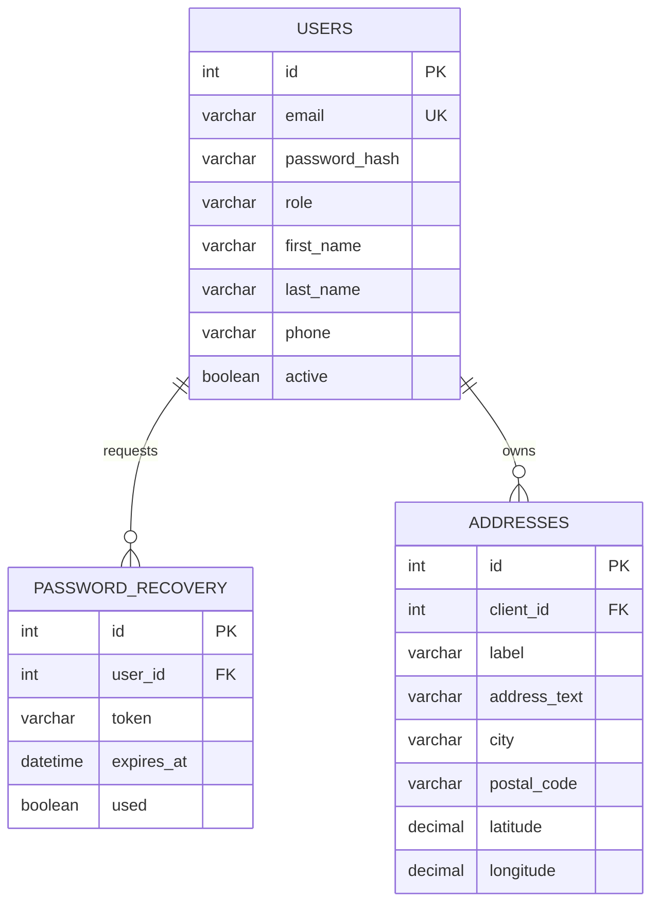

## 6.2 Sucursales y catálogo

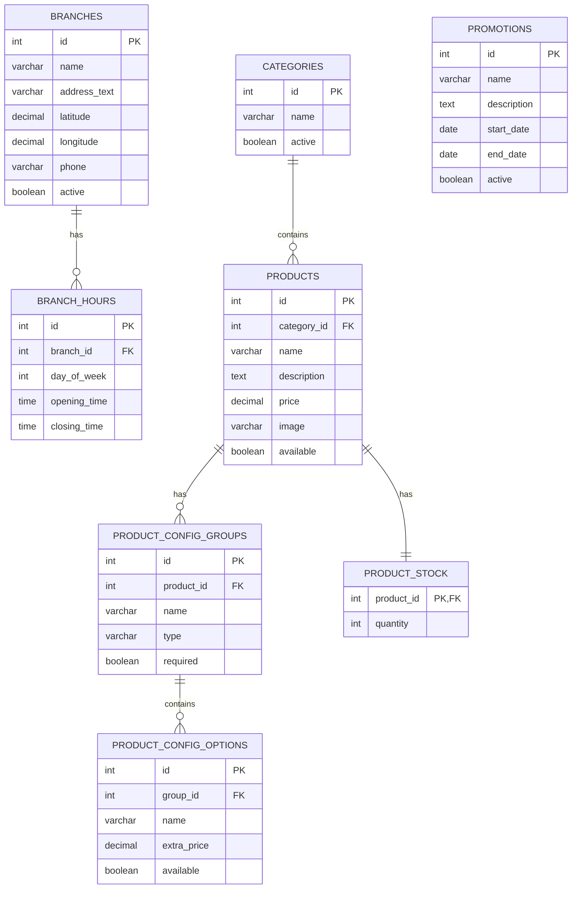

`PRODUCT_STOCK` representa únicamente el stock general solicitado en el sistema administrativo y en el reporte de productos sin stock. No se utiliza para reservar, descontar ni validar pedidos.

`PROMOTIONS` se administra como dato general. No se incluye un motor de reglas ni su aplicación automática al carrito.

## 6.3 Carrito

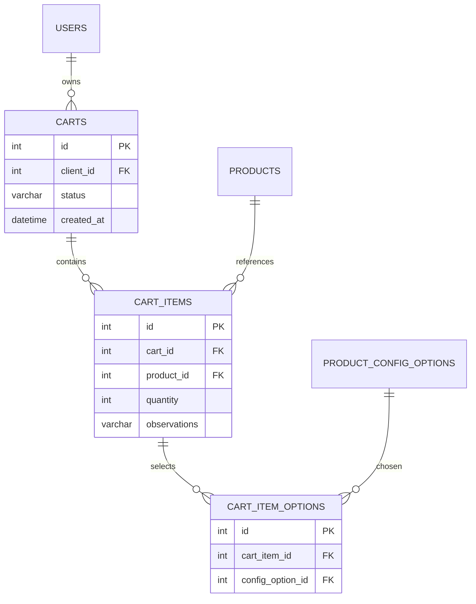

## 6.4 Pedidos

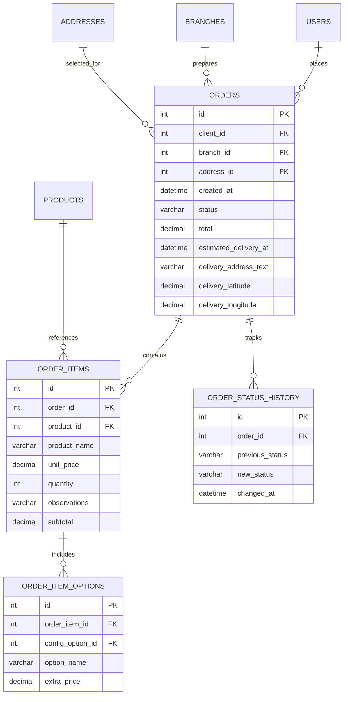

Los nombres y precios utilizados al confirmar se guardan en el detalle del pedido para que el historial muestre lo comprado en ese momento.

## 6.5 Estados generales y parámetros

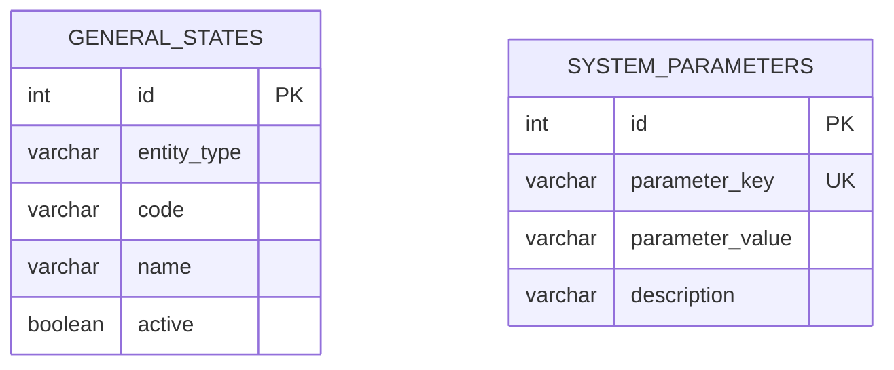

Parámetros iniciales posibles:

- `MAX_BRANCH_DISTANCE_KM`.
- `BASE_PREPARATION_MINUTES`.
- `AVERAGE_DELIVERY_SPEED_KMH`.

## 6.6 Relaciones principales resumidas

```text
Usuario cliente
├── Direcciones
├── Carritos
└── Pedidos

Sucursal
├── Horarios
└── Pedidos asignados

Categoría
└── Productos
    ├── Configuraciones
    └── Stock general

Carrito
└── Ítems
    └── Opciones seleccionadas

Pedido
├── Ítems
│   └── Opciones seleccionadas
└── Historial de estados
```

---

# 7. Diagramas Controller–Orchestrator–Service–Repository

## 7.1 Referencias visuales

- Naranja: controller.
- Verde: orchestrator.
- Azul: servicio primario.
- Amarillo: repositorio.

## 7.2 Vista global

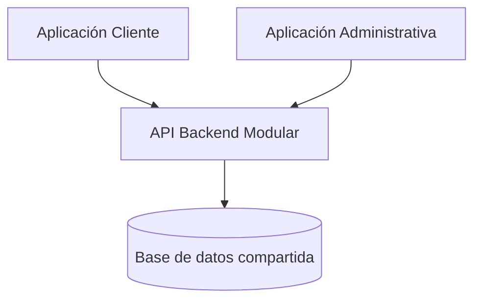

## 7.3 Autenticación y usuarios

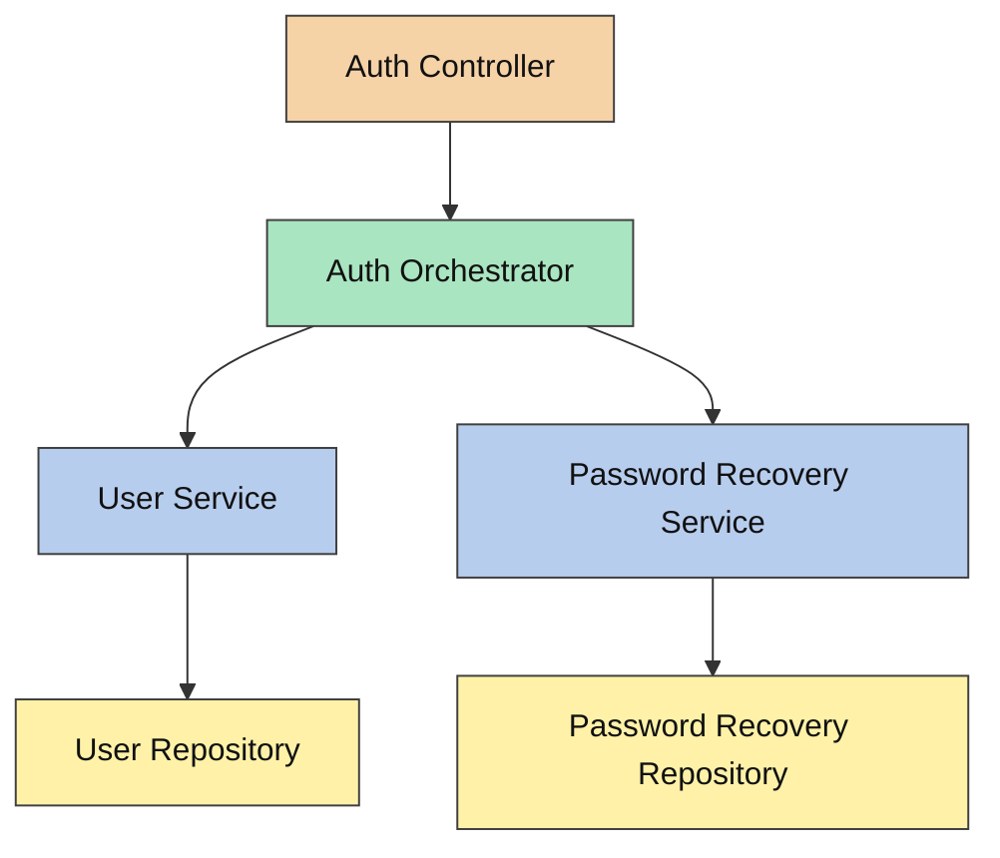

El orchestrator coordina el alta de usuario, el inicio de sesión y la recuperación de contraseña. `UserService` y `PasswordRecoveryService` no se llaman entre sí.

## 7.4 CRUD administrativos simples

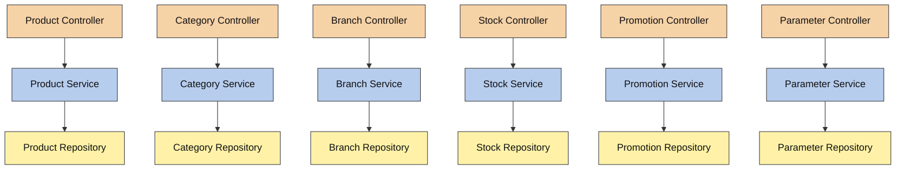

Cada operación afecta un único módulo, por lo que el controller puede llamar directamente al servicio primario correspondiente.

## 7.5 Carrito

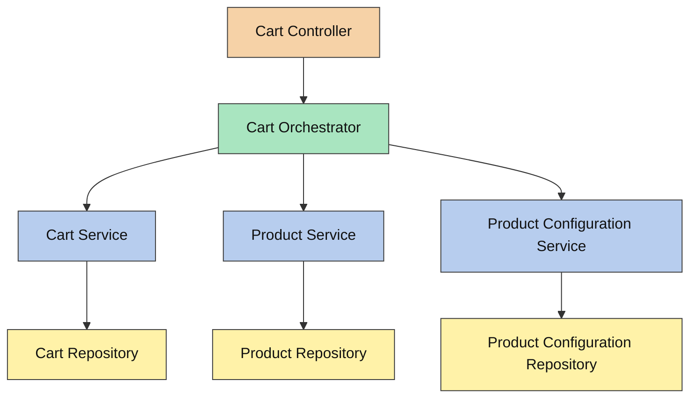

El orchestrator valida que el producto y sus configuraciones estén disponibles antes de pedirle a `CartService` que guarde el ítem.

## 7.6 Confirmación de pedido

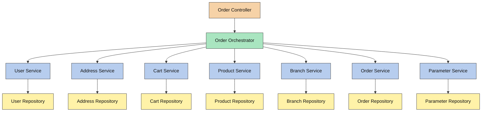

Responsabilidades del `OrderOrchestrator`:

1. Verificar que el cliente exista.
2. Verificar que la dirección pertenezca al cliente.
3. Obtener el carrito activo.
4. Validar que los productos continúen disponibles.
5. Obtener sucursales activas y abiertas.
6. Elegir la sucursal más cercana.
7. Calcular el total.
8. Calcular el tiempo estimado.
9. Crear el pedido y sus detalles.
10. Marcar el carrito como confirmado.

Ningún servicio primario llama a otro servicio primario.

## 7.7 Seguimiento y cambios de estado

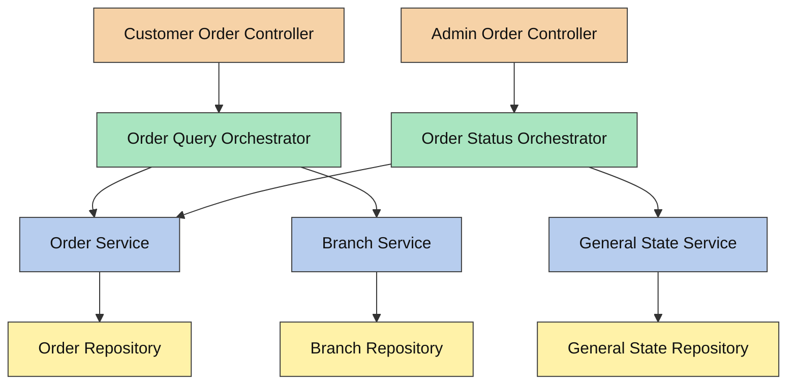

- `OrderQueryOrchestrator` arma la vista de seguimiento con pedido, sucursal e historial.
- `OrderStatusOrchestrator` verifica la transición y solicita a `OrderService` que registre el cambio.

## 7.8 Reportes de productos

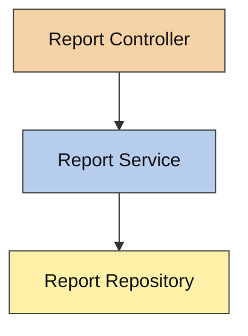

`ReportRepository` realizará las consultas necesarias sobre productos, pedidos, detalles de pedidos y stock general.

---

# 8. Flujos principales

## 8.1 Agregar un producto al carrito

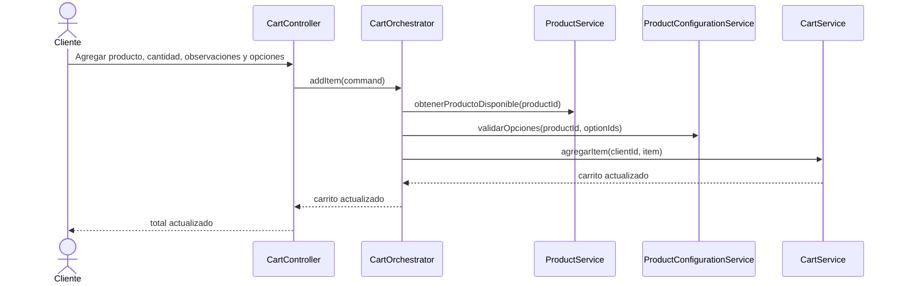

## 8.2 Confirmar un pedido

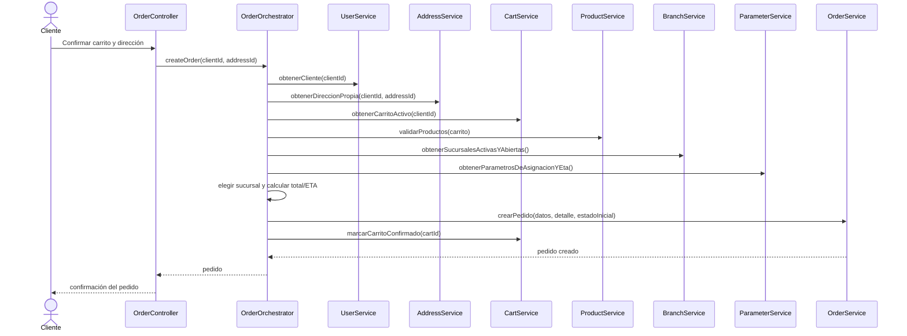

## 8.3 Cambiar el estado de un pedido

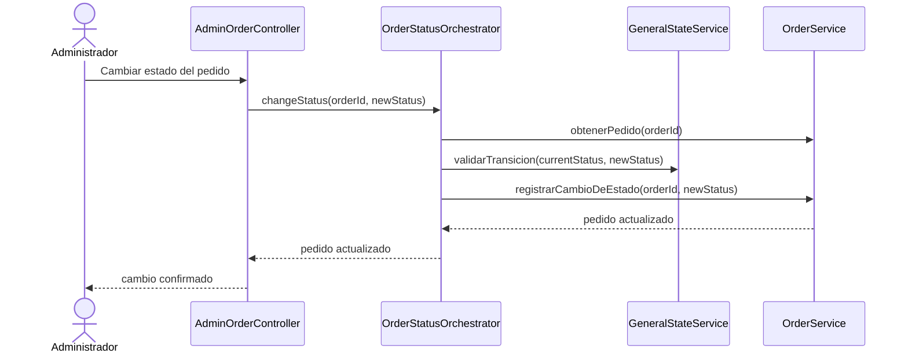

---

# 9. Máquina de estados

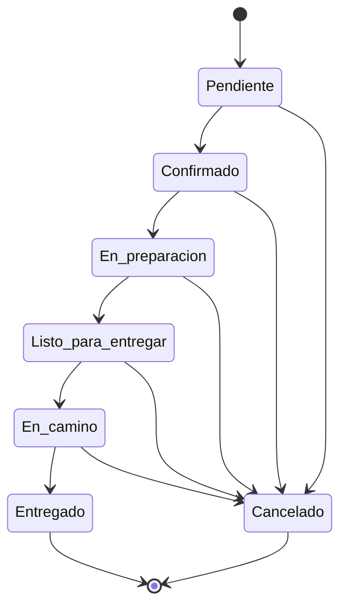

| Estado actual | Estados siguientes permitidos |
|---|---|
| Pendiente | Confirmado, Cancelado |
| Confirmado | En preparación, Cancelado |
| En preparación | Listo para entregar, Cancelado |
| Listo para entregar | En camino, Cancelado |
| En camino | Entregado, Cancelado |
| Entregado | Ninguno |
| Cancelado | Ninguno |

---

# 10. Reportes incluidos

Se implementarán únicamente los cuatro reportes base de la consigna.

## 10.1 Productos más vendidos

- Considera ítems de pedidos entregados.
- Agrupa por producto.
- Suma las cantidades vendidas.
- Ordena de mayor a menor.

## 10.2 Productos menos vendidos

- Considera todos los productos del catálogo.
- Suma sus cantidades vendidas en pedidos entregados.
- Incluye productos sin ventas.
- Ordena de menor a mayor.

## 10.3 Productos sin stock

- Consulta el stock general registrado para cada producto.
- Muestra los productos cuya cantidad sea cero.

## 10.4 Productos con mayor facturación

- Considera ítems de pedidos entregados.
- Multiplica precio por cantidad y suma el resultado por producto.
- Ordena de mayor a menor facturación.

---

# 11. Distribución del trabajo para tres desarrolladores

## 11.1 Thomas — SSR

Responsabilidades principales:

- Definición y mantenimiento de la arquitectura.
- Estructura de módulos y capas.
- Autenticación y recuperación de contraseña.
- `OrderOrchestrator`.
- Asignación de sucursal.
- Máquina de estados.
- Integración final entre módulos.
- Acompañamiento y revisión técnica de Mateo y Bosco.

## 11.2 Mateo — Trainee

Responsabilidades principales:

- Categorías.
- Productos.
- Configuraciones de productos.
- Sucursales.
- Horarios de sucursales.
- ABM administrativo de promociones.
- ABM administrativo de stock general.

## 11.3 Bosco — Trainee

Responsabilidades principales:

- Perfil del cliente.
- Direcciones y coordenadas.
- Carrito.
- Consulta de pedidos.
- Seguimiento e historial.
- Repetición de pedidos.
- Reportes de productos.

## 11.4 Trabajo compartido

Los tres integrantes participarán en:

- Definición de contratos entre módulos.
- Integración de la aplicación cliente y administrativa con la API.
- Revisión del cumplimiento de la regla de servicios primarios.
- Preparación de datos y demostración final.

---

# 12. Etapas de implementación

## Etapa 1 — Estructura y usuarios

- Crear el backend modular.
- Crear la base de datos compartida.
- Implementar usuarios y roles.
- Crear el administrador inicial.
- Implementar registro, login y recuperación de contraseña.
- Implementar perfil y direcciones.

**Responsables principales:** Thomas y Bosco.

## Etapa 2 — Administración y catálogo

- Implementar sucursales y horarios.
- Implementar categorías.
- Implementar productos.
- Implementar configuraciones especiales.
- Implementar ABM de stock general.
- Implementar ABM de promociones como datos administrativos.
- Implementar estados generales y parámetros.

**Responsable principal:** Mateo, con revisión de Thomas.

## Etapa 3 — Carrito y pedidos

- Implementar carrito e ítems.
- Implementar configuraciones y observaciones del carrito.
- Implementar cálculo del total.
- Implementar asignación de sucursal.
- Implementar confirmación del pedido.
- Implementar cambios de estado.
- Implementar seguimiento e historial.
- Implementar repetición de pedidos.

**Responsables principales:** Thomas y Bosco, con apoyo de Mateo.

## Etapa 4 — Reportes e integración

- Implementar productos más vendidos.
- Implementar productos menos vendidos.
- Implementar productos sin stock.
- Implementar productos con mayor facturación.
- Integrar aplicación cliente, aplicación administrativa, API y base de datos.
- Preparar la demostración del flujo completo.

**Responsables:** los tres integrantes.

---

# 13. Flujo completo para la demostración

1. Ingresar con el administrador inicial.
2. Crear una sucursal y cargar sus horarios.
3. Crear una categoría.
4. Crear un producto con una configuración especial.
5. Registrar el stock general del producto.
6. Registrar un cliente.
7. Iniciar sesión como cliente.
8. Crear una dirección con latitud y longitud.
9. Consultar las sucursales disponibles.
10. Consultar el catálogo.
11. Agregar un producto configurado al carrito.
12. Modificar la cantidad o las observaciones.
13. Confirmar el pedido.
14. Mostrar la sucursal asignada y el tiempo estimado.
15. Cambiar los estados desde la aplicación administrativa.
16. Consultar el seguimiento desde la aplicación cliente.
17. Consultar el pedido dentro del historial.
18. Repetir el pedido para generar un carrito nuevo.
19. Mostrar los cuatro reportes de productos.

---

# 14. Elementos expresamente fuera del alcance

No se incluyen funcionalidades de la **Extensión 1**:

- Stock independiente por sucursal.
- Validación de stock al confirmar un pedido.
- Reserva, descuento o liberación automática de stock.
- Niveles o alertas de stock.
- Reglas automáticas de promociones.
- Combos, descuentos, 2x1, cupones o envío gratuito aplicados al pedido.
- Reportes adicionales de pedidos, clientes, sucursales o promociones.

No se incluyen funcionalidades de la **Extensión 2**:

- Calificaciones.
- Notificaciones.
- Aplicación de repartidores.
- Asignación de repartidores.
- Viajes y entregas administradas por repartidores.
- Reportes adicionales relacionados con estas funcionalidades.

Tampoco se incluyen agregados no solicitados:

- Auditoría.
- Outbox.
- Colas de mensajes.
- Microservicios.
- Pago en línea.
- Navegación GPS real.
- Optimización de recorridos.
- Exportaciones adicionales.
- Funciones no mencionadas en la consigna base.

---

# 15. Resultado esperado

Al finalizar, el proyecto deberá permitir demostrar el siguiente proceso completo:

```text
Administrador configura sucursales, catálogo y parámetros
                         ↓
Cliente se registra y carga una dirección
                         ↓
Cliente consulta el catálogo y arma un carrito
                         ↓
El sistema calcula el total y asigna una sucursal
                         ↓
Cliente confirma el pedido
                         ↓
Administrador actualiza los estados
                         ↓
Cliente consulta seguimiento e historial
                         ↓
Administrador consulta los reportes de productos
```

La solución mantendrá una arquitectura clara:

```text
Controller
    ↓
Orchestrator, cuando sea necesario
    ↓
Servicios primarios independientes
    ↓
Repositorios
    ↓
Base de datos compartida
```

La regla final será siempre:

> **Un servicio primario nunca llama a otro servicio primario. La coordinación pertenece al orchestrator.**
