# Diagramas completos — Servicios y modelo de datos

**Proyecto:** Plataforma de pedidos para una cadena de comidas rápidas  
**Arquitectura:** monolito modular multicapa con patrón **Orchestrator**  
**Alcance:** únicamente las funcionalidades base de la consigna, sin extensiones ni componentes adicionales.

> Regla obligatoria: los servicios primarios nunca se comunican entre sí. Un caso de uso que necesita varios servicios es coordinado por un orchestrator.

**Referencias:** naranja = controller; verde = orchestrator; azul = servicio primario; amarillo = repositorio; gris = base de datos.

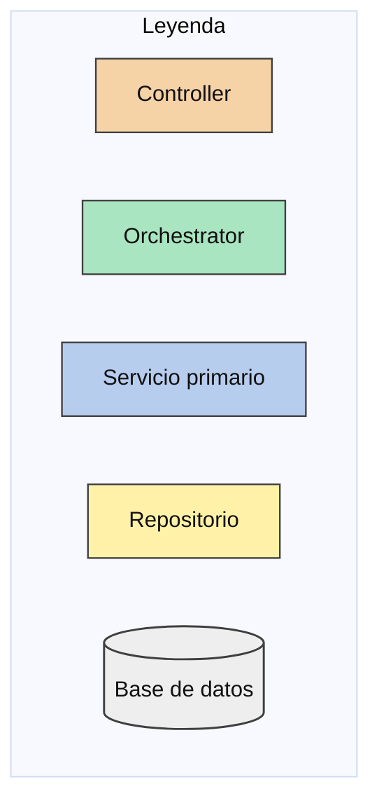

---

## 1. Vista general

```mermaid
%%{init: {"flowchart": {"curve": "basis"}}}%%
flowchart TB
    subgraph CONTROLLERS["CONTROLLERS"]
        direction LR
        A1["Auth"]:::controller
        A2["Profile"]:::controller
        A3["Admin User"]:::controller
        A4["Address"]:::controller
        A5["Branch Availability"]:::controller
        A6["Branch Admin"]:::controller
        A7["Catalog"]:::controller
        A8["Category Admin"]:::controller
        A9["Product Admin"]:::controller
        A10["Product Config Admin"]:::controller
        A11["Cart"]:::controller
        A12["Checkout"]:::controller
        A13["Customer Order"]:::controller
        A14["Admin Order"]:::controller
        A15["Stock Admin"]:::controller
        A16["Promotion Admin"]:::controller
        A17["General State Admin"]:::controller
        A18["System Parameter Admin"]:::controller
        A19["Report"]:::controller
    end

    subgraph ORCH["ORCHESTRATORS"]
        direction LR
        O1["Auth"]:::orchestrator
        O2["Branch Availability"]:::orchestrator
        O3["Catalog Query"]:::orchestrator
        O4["Cart"]:::orchestrator
        O5["Checkout / Create Order"]:::orchestrator
        O6["Order Query"]:::orchestrator
        O7["Repeat Order"]:::orchestrator
        O8["Order Status"]:::orchestrator
    end

    subgraph PRIM["SERVICIOS PRIMARIOS"]
        direction LR
        S1["User"]:::primary
        S2["Password Recovery"]:::primary
        S3["Address"]:::primary
        S4["Branch"]:::primary
        S5["Category"]:::primary
        S6["Product"]:::primary
        S7["Product Config"]:::primary
        S8["Cart"]:::primary
        S9["Order"]:::primary
        S10["Stock"]:::primary
        S11["Promotion"]:::primary
        S12["General State"]:::primary
        S13["System Parameter"]:::primary
        S14["Report"]:::primary
    end

    A1 --> O1
    A2 --> S1
    A3 --> S1
    A4 --> S3
    A5 --> O2
    A6 --> S4
    A7 --> O3
    A8 --> S5
    A9 --> S6
    A10 --> S7
    A11 --> O4
    A12 --> O5
    A13 --> O6
    A13 --> O7
    A14 --> O6
    A14 --> O8
    A15 --> S10
    A16 --> S11
    A17 --> S12
    A18 --> S13
    A19 --> S14
    classDef controller fill:#f6d2a7,stroke:#3f3f3f,stroke-width:1.2px,color:#111;
    classDef orchestrator fill:#a9e5c0,stroke:#3f3f3f,stroke-width:1.2px,color:#111;
    classDef primary fill:#b7cdee,stroke:#3f3f3f,stroke-width:1.2px,color:#111;
```

Cada orchestrator se detalla por separado en las secciones siguientes.

---

## 2. Auth Orchestrator

**Caso de uso:** registro, inicio de sesión, cierre de sesión y recuperación de contraseña. Coordina `UserService` y `PasswordRecoveryService`, que no se llaman entre sí.

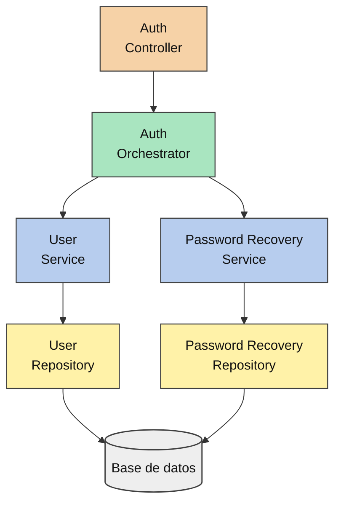

---

## 3. Branch Availability Orchestrator

**Caso de uso:** dado un cliente y una ubicación, devuelve las sucursales activas y abiertas que cubren esa ubicación (HU-C06).

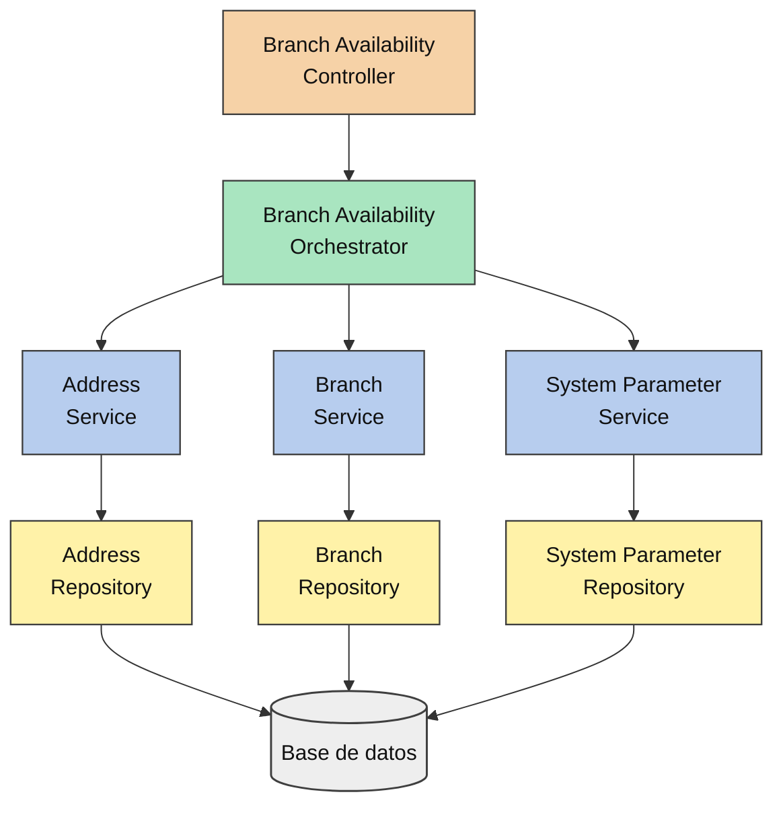

---

## 4. Catalog Query Orchestrator

**Caso de uso:** consulta del catálogo disponible (categorías, productos y configuraciones) para la aplicación cliente (HU-C07, HU-C08).

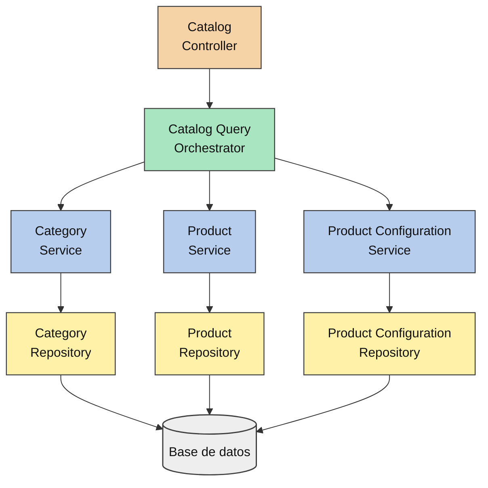

---

## 5. Cart Orchestrator

**Caso de uso:** agregar ítems al carrito con cantidad, observaciones y configuraciones; validar que el producto y sus opciones estén disponibles antes de guardar (HU-C10, HU-C11).

---

## 6. Checkout / Create Order Orchestrator

**Caso de uso:** confirmar el carrito como pedido. Valida cliente, dirección propia, carrito activo y productos disponibles; elige la sucursal activa y abierta más cercana dentro de la distancia máxima; calcula total y ETA; crea el pedido con su detalle e historial; marca el carrito como confirmado (HU-C13, HU-S01, HU-S02, HU-S03, HU-S04).

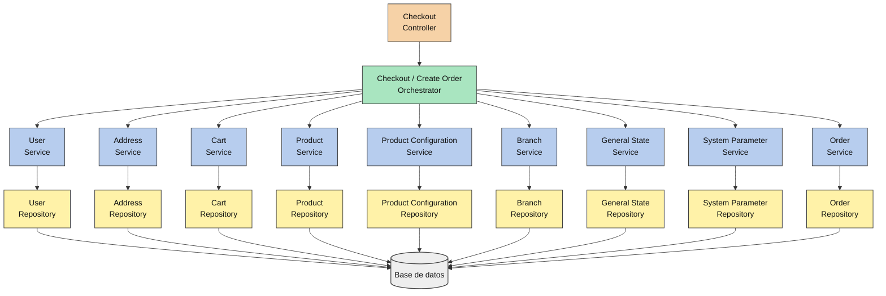

---

## 7. Order Query Orchestrator

**Caso de uso:** consulta de pedidos (seguimiento, detalle e historial) tanto para el cliente (pedidos propios) como para el administrador (HU-C14, HU-C15, HU-C16, HU-A11).

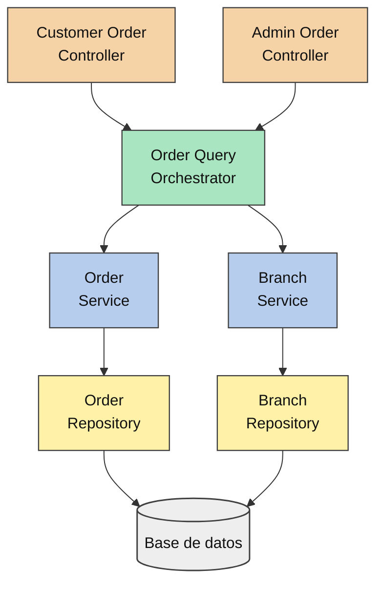

---

## 8. Repeat Order Orchestrator

**Caso de uso:** repetir un pedido anterior creando un carrito nuevo solo con los productos que continúen disponibles (HU-C17, RF-067).

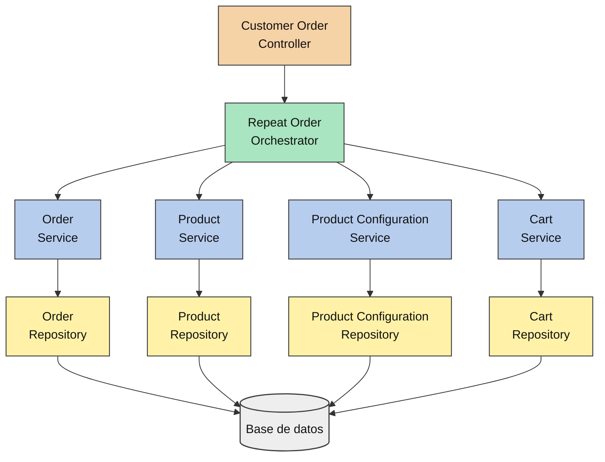

---

## 9. Order Status Orchestrator

**Caso de uso:** cambiar el estado de un pedido desde la administración. Valida que la transición respete la máquina de estados y registra el cambio con fecha y hora (HU-A12, HU-S03).

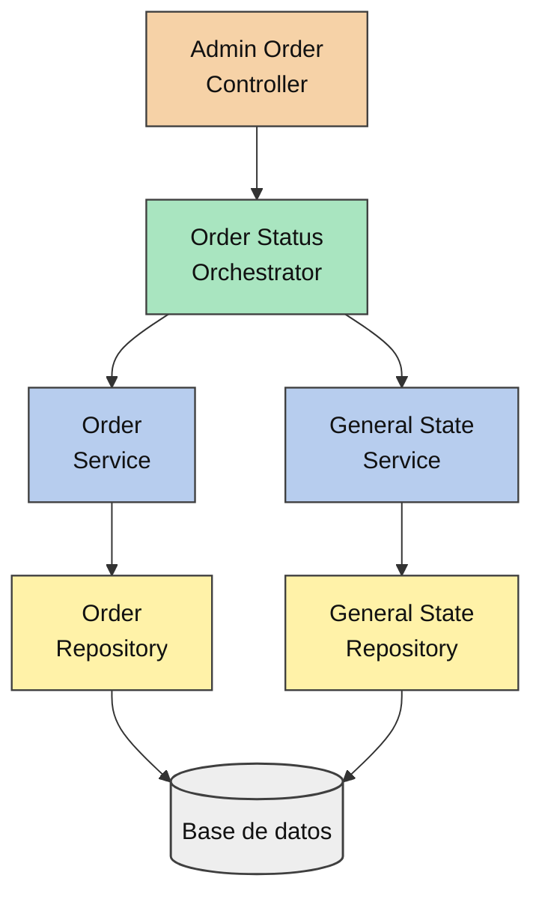

---

## 10. CRUD simples — Controller → Service → Repository

Cada operación afecta un único módulo, por lo que el controller llama directamente al servicio primario sin orchestrator.

```mermaid
%%{init: {"flowchart": {"curve": "basis"}}}%%
flowchart TB
    PC["Profile<br/>Controller"]:::controller --> US["User<br/>Service"]:::primary
    AUC["Admin User<br/>Controller"]:::controller --> US
    ADC["Address<br/>Controller"]:::controller --> AS["Address<br/>Service"]:::primary
    BRC["Branch Admin<br/>Controller"]:::controller --> BS["Branch<br/>Service"]:::primary
    CTC["Category Admin<br/>Controller"]:::controller --> CS["Category<br/>Service"]:::primary
    PRC["Product Admin<br/>Controller"]:::controller --> PS["Product<br/>Service"]:::primary
    PCC["Product Config<br/>Admin Controller"]:::controller --> PCS["Product Configuration<br/>Service"]:::primary
    STC["Stock Admin<br/>Controller"]:::controller --> SS["Stock<br/>Service"]:::primary
    PMC["Promotion Admin<br/>Controller"]:::controller --> PMS["Promotion<br/>Service"]:::primary
    GSC["General State<br/>Admin Controller"]:::controller --> GSS["General State<br/>Service"]:::primary
    SPC["System Parameter<br/>Admin Controller"]:::controller --> PAS["System Parameter<br/>Service"]:::primary
    RPC["Report<br/>Controller"]:::controller --> RS["Report<br/>Service"]:::primary

    US --> UR["User<br/>Repository"]:::repository
    AS --> AR["Address<br/>Repository"]:::repository
    BS --> BR["Branch<br/>Repository"]:::repository
    CS --> CR["Category<br/>Repository"]:::repository
    PS --> PR["Product<br/>Repository"]:::repository
    PCS --> PCR["Product Configuration<br/>Repository"]:::repository
    SS --> SR["Stock<br/>Repository"]:::repository
    PMS --> PMR["Promotion<br/>Repository"]:::repository
    GSS --> GSR["General State<br/>Repository"]:::repository
    PAS --> PAR["System Parameter<br/>Repository"]:::repository
    RS --> RR["Report Read<br/>Repository"]:::repository

    UR --> DB[("Base de datos")]:::database
    AR --> DB
    BR --> DB
    CR --> DB
    PR --> DB
    PCR --> DB
    SR --> DB
    PMR --> DB
    GSR --> DB
    PAR --> DB
    RR -. consultas de solo lectura .-> DB
    classDef controller fill:#f6d2a7,stroke:#3f3f3f,stroke-width:1.2px,color:#111;
    classDef primary fill:#b7cdee,stroke:#3f3f3f,stroke-width:1.2px,color:#111;
    classDef repository fill:#fff2a8,stroke:#3f3f3f,stroke-width:1.2px,color:#111;
    classDef database fill:#eeeeee,stroke:#3f3f3f,stroke-width:1.5px,color:#111;
```

---

## 11. DER completo — Todas las tablas y relaciones

El diagrama está agrupado por dominio (usuarios, catálogo, carrito, pedidos, parámetros). Cuando una entidad pertenece a otro dominio (por ejemplo `USERS` en el bloque del carrito) se declara como **stub**, con sus campos mínimos, para que el bloque sea legible por sí solo y las relaciones crucen correctamente.

### 11.1 Dominio: usuarios, direcciones y recuperación de contraseña

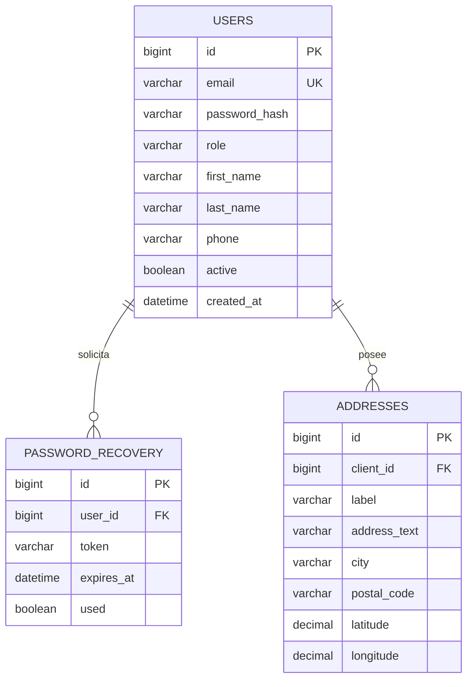

### 11.2 Dominio: sucursales, catálogo y stock

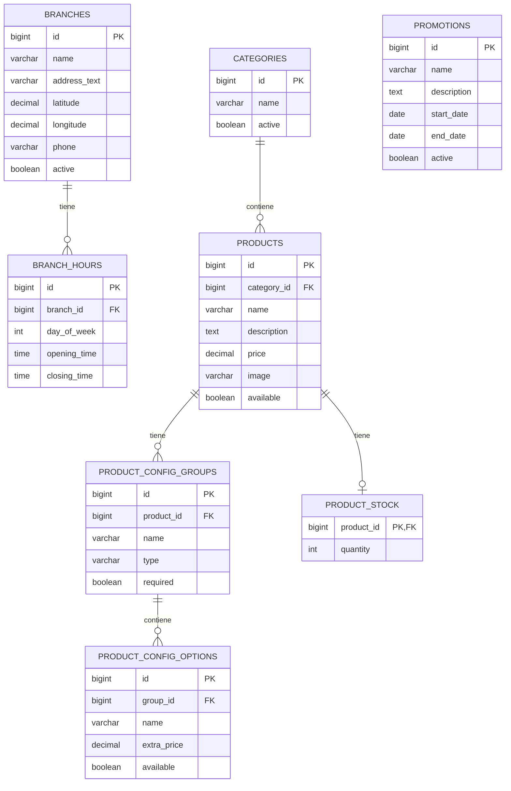

### 11.3 Dominio: carrito de compras

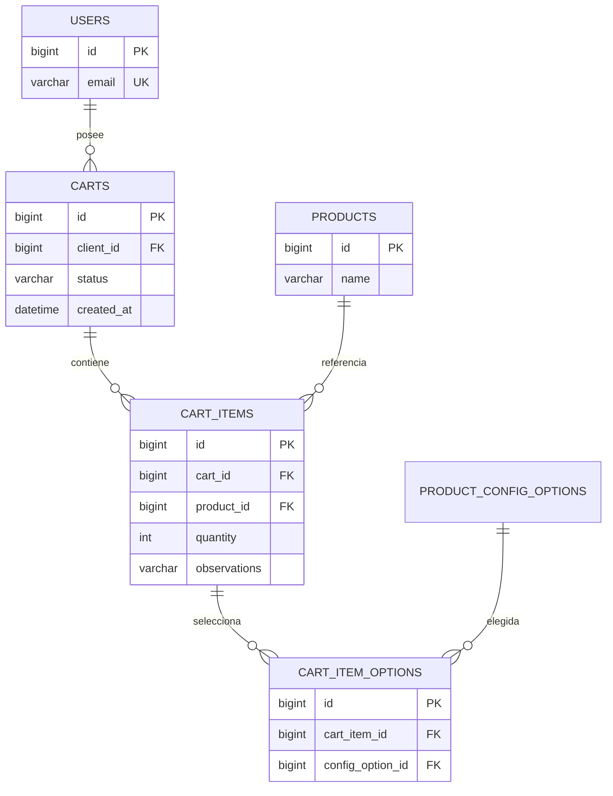

### 11.4 Dominio: pedidos y su historial

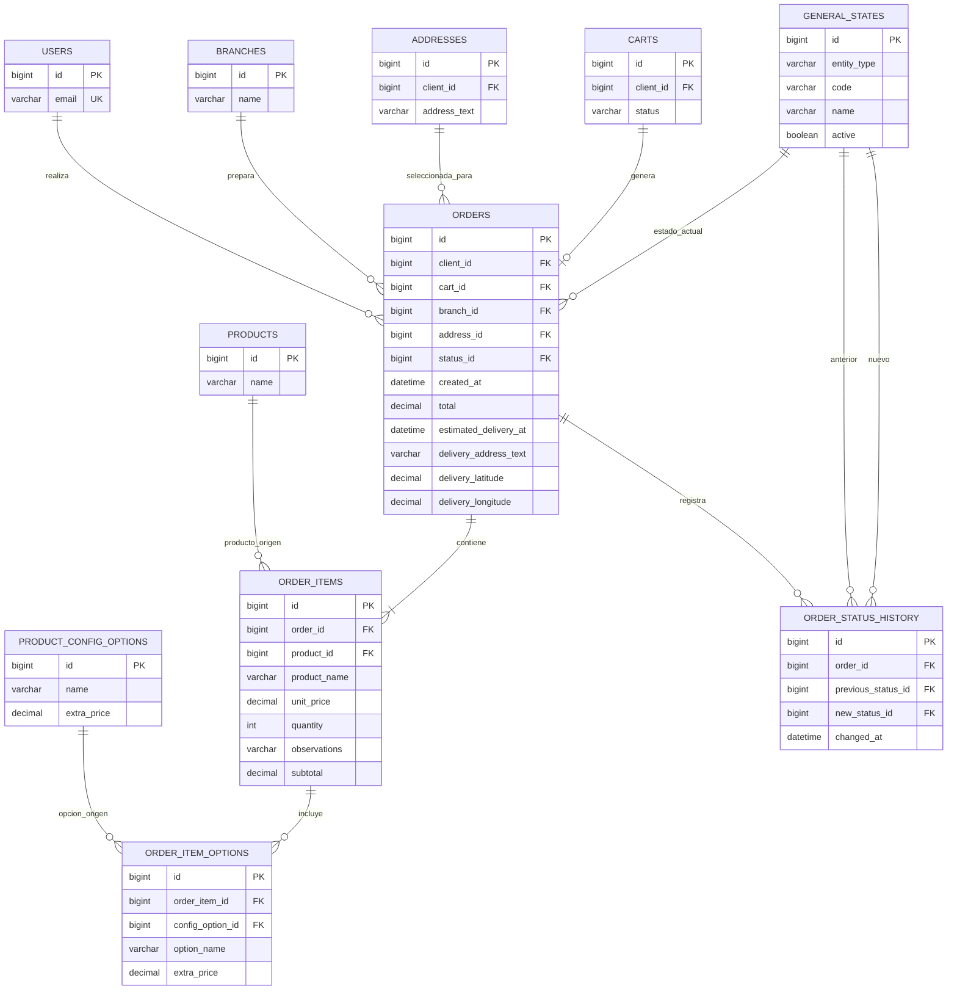

`ORDERS.cart_id` es **nulable** y se setea al confirmar el pedido; el carrito que lo origina se marca como confirmado (RF-059). `previous_status_id` en `ORDER_STATUS_HISTORY` es **nulable**: el primer cambio de estado no tiene estado anterior. `new_status_id` es obligatorio.

### 11.5 Dominio: parámetros del sistema

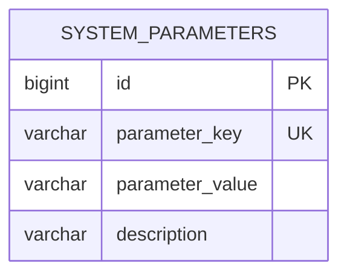

`PRODUCT_STOCK` representa stock general por producto, únicamente para su ABM administrativo y el reporte de productos sin stock. `PROMOTIONS` se mantiene como una entidad administrable independiente, sin motor de reglas ni aplicación automática a pedidos.
