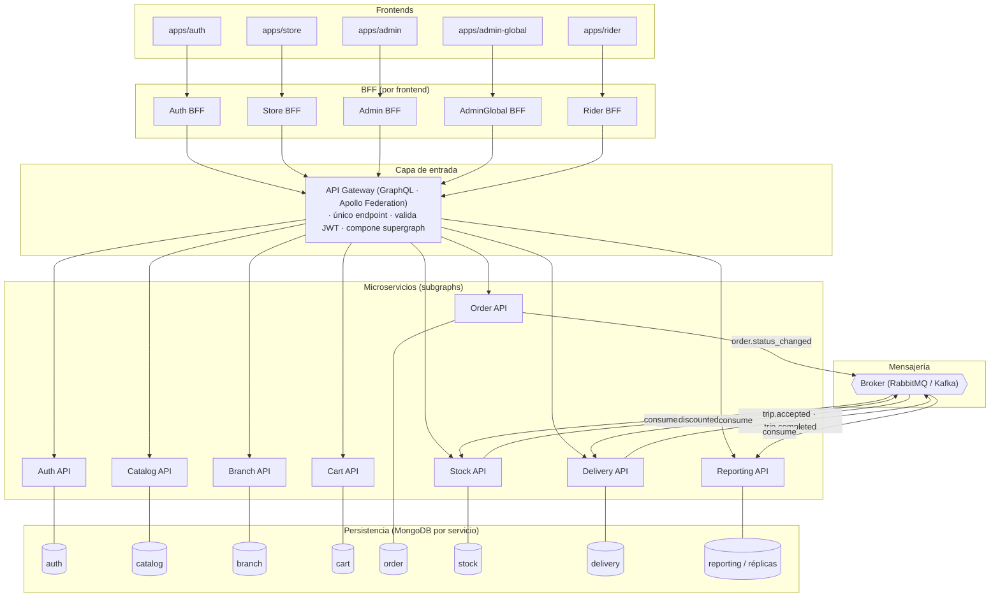
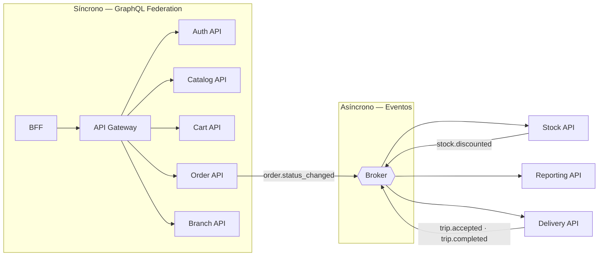
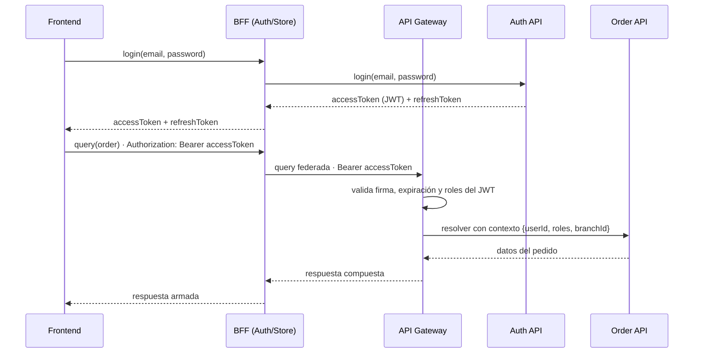

# Requerimientos — Backend (microservicios)

**Proyecto:** Plataforma de pedidos para una cadena de comidas rápidas
**Documento:** requerimientos funcionales y no funcionales del backend
**Arquitectura:** microservicios + API Gateway GraphQL + MongoDB
**Fuente de verdad funcional:** `client/docs/requerimientos-funcionales.md`
**Versión:** 1.0

> Este documento define el alcance del **backend** como un conjunto de microservicios detrás de un **API Gateway (Apollo Federation)**, expuesto a los frontends a través de **BFF** (Backend for Frontend). Cada servicio es dueño de su dominio y de su propia base **MongoDB**. La propuesta de arquitectura está en `plan/backend-microservicios-propuesta.md`.

---

## Índice

1. [Objetivo y alcance](#1-objetivo-y-alcance)
2. [Arquitectura general](#2-arquitectura-general)
3. [Servicios y responsabilidades](#3-servicios-y-responsabilidades)
4. [Capa de entrada: BFF y API Gateway](#4-capa-de-entrada-bff-y-api-gateway)
5. [Auth API](#5-auth-api)
6. [Catalog API](#6-catalog-api)
7. [Branch API](#7-branch-api)
8. [Cart API](#8-cart-api)
9. [Order API](#9-order-api)
10. [Stock API](#10-stock-api)
11. [Delivery API](#11-delivery-api)
12. [Reporting API](#12-reporting-api)
13. [Comunicación entre servicios](#13-comunicación-entre-servicios)
14. [Autenticación y autorización](#14-autenticación-y-autorización)
15. [Modelo de datos (MongoDB)](#15-modelo-de-datos-mongodb)
16. [Requerimientos no funcionales](#16-requerimientos-no-funcionales)
17. [Fuera del alcance](#17-fuera-del-alcance)

---

# 1. Objetivo y alcance

El backend da soporte a los cinco frontends (`apps/auth`, `apps/store`, `apps/admin`, `apps/admin-global`, `apps/rider`). Cada frontend consume su **BFF**, que a su vez habla con un **API Gateway** (GraphQL).

Se implementa como un conjunto de **microservicios** más una capa de entrada:

1. **BFF (Backend for Frontend)** — `Auth BFF`, `Store BFF`, `Admin BFF`, `AdminGlobal BFF`, `Rider BFF`: punto de entrada por frontend y dueños de la orquestación de casos de uso.
2. **API Gateway (GraphQL / Apollo Federation)** — router de federación delgado.
3. **Auth API** — identidad, sesión, JWT, recuperación de contraseña y personal.
4. **Catalog API** — categorías, productos, configuraciones, ingredientes/recetas y promociones.
5. **Branch API** — sucursales, horarios y geolocalización.
6. **Cart API** — carrito, ítems y total.
7. **Order API** — pedidos, estados, asignación de sucursal y ETA.
8. **Stock API** — inventario de ingredientes por sucursal.
9. **Delivery API** — repartidores, viajes y ofertas.
10. **Reporting API** — reportes de productos.

Cada servicio posee su propia base **MongoDB**. Los BFF son stateless (sin base propia). La comunicación es **síncrona** (BFF → gateway → subgraphs, mediante GraphQL Federation) y **asíncrona** (mediante eventos en un broker).

---

# 2. Arquitectura general



---

# 3. Servicios y responsabilidades

| Servicio | Responsabilidad | Colecciones propias (MongoDB) |
|---|---|---|
| **Auth BFF** | Contrato fijo con `apps/auth`: login, registro, recuperación, refresh, logout, `me`. | Ninguna (stateless). |
| **Store BFF** | Orquestación de la Tienda: `home`, detalle de producto, carrito, `checkout`, seguimiento, repetir pedido. | Ninguna (stateless). |
| **Admin BFF** (sucursal) | Orquestación del admin de sucursal: pausar/reactivar productos, stock de su almacén, pedidos y reportes de su sucursal. | Ninguna (stateless). |
| **AdminGlobal BFF** | Orquestación del admin global: productos/recetas, catálogo de ingredientes, categorías, sucursales, promociones, personal, vista global de pedidos/stock/reportes. | Ninguna (stateless). |
| **Rider BFF** | Orquestación del Repartidor: ofertas de viaje, aceptar/rechazar, retiros/entregas, historial. | Ninguna (stateless). |
| **API Gateway** | Router de federación detrás de los BFF; valida JWT, compone el supergraph, rate limiting, logs. | Ninguna. |
| **Auth API** | Registro, login, refresh, recuperación de contraseña, perfiles, personal, roles. Emite/valida JWT. | `users`, `passwordRecovery`, `refreshTokens` |
| **Catalog API** | Categorías, productos, configuraciones, ingredientes/recetas, promociones. | `categories`, `products`, `ingredients`, `promotions` |
| **Branch API** | Sucursales, horarios, cálculo de distancia y disponibilidad. | `branches` |
| **Cart API** | Carrito e ítems, validación, total. | `carts` |
| **Order API** | Confirmación, asignación de sucursal, máquina de estados, ETA, historial. | `orders` |
| **Stock API** | Inventario de ingredientes por sucursal, ajustes, descuento. | `branchStock`, `stockMovements` |
| **Delivery API** | Repartidores, disponibilidad/ubicación, ofertas de viaje, viajes. | `riders`, `trips` |
| **Reporting API** | Reportes de productos (lectura). | Réplicas/eventos (no escribe). |

---

# 4. Capa de entrada: BFF y API Gateway

## 4.1 BFF (Backend for Frontend)

Cada frontend tiene su propio **BFF**: un servidor GraphQL que expone el esquema específico de ese cliente y es dueño de la **orquestación** de los casos de uso cross (orden, reglas, fallbacks). El BFF no tiene base de datos propia y consume el API Gateway para resolver datos de dominio.

| BFF | Casos de uso cross |
|---|---|
| **Auth BFF** | `login`, `register`, `requestPasswordRecovery`, `resetPassword`, `refreshToken`, `logout`, `me`. |
| **Store BFF** | `home(lat,lng)` (sucursales + catálogo + stock), `getProductDetail`, `addToCart`, `checkout`, `trackOrder`, `repeatOrder`. |
| **Admin BFF** (sucursal) | pausar/reactivar productos de su sucursal, stock de su almacén, pedidos y reportes de su sucursal. |
| **AdminGlobal BFF** | productos con receta/ingredientes, catálogo de ingredientes, categorías, sucursales, promociones, personal vinculado a sucursal, vista global de pedidos/stock/reportes. |
| **Rider BFF** | `offerTrip`, aceptar/rechazar viaje, marcar retiro/entrega, historial de viajes. |

| ID | Requerimiento |
|---|---|
| RQ-BFF-01 | Deberá existir un BFF por frontend: `Auth BFF`, `Store BFF`, `Admin BFF`, `AdminGlobal BFF` y `Rider BFF`. |
| RQ-BFF-02 | Cada BFF deberá exponer un esquema GraphQL propio y acotado a las necesidades de su frontend. |
| RQ-BFF-03 | El BFF deberá ser el único dueño de la orquestación de casos de uso cross (orden, reglas y fallbacks). |
| RQ-BFF-04 | El BFF deberá consumir el API Gateway para resolver datos de dominio, reenviando el token del usuario (no accede a servicios ni bases directamente). |
| RQ-BFF-05 | El BFF deberá ser stateless: sin base de datos ni estado de negocio propio. |
| RQ-BFF-06 | El `Auth BFF` deberá ser el contrato fijo del frontend de auth y el lugar para lógica adicional (rotación de tokens, reglas post-login). |
| RQ-BFF-07 | El cliente no deberá orquestar reglas de negocio: solo consume su BFF. |

## 4.2 API Gateway (GraphQL)

El gateway es el **router de federación** que queda detrás de los BFF. Expone un solo endpoint `POST /graphql` (usado por los BFF).

| ID | Requerimiento |
|---|---|
| RQ-GW-01 | El gateway deberá exponer un único endpoint GraphQL (`/graphql`). |
| RQ-GW-02 | El gateway deberá componer el *supergraph* a partir de los *subgraphs* de cada servicio (Apollo Federation v2). |
| RQ-GW-03 | El gateway deberá validar la firma, la expiración y los roles del JWT en cada request antes de resolver. |
| RQ-GW-04 | El gateway deberá inyectar en el contexto GraphQL el `userId`, los `roles` y la `branchId` (si aplica) del usuario autenticado. |
| RQ-GW-05 | El gateway deberá rechazar requests sin token válido en los campos/consultas protegidos, con un error de autenticación estandarizado. |
| RQ-GW-06 | El gateway deberá propagar los errores de cada subgraph en un formato único (`errors[]` con código, mensaje y `path`). |
| RQ-GW-07 | El gateway deberá soportar consultas federadas que crucen dominios (ej. `Order.client` resuelto contra el subgraph de Auth, `Product.category` contra Catalog). |
| RQ-GW-08 | El gateway deberá aplicar *rate limiting* por cliente/token. |
| RQ-GW-09 | El gateway deberá exponer `GET /health` y `GET /graphql` (sandbox) en entornos de desarrollo. |
| RQ-GW-10 | El gateway no deberá contener lógica de negocio de ningún dominio: solo enruta, autentica y compone. |

### Ejemplo de query federada

```graphql
query PedidoCliente($id: ID!) {
  order(id: $id) {              # Order API
    number
    status
    total
    branch { name }             # Branch API
    client { name email }       # Auth API
    items { product { name } quantity }  # Catalog API
  }
}
```

---

# 5. Auth API

Dueño de la identidad, la sesión y los roles. Es el **único** servicio que emite y valida JWT.

### 5.1 Roles

| Rol | Descripción |
|---|---|
| `customer` | Cliente de la Tienda. |
| `branch_admin` | Admin de una sucursal específica. |
| `super_admin` | Admin global. |
| `rider` | Repartidor. |

### 5.2 Requerimientos

| ID | Requerimiento |
|---|---|
| RQ-AUTH-01 | El sistema deberá permitir el registro de un cliente con nombre, apellido, correo, teléfono y contraseña. |
| RQ-AUTH-02 | El correo deberá identificar de forma única a cada usuario. |
| RQ-AUTH-03 | La contraseña deberá almacenarse con hash (bcrypt/argon2); nunca en texto plano. |
| RQ-AUTH-04 | El sistema deberá permitir el login de clientes, admins y repartidores con correo y contraseña. |
| RQ-AUTH-05 | El login deberá devolver un `accessToken` (JWT de corta vida) y un `refreshToken`. |
| RQ-AUTH-06 | El login fallido deberá devolver un error genérico ("Credenciales inválidas") sin revelar si falló el correo o la contraseña. |
| RQ-AUTH-07 | El sistema deberá permitir refrescar el `accessToken` a partir de un `refreshToken` válido. |
| RQ-AUTH-08 | El sistema deberá permitir cerrar sesión (revocar el `refreshToken`). |
| RQ-AUTH-09 | El sistema deberá permitir solicitar recuperación de contraseña y responder de forma neutral (sin revelar si el correo existe). |
| RQ-AUTH-10 | El sistema deberá generar un token de recuperación con expiración y permitir restablecer la contraseña con él. |
| RQ-AUTH-11 | Un usuario autenticado deberá poder consultar y modificar su propio perfil. |
| RQ-AUTH-12 | El sistema deberá crearse con un administrador inicial (`super_admin`) por seed. |
| RQ-AUTH-13 | Un `super_admin` deberá poder crear colaboradores de sucursal (`branch_admin`) y vincularlos a una sucursal existente. |
| RQ-AUTH-14 | Un `super_admin` deberá poder crear otros `super_admin`. |
| RQ-AUTH-15 | El sistema deberá poder crear repartidores (`rider`) con su vehículo y teléfono. |
| RQ-AUTH-16 | El sistema deberá poder activar/desactivar usuarios (sin borrado físico). |
| RQ-AUTH-17 | El subgraph de Auth deberá exponer la entidad `User` como tipo federado (`@key`) para que otros servicios la referencien. |
| RQ-AUTH-18 | El sistema deberá devolver el `role` y los datos del perfil en el `me`/`currentUser`. |

---

# 6. Catalog API

Dueño del catálogo global: categorías, productos, configuraciones, ingredientes/recetas y promociones.

### 6.1 Requerimientos

| ID | Requerimiento |
|---|---|
| RQ-CAT-01 | Un admin global deberá poder crear, consultar, modificar y activar/desactivar categorías. |
| RQ-CAT-02 | Una categoría deberá tener nombre y estado (activa/inactiva). |
| RQ-CAT-03 | Un admin global deberá poder crear, consultar, modificar y activar/desactivar productos. |
| RQ-CAT-04 | Un producto deberá tener nombre, descripción, categoría, precio, imagen (opcional) y disponibilidad. |
| RQ-CAT-05 | El catálogo público deberá devolver únicamente categorías activas y productos disponibles. |
| RQ-CAT-06 | Un producto deberá poder tener configuraciones especiales (tamaño, sabor, adicionales, eliminaciones). |
| RQ-CAT-07 | Cada configuración deberá indicar si es obligatoria, el tipo de selección (única/múltiple), mín/máx y sus opciones. |
| RQ-CAT-08 | Cada opción de configuración deberá poder modificar el precio (variación `+$`). |
| RQ-CAT-09 | Un admin global deberá poder mantener el catálogo de ingredientes (nombre y unidad). |
| RQ-CAT-10 | Un ingrediente usado en recetas activas no deberá eliminarse, solo desactivarse. |
| RQ-CAT-11 | Un admin global deberá poder definir la receta de un producto (ingrediente + cantidad). |
| RQ-CAT-12 | La cantidad de un ingrediente en una receta deberá poder variar según la opción seleccionada (ej. "Doble" = 2 medallones). |
| RQ-CAT-13 | Un admin global deberá poder crear, consultar, modificar y activar/desactivar promociones como información general (sin motor de descuentos). |
| RQ-CAT-14 | El subgraph de Catalog deberá exponer `Product`, `Category` e `Ingredient` como tipos federados. |

---

# 7. Branch API

Dueño de las sucursales, sus horarios y el cálculo de disponibilidad geográfica.

### 7.1 Requerimientos

| ID | Requerimiento |
|---|---|
| RQ-BRN-01 | Un admin global deberá poder crear, consultar, modificar y activar/desactivar sucursales. |
| RQ-BRN-02 | Una sucursal deberá tener nombre, dirección textual, latitud, longitud, teléfono y estado. |
| RQ-BRN-03 | Una sucursal deberá tener horarios de atención por día (apertura/cierre, o cerrado). |
| RQ-BRN-04 | El sistema deberá poder listar las sucursales activas y abiertas para una ubicación (lat/lng) dentro de la distancia máxima configurada. |
| RQ-BRN-05 | El sistema deberá calcular la distancia entre la sucursal y la dirección del cliente. |
| RQ-BRN-06 | Una sucursal inactiva o cerrada no deberá aparecer como disponible para un pedido. |
| RQ-BRN-07 | El subgraph de Branch deberá exponer `Branch` como tipo federado. |
| RQ-BRN-08 | El servicio deberá permitir al `Order API` consultar la sucursal activa y abierta más cercana (asignación). |

---

# 8. Cart API

Dueño del carrito, sus ítems y el cálculo del total.

### 8.1 Requerimientos

| ID | Requerimiento |
|---|---|
| RQ-CART-01 | Un cliente autenticado deberá tener un carrito activo (o crearlo bajo demanda). |
| RQ-CART-02 | El sistema deberá agregar ítems al carrito validando que el producto y sus configuraciones estén disponibles. |
| RQ-CART-03 | Cada ítem deberá registrar producto, cantidad, observaciones y opciones seleccionadas. |
| RQ-CART-04 | El sistema deberá permitir modificar cantidad, observaciones y configuraciones de un ítem. |
| RQ-CART-05 | El sistema deberá permitir eliminar ítems del carrito. |
| RQ-CART-06 | El sistema deberá calcular el total del carrito a partir de precios, cantidades y adicionales. |
| RQ-CART-07 | El total deberá recalcularse en el servidor (el cliente nunca lo calcula como verdad final). |
| RQ-CART-08 | El carrito deberá poder marcarse como "confirmado" al convertirse en pedido (RF-059). |
| RQ-CART-09 | Un carrito confirmado no deberá poder modificarse. |
| RQ-CART-10 | El subgraph de Cart deberá exponer `Cart` y `CartItem` como tipos federados. |

---

# 9. Order API

Núcleo del sistema: confirmación de pedido, asignación de sucursal, máquina de estados y ETA.

### 9.1 Estados y transiciones

| Estado | Siguientes permitidos |
|---|---|
| `PENDING` | `CONFIRMED`, `CANCELLED` |
| `CONFIRMED` | `PREPARING`, `CANCELLED` |
| `PREPARING` | `READY_FOR_DELIVERY`, `CANCELLED` |
| `READY_FOR_DELIVERY` | `ON_THE_WAY`, `CANCELLED` |
| `ON_THE_WAY` | `DELIVERED`, `CANCELLED` |
| `DELIVERED` | — |
| `CANCELLED` | — |

### 9.2 Requerimientos

| ID | Requerimiento |
|---|---|
| RQ-ORD-01 | El sistema deberá confirmar un carrito como pedido validando cliente, dirección, carrito, productos y el **stock de ingredientes** de la sucursal asignada (consulta síncrona a Stock API). |
| RQ-ORD-02 | Para confirmar, el cliente deberá haber seleccionado una dirección propia. |
| RQ-ORD-03 | El sistema deberá asignar al pedido la sucursal activa y abierta más cercana dentro de la distancia máxima. |
| RQ-ORD-04 | Si no existe sucursal disponible, el pedido no deberá confirmarse. |
| RQ-ORD-05 | El pedido deberá registrar cliente, sucursal asignada, dirección de entrega (snapshot), fecha y hora. |
| RQ-ORD-06 | El pedido deberá guardar un snapshot del detalle (producto, nombre, precio unitario, cantidad, observaciones, opciones y subtotal). |
| RQ-ORD-07 | El sistema deberá calcular y guardar el importe total del pedido. |
| RQ-ORD-08 | El pedido deberá iniciar en estado `PENDING`. |
| RQ-ORD-09 | El sistema deberá calcular el tiempo estimado de entrega (tiempo base + traslado estimado por distancia). |
| RQ-ORD-10 | El sistema deberá marcar el carrito como confirmado al crear el pedido. |
| RQ-ORD-11 | El cliente deberá poder consultar el detalle y el historial de estados de sus propios pedidos. |
| RQ-ORD-12 | El admin de sucursal deberá poder listar y operar los pedidos de **su** sucursal. |
| RQ-ORD-13 | El admin global deberá poder listar y operar los pedidos de **todas** las sucursales. |
| RQ-ORD-14 | El sistema deberá validar cada transición de estado contra la máquina de estados. |
| RQ-ORD-15 | Cada cambio de estado deberá registrar estado anterior, nuevo estado, fecha y hora. |
| RQ-ORD-16 | El repartidor deberá poder consultar los pedidos de sus viajes y marcarlos retirados/entregados (ver Delivery API). |
| RQ-ORD-17 | El sistema deberá permitir repetir un pedido anterior creando un carrito nuevo con los productos que continúen disponibles. |
| RQ-ORD-18 | El sistema deberá emitir el evento `order.status_changed` ante cada transición. |
| RQ-ORD-19 | El subgraph de Order deberá exponer `Order` y `OrderItem` como tipos federados. |

---

# 10. Stock API

Dueño del inventario de **ingredientes por sucursal**, su validación al confirmar y su descuento al entrar en realización.

### 10.1 Requerimientos

| ID | Requerimiento |
|---|---|
| RQ-STK-01 | El sistema deberá mantener el stock de ingredientes por sucursal. |
| RQ-STK-02 | El admin de sucursal deberá poder listar y ajustar el stock de **su** sucursal. |
| RQ-STK-03 | El admin global deberá poder listar y ajustar el stock de **todas** las sucursales. |
| RQ-STK-04 | El ajuste de stock deberá registrar un movimiento (ingrediente, sucursal, cantidad, motivo/fecha). |
| RQ-STK-05 | Un producto se podrá preparar (y, por lo tanto, **comprar**) solo si hay stock suficiente de todos los ingredientes de su receta; sin stock, el producto no se puede comprar. |
| RQ-STK-06 | El sistema deberá validar, al confirmar un pedido, que la sucursal asignada tenga stock suficiente de los ingredientes de cada producto; si falta stock, el pedido no se confirma. |
| RQ-STK-07 | El stock deberá descontarse cuando el pedido **entre en realización** (`PREPARING`), no al confirmar. |
| RQ-STK-08 | El descuento deberá consumir el evento `order.status_changed` (→ `PREPARING`). |
| RQ-STK-09 | Si el pedido se cancela antes de entrar en realización, no deberá descontarse stock. |
| RQ-STK-10 | El subgraph de Stock deberá exponer `BranchStock` e `IngredientStock` como tipos federados. |

---

# 11. Delivery API

Dueño de los repartidores, su disponibilidad/ubicación, las ofertas de viaje y los viajes.

### 11.1 Requerimientos

| ID | Requerimiento |
|---|---|
| RQ-DLV-01 | El repartidor deberá poder activar/desactivar su disponibilidad (online/offline). |
| RQ-DLV-02 | El repartidor deberá poder compartir su ubicación actual. |
| RQ-DLV-03 | El sistema deberá generar ofertas de viaje según la ubicación del repartidor (sin lista global). |
| RQ-DLV-04 | Un viaje deberá agrupar una o más órdenes (de distintos clientes y/o sucursales). |
| RQ-DLV-05 | El repartidor deberá poder aceptar o rechazar una oferta de viaje; si no responde, la oferta vence. |
| RQ-DLV-06 | Al aceptar, el viaje deberá pasar a "en curso". |
| RQ-DLV-07 | El repartidor deberá poder marcar el retiro (`pickup`) y la entrega (`DELIVERED`) de cada orden del viaje. |
| RQ-DLV-08 | Al entregar la última orden, el viaje deberá quedar completado. |
| RQ-DLV-09 | El repartidor no deberá poder modificar ítems ni cancelar órdenes. |
| RQ-DLV-10 | El repartidor deberá poder consultar su historial de viajes. |
| RQ-DLV-11 | El repartidor deberá poder gestionar su perfil (nombre, vehículo, teléfono). |
| RQ-DLV-12 | El sistema deberá emitir los eventos `trip.accepted` y `trip.completed`. |
| RQ-DLV-13 | El subgraph de Delivery deberá exponer `Trip`, `TripOffer` y `Rider` como tipos federados. |

---

# 12. Reporting API

Servicio de solo lectura para los reportes de productos.

| ID | Requerimiento |
|---|---|
| RQ-REP-01 | El sistema deberá reportar los productos **más vendidos** (cantidad, de mayor a menor). |
| RQ-REP-02 | El sistema deberá reportar los productos **menos vendidos** (incluye productos sin ventas). |
| RQ-REP-03 | El sistema deberá reportar los productos **sin stock**. |
| RQ-REP-04 | El sistema deberá reportar los productos con **mayor facturación**. |
| RQ-REP-05 | Los reportes deberán consumir réplicas/eventos de Order, Catalog y Stock (no escritura propia). |
| RQ-REP-06 | El reporte de stock deberá reflejar el stock **por sucursal**; el admin de sucursal ve el suyo y el global ve todos. |

---

# 13. Comunicación entre servicios



| ID | Requerimiento |
|---|---|
| RQ-COM-01 | La comunicación síncrona deberá fluir así: **BFF → gateway → subgraphs** (federación de entidades `@key`). |
| RQ-COM-02 | Los efectos colaterales (descuento de stock, actualización de reportes, cambios de viaje) deberán comunicarse por eventos asíncronos. |
| RQ-COM-03 | Los eventos deberán tener un esquema versionado y un identificador de correlación (`orderId`, `tripId`). |
| RQ-COM-04 | El consumo de eventos deberá ser idempotente (reprocesar un evento no deberá duplicar efectos). |
| RQ-COM-05 | Ningún servicio deberá acceder directamente a la base de datos de otro servicio. |

---

# 14. Autenticación y autorización



| ID | Requerimiento |
|---|---|
| RQ-SEC-01 | El `accessToken` deberá ser un JWT firmado con un secreto compartido entre Auth y el Gateway. |
| RQ-SEC-02 | El JWT deberá incluir `userId` y `roles`. |
| RQ-SEC-03 | Cada servicio deberá aplicar autorización por rol sobre los campos/mutaciones que expone. |
| RQ-SEC-04 | El admin de sucursal solo deberá poder operar datos de **su** sucursal (`branchId` en el contexto). |
| RQ-SEC-05 | El repartidor solo deberá poder operar sus propios viajes. |
| RQ-SEC-06 | Las credenciales y tokens nunca deberán registrarse en logs. |
| RQ-SEC-07 | Las contraseñas deberán almacenarse con hash; los tokens de recuperación deberán expirar y ser de un solo uso. |

---

# 15. Modelo de datos (MongoDB)

Base de datos por servicio, con documentos embebidos donde el acceso es conjunto.

## 15.1 Auth API — `auth`

```text
users: {
  _id, email (unique), passwordHash, role,
  firstName, lastName, phone, active,
  branchId (solo branch_admin), vehicle (solo rider), createdAt
}

passwordRecovery: { _id, userId, token, expiresAt, used }
refreshTokens:    { _id, userId, token, expiresAt, revoked }
```

## 15.2 Catalog API — `catalog`

```text
categories:  { _id, name, active }

products: {
  _id, categoryId, name, description, price, image, available,
  configGroups: [
    { _id, name, type, required, min, max,
      options: [ { _id, name, extraPrice, available } ] }
  ],
  recipe: [ { ingredientId, quantity, optionAdjustments? } ]
}

ingredients: { _id, name, unit, active }
promotions:  { _id, name, description, startDate, endDate, active }
```

## 15.3 Branch API — `branch`

```text
branches: {
  _id, name, addressText, latitude, longitude, phone, active,
  hours: [ { dayOfWeek, opening, closing, closed } ]
}
```

## 15.4 Cart API — `cart`

```text
carts: {
  _id, clientId, status (active|confirmed), createdAt,
  items: [
    { _id, productId, quantity, observations, optionIds: [] }
  ],
  total
}
```

## 15.5 Order API — `order`

```text
orders: {
  _id, number, clientId, branchId, addressId,
  deliveryAddress: { text, latitude, longitude },  // snapshot
  status, total, estimatedDeliveryAt, createdAt,
  items: [
    { productId, name, unitPrice, quantity, observations, subtotal,
      options: [ { optionId, name, extraPrice } ] }
  ],
  statusHistory: [ { previousStatus, newStatus, changedAt } ]
}
```

## 15.6 Stock API — `stock`

```text
branchStock: {
  _id, branchId, ingredientId, quantity,
  updatedAt
}

stockMovements: {
  _id, branchId, ingredientId, delta, reason (adjust|preparing), orderId?, createdAt
}
```

## 15.7 Delivery API — `delivery`

```text
riders: {
  _id, userId, vehicle, phone, available, currentLocation, status
}

trips: {
  _id, riderId, status (offered|active|completed|cancelled),
  orders: [ { orderId, pickup: {branchId}, delivery: {addressId}, status } ],
  startedAt, completedAt, earnings
}
```

---

# 16. Requerimientos no funcionales

| ID | Requerimiento |
|---|---|
| NFR-01 | **Persistencia:** MongoDB; una base por servicio; índices sobre los campos de consulta frecuente (`email`, `clientId`, `branchId`, `status`, `number`). |
| NFR-02 | **Statelessness:** los servicios deberán ser stateless; la sesión se resuelve vía JWT. |
| NFR-03 | **Observabilidad:** cada servicio deberá emitir logs estructurados y trazas con un `requestId` correlacionado desde el gateway. |
| NFR-04 | **Idempotencia:** las mutaciones que lo requieran (cambios de estado, ajustes de stock) deberán ser idempotentes. |
| NFR-05 | **Errores:** formato único de error (`code`, `message`, `path`) y códigos de estado coherentes. |
| NFR-06 | **Escalabilidad:** cada servicio deberá poder escalar horizontalmente de forma independiente. |
| NFR-07 | **Seguridad:** hash de contraseñas (bcrypt/argon2), JWT firmado, validación de entradas y sin secretos en logs. |
| NFR-08 | **Disponibilidad:** el gateway y el Auth API deberán tener *health checks* para orquestación. |
| NFR-09 | **Versionado:** los eventos y el esquema GraphQL deberán versionarse sin romper a los clientes. |

---

# 17. Fuera del alcance

- Pago en línea.
- Navegación GPS real u optimización de recorridos.
- Motor automático de promociones/descuentos (solo información general).
- Reserva de stock al confirmar (el descuento es al entrar en realización).
- Notificaciones push en tiempo real.
- Auditoría completa o *outbox* transaccional obligatorio.
- Reportes adicionales (pedidos, clientes, sucursales, promociones).
