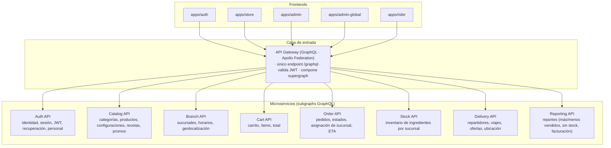
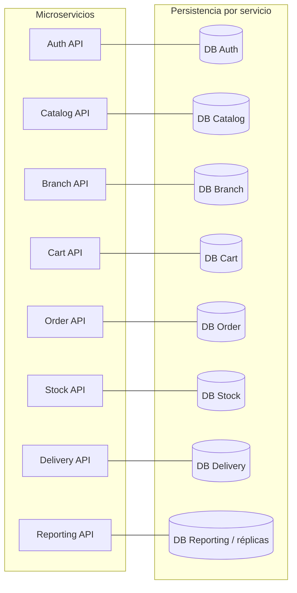
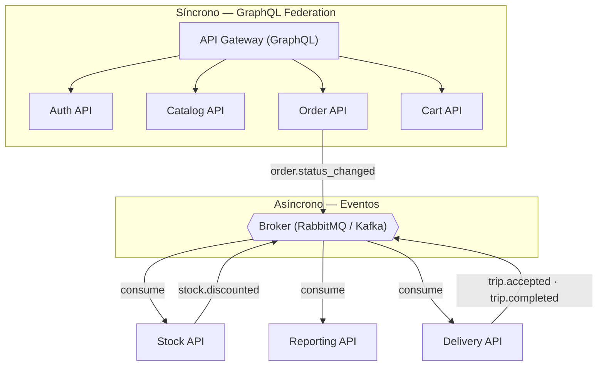
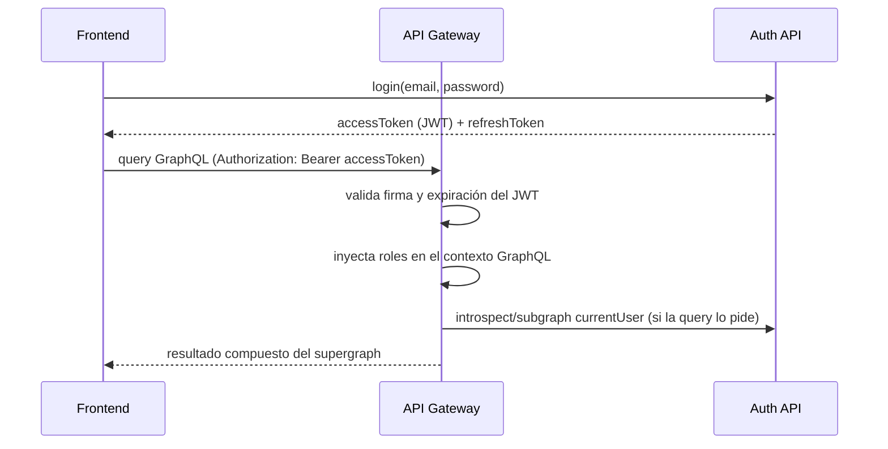

# Propuesta de arquitectura — Backend con microservicios

**Proyecto:** Plataforma de pedidos para una cadena de comidas rápidas
**Documento:** propuesta de arquitectura del backend (borrador para validación)
**Estado:** pendiente de confirmación

> Este documento propone una **arquitectura de microservicios** para el backend, distinta del monolito modular actual. Antes de redactar el documento de requerimientos, se valida esta estructura.

---

## 1. Visión general

Los cinco frontends (auth, tienda, admin de sucursal, admin global y repartidor) consumen un **único endpoint GraphQL** expuesto por un **API Gateway**. Detrás del gateway, cada dominio vive en un microservicio independiente que expone su propio *subgraph*.

---

## 2. Detalle por servicio

| Servicio | Responsabilidad | Datos que posee |
|---|---|---|
| **API Gateway (GraphQL)** | Único endpoint, valida JWT, compone el *supergraph*, rate limiting, logs de entrada. | Ninguno (solo routing/orquestación de queries). |
| **Auth API** | Registro, login, refresh token, recuperación/restablecimiento de contraseña, perfiles, gestión de personal (colaboradores, admins), roles/permisos. Emite y valida JWT. | `users`, `password_recovery`, `roles`. |
| **Catalog API** | Categorías, productos, configuraciones especiales, catálogo de ingredientes/recetas, promociones. | `categories`, `products`, `product_config_groups`, `product_config_options`, `ingredients`, `recipes`, `promotions`. |
| **Branch API** | Sucursales, horarios, geolocalización y cálculo de distancia. | `branches`, `branch_hours`. |
| **Cart API** | Carrito e ítems, validación de productos/configuraciones, total del carrito. | `carts`, `cart_items`, `cart_item_options`. |
| **Order API** | Confirmación de pedido, asignación de sucursal, máquina de estados, ETA, historial. | `orders`, `order_items`, `order_item_options`, `order_status_history`. |
| **Stock API** | Inventario de ingredientes por sucursal, ajustes, descuento al entrar en realización. | `branch_ingredient_stock`, `stock_movements`. |
| **Delivery API** | Disponibilidad y ubicación del repartidor, ofertas de viaje, viajes, retiros/entregas, historial. | `riders`, `trips`, `trip_orders`, `rider_locations`. |
| **Reporting API** | Reportes base: más/menos vendidos, sin stock, mayor facturación. | Lectura de réplicas/eventos (no escribe). |

---

## 3. Modelo de comunicación

- **Síncrono (federation):** lecturas y operaciones que cruzan dominios (ej. armar el pedido usando datos del catálogo, obtener `currentUser` en cualquier subgraph).
- **Asíncrono (eventos):** efectos colaterales que no necesitan ser transaccionales en la misma operación (descuento de stock al entrar en realización, actualización de reportes, cambios que disparan la oferta de viajes).

---

## 4. Autenticación y autorización

- El **Auth API** es el único que emite y conoce los JWT.
- El **gateway** valida el token en cada request y propaga `{ userId, roles }` al contexto.
- Cada subgraph aplica sus propias reglas de autorización por rol (`customer`, `branch_admin`, `super_admin`, `rider`).

---

## 5. Decisiones de diseño (resumen)

| Decisión | Justificación |
|---|---|
| **GraphQL Federation** | Un solo endpoint; el frontend resuelve queries que cruzan dominios sin llamadas N+1 manuales. |
| **Auth API independiente** | Dueño exclusivo de identidad, sesión y roles; el gateway depende de él para validar. |
| **Síncrono vía gateway / asíncrono vía eventos** | Separa operaciones transaccionales de efectos colaterales. |
| **Base de datos por servicio** | Cada servicio dueño de sus tablas; `Reporting` lee réplicas/eventos. |
| **Catálogo vs Stock separados** | Lo global (productos/recetas) no se acopla a lo operativo por sucursal. |
| **Pedidos vs Carrito separados** | Ciclos de vida distintos; el pedido es inmutable tras confirmarse, el carrito es mutable. |

---

## 6. Decisiones confirmadas

- **Base de datos:** MongoDB, una base por servicio (documentos embebidos; sin joins).
- **Broker:** por definir (RabbitMQ o Kafka) — no bloquea el documento de requerimientos.
- **Desglose:** confirmado tal cual (8 servicios + gateway).
