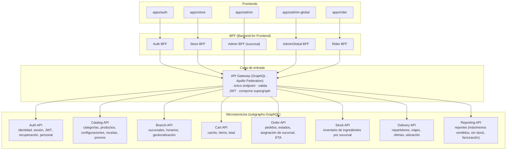
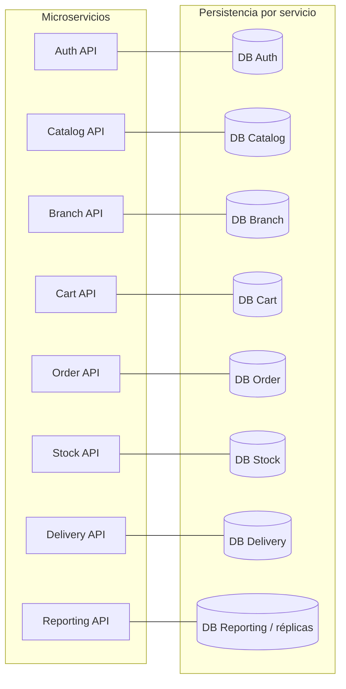
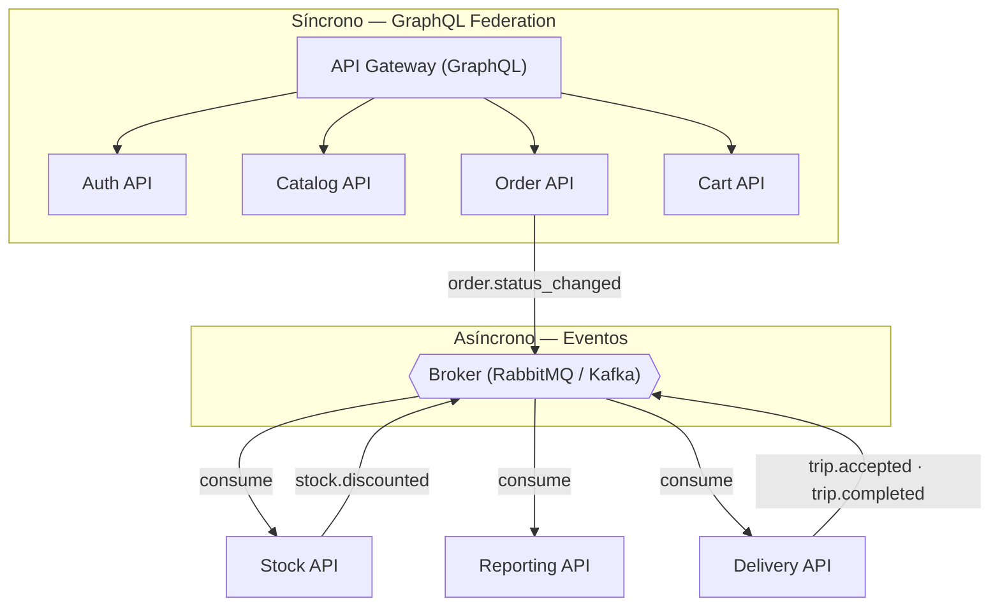
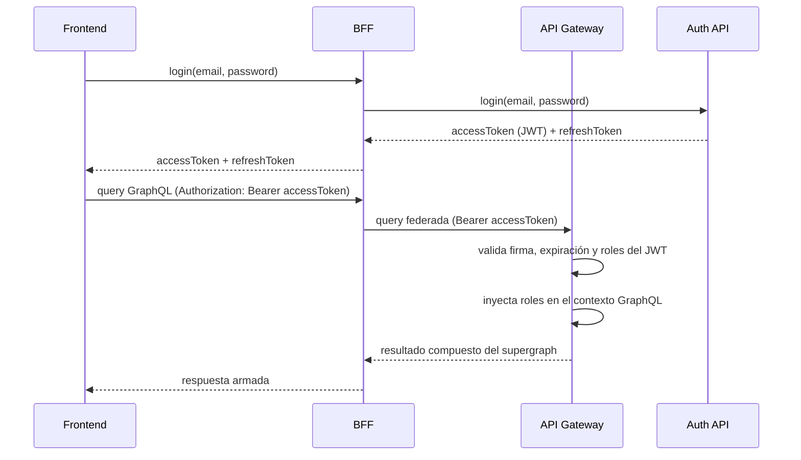
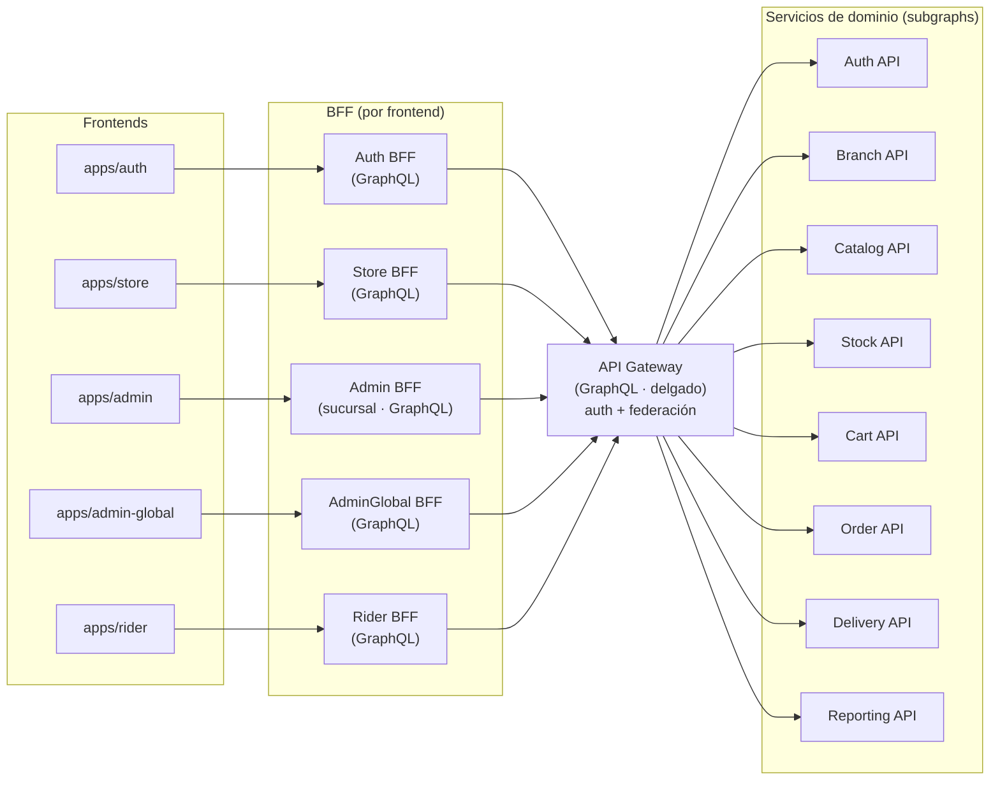
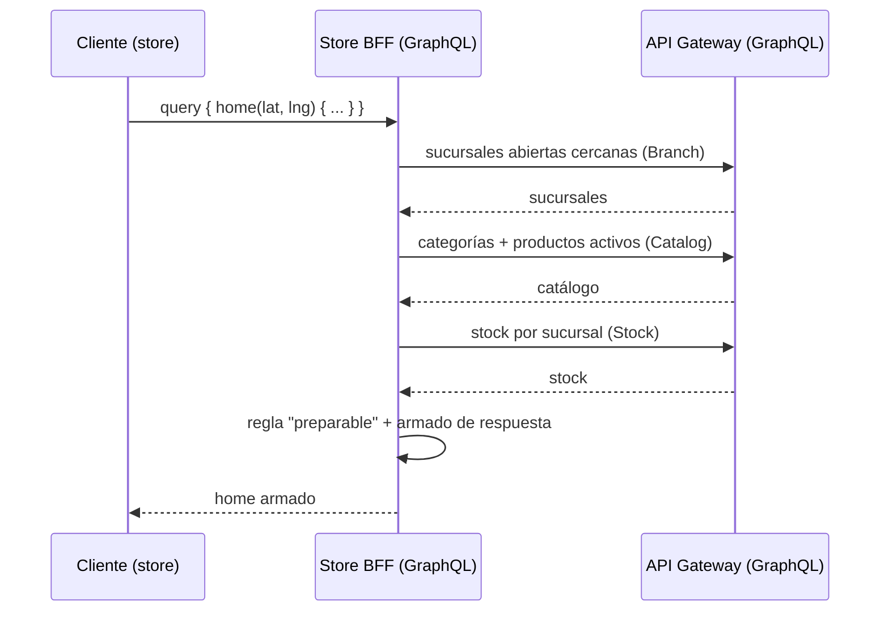

# Propuesta de arquitectura — Backend con microservicios

**Proyecto:** Plataforma de pedidos para una cadena de comidas rápidas
**Documento:** propuesta de arquitectura del backend
**Estado:** confirmado

> Este documento define la **arquitectura de microservicios** del backend. Los requerimientos correspondientes viven en `plan/api/requerimientos-backend.md`.

---

## 1. Visión general

Los cinco frontends (auth, tienda, admin de sucursal, admin global y repartidor) consumen su **BFF** (Backend for Frontend), que a su vez habla con un **API Gateway** (GraphQL). Detrás del gateway, cada dominio vive en un microservicio independiente que expone su propio *subgraph*. El detalle de la capa BFF está en §5.



---

## 2. Detalle por servicio



| Servicio | Responsabilidad | Datos que posee |
|---|---|---|
| **API Gateway (GraphQL)** | Único endpoint, valida JWT, compone el *supergraph*, rate limiting, logs de entrada. | Ninguno (solo routing/orquestación de queries). |
| **Auth API** | Registro, login, refresh token, recuperación/restablecimiento de contraseña, perfiles, gestión de personal (colaboradores, admins), roles/permisos. Emite y valida JWT. | `users`, `password_recovery`, `roles`. |
| **Catalog API** | Categorías, productos, configuraciones especiales, catálogo de ingredientes/recetas, promociones. | `categories`, `products`, `product_config_groups`, `product_config_options`, `ingredients`, `recipes`, `promotions`. |
| **Branch API** | Sucursales, horarios, geolocalización y cálculo de distancia. | `branches`, `branch_hours`. |
| **Cart API** | Carrito e ítems, validación de productos/configuraciones, total del carrito. | `carts`, `cart_items`, `cart_item_options`. |
| **Order API** | Confirmación de pedido, asignación de sucursal, máquina de estados, ETA, historial. | `orders`, `order_items`, `order_item_options`, `order_status_history`. |
| **Stock API** | Inventario de ingredientes por sucursal, ajustes, descuento al entrar en realización. | `branch_ingredient_stock`, `stock_movements`. |
| **Delivery API** | Disponibilidad y ubicación del repartidor, ofertas de viaje, viajes, retiros/entregas, historial. | `riders`, `trips`, `trip_orders`, `rider_locations`. |
| **Reporting API** | Reportes base: más/menos vendidos, sin stock, mayor facturación. | Lectura de réplicas/eventos (no escribe). |

---

## 3. Modelo de comunicación



- **Síncrono (federation):** lecturas y operaciones que cruzan dominios (ej. armar el pedido usando datos del catálogo, obtener `currentUser` en cualquier subgraph).
- **Asíncrono (eventos):** efectos colaterales que no necesitan ser transaccionales en la misma operación (descuento de stock al entrar en realización, actualización de reportes, cambios que disparan la oferta de viajes).

---

## 4. Autenticación y autorización



- El **Auth API** es el único que emite y conoce los JWT.
- El **gateway** valida el token en cada request y propaga `{ userId, roles }` al contexto.
- Cada subgraph aplica sus propias reglas de autorización por rol (`customer`, `branch_admin`, `super_admin`, `rider`).

---

## 5. BFF (Backend for Frontend) — orquestación cross

Orden correcto: **cliente → BFF (GraphQL) → API Gateway (GraphQL) → microservicios**.

- El **BFF** es el punto de entrada de cada frontend: expone el esquema específico de ese cliente y es dueño de la **orquestación** de los casos de uso (orden, reglas, fallbacks).
- El **API Gateway** queda **detrás** del BFF: router de federación delgado (auth + composición de subgraphs), sin reglas de negocio.
- El **Auth BFF** existe por el mismo motivo que los demás: contrato fijo con `apps/auth` y lugar para lógica adicional (rotación de tokens, reglas post-login), sin ensuciar el dominio de la Auth API.



### Casos de uso que resuelve cada BFF

| BFF | Casos de uso cross |
|---|---|
| **Auth BFF** | `login`, `register`, `requestPasswordRecovery`, `resetPassword`, `refreshToken`, `logout`, `me`. Contrato fijo con el frontend de auth; punto para lógica adicional (rotación de tokens, reglas post-login). |
| **Store BFF** | `home(lat,lng)` (sucursales + catálogo + stock), `getProductDetail`, `addToCart` (validando producto + configs), `checkout` (dirección → sucursal → stock → total → confirmar), `trackOrder` (pedido + sucursal + historial), `repeatOrder`. |
| **Admin BFF** (sucursal) | pausar/reactivar productos de su sucursal, stock de su almacén, pedidos y reportes de su sucursal. |
| **AdminGlobal BFF** | productos con receta/ingredientes, catálogo de ingredientes, categorías, sucursales, promociones, personal vinculado a sucursal, vista global de pedidos/stock/reportes. |
| **Rider BFF** | `offerTrip` (ubicación → oferta de viaje), aceptar/rechazar viaje, marcar retiro/entrega, historial de viajes. |

### Ejemplo: obtener el catálogo (regla "stock → preparable")



### Regla

- **Cliente:** una query GraphQL contra **su BFF**; no conoce el gateway ni orquesta reglas.
- **BFF:** dueño de los casos de uso cross; llama al API Gateway y arma la respuesta.
- **API Gateway:** delgado (auth + federación); nunca reglas de negocio.

---

## 6. Decisiones de diseño (resumen)

| Decisión | Justificación |
|---|---|
| **GraphQL Federation** | Un solo endpoint; el frontend resuelve queries que cruzan dominios sin llamadas N+1 manuales. |
| **Auth API independiente** | Dueño exclusivo de identidad, sesión y roles; el gateway depende de él para validar. |
| **Síncrono vía gateway / asíncrono vía eventos** | Separa operaciones transaccionales de efectos colaterales. |
| **Base de datos por servicio** | Cada servicio dueño de sus tablas; `Reporting` lee réplicas/eventos. |
| **Catálogo vs Stock separados** | Lo global (productos/recetas) no se acopla a lo operativo por sucursal. |
| **BFF para orquestación cross** | El gateway solo une datos; las reglas entre servicios (sucursal + stock + catálogo) viven en un BFF por frontend. |
| **Pedidos vs Carrito separados** | Ciclos de vida distintos; el pedido es inmutable tras confirmarse, el carrito es mutable. |

---

## 7. Decisiones confirmadas

- **Base de datos:** MongoDB, una base por servicio (documentos embebidos; sin joins).
- **Broker:** por definir (RabbitMQ o Kafka) — no bloquea el documento de requerimientos.
- **Desglose:** confirmado tal cual (8 servicios + gateway).
- **BFF:** confirmado (Auth/Store/Admin/AdminGlobal/Rider BFF) — ver §5.
- **Repositorios:** `backend/` (turborepo de servicios), `bff/` (turborepo de BFFs) y `gateway/` (standalone) — ver §8.

---

## 8. Organización de repositorios (Turborepo)

Se proponen **tres repos backend** + el `client/` existente:

```text
desa-apps-prueba/
├── client/        # turborepo (existente) — frontends
│   ├── apps/      # auth, store, admin, admin-global, rider
│   └── packages/  # components, domain, api, theme, ...
│
├── backend/       # turborepo — microservicios de dominio
│   ├── apps/
│   │   ├── auth-api
│   │   ├── catalog-api
│   │   ├── branch-api
│   │   ├── cart-api
│   │   ├── order-api
│   │   ├── stock-api
│   │   ├── delivery-api
│   │   └── reporting-api
│   └── packages/
│       ├── config/        # tsconfig, eslint, prettier
│       ├── mongo/         # conexión y helpers de MongoDB
│       ├── events/        # esquemas de eventos del broker
│       ├── graphql/       # boilerplate de subgraph (federación, @key)
│       └── errors/        # formato de error compartido
│
├── bff/           # turborepo — BFFs
│   ├── apps/
│   │   ├── auth-bff
│   │   ├── store-bff
│   │   ├── admin-bff
│   │   ├── admin-global-bff
│   │   └── rider-bff
│   └── packages/
│       ├── config/
│       ├── gateway-client/  # cliente del API Gateway (federación)
│       └── auth/            # reenvío de JWT / contexto
│
└── gateway/       # repo standalone — Apollo Router
    ├── router.yaml         # config del router
    └── supergraph/         # URLs de los subgraphs
```

### Por qué así

| Repo | Qué agrupa | Razón |
|---|---|---|
| `backend/` | 8 servicios de dominio | Comparten stack (NestJS + Mongo), paquetes de subgraph, eventos y errores. `turbo dev` levanta todo en local. |
| `bff/` | 5 BFF | Comparten el cliente del gateway y el reenvío de auth; son la capa de orquestación por frontend. |
| `gateway/` | Apollo Router | Lifecycle distinto (única entrada, deployment en el edge, es casi todo configuración). |
| `client/` | 5 frontends | Ya existente. |

### Notas

- Aunque compartan repo, **cada servicio/BFF se despliega y versiona por separado** (Turborepo lo soporta con `turbo build --filter=...` y pipelines por app).
- El gateway podría vivir dentro de `backend/`, pero se mantiene standalone para aislar la entrada de la plataforma (cambios y releases independientes).
- El `api/` actual (monolito NestJS) se **refactoriza/splitea** hacia `backend/` (servicios), `bff/` (orquestación) y `gateway/` (router).
